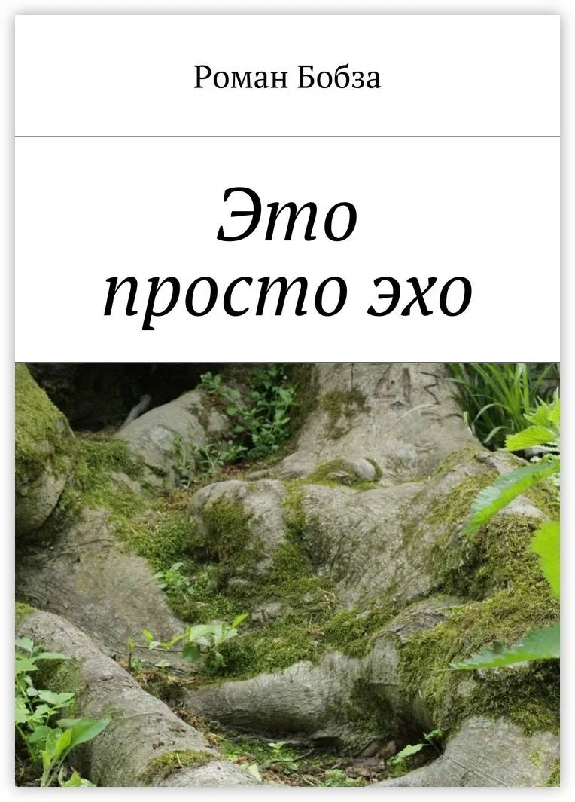

**Роман Олегович Бобза** 
=======================
© Роман Олегович Бобза, 2017

ISBN 978-5-4485-3717-2

# **Глава 1**
Мы сидим на берегу моря, я в плавках, она в синем купальнике. Греемся и смотрим на море.

– Ты сейчас думаешь только обо мне? – спрашивает она. Я смотрю на неё. Вода с русых волос капает на её грудь. Капли стекают в декольте купальника и исчезают. У неё красивая хорошо развитая грудь, белая кожа и очаровательные ноги.

– Да. Но было время, когда я также сосредоточенно думал о другой.

Она замолкает.

Ветер приятно прохладен. Нежное июльское солнце скользит горячими лучами по нашим спинам и согревает. Мне 24, ей 21.

– Расскажешь?

– Да, – говорю я. – Но это будет долгий рассказ.

Помню, учился со мной парень по имени Роберт. Мы познакомились ещё при поступлении. Пару раз я даже списывал у него. Бывает такое. Чувствуешь, когда человек «твоего склада». Люди разные, но нечто, какая-то черта характера объединяет вас.

Мы поступили в университет. Я на филологический факультет, он – на худграф. Нас часто можно было застать в университетской столовой или на улице во время перемены. Мы сидели на скамье под старыми липами. Я читал, Роб рисовал. Он рисовал всегда, когда появлялась свободная минутка. Потому и говорил мало, не хотел попусту тратить время. Казалось, он знает что-то очень важное. У него не было претензий к жизни и к людям. Он знал, чем ему заниматься, и умел зарабатывать. Никогда не сомневался в выборе. Работу свою любил, и работа его тоже любила.

Он жил за университетом, в общежитии, которое было окружено небольшим парком. Там росли старые абрикосовые деревья.

В один из дней – в пятницу кажется – пары закончились пораньше. Я собрался ехать домой.

– Что будешь делать?

Я пожал плечами.

– Пойдём к нам. У нас сегодня вечеринка. Девчонки придут.

– Пойдём. Завтра всё равно выходной.

В комнате, где жил Роб, жило ещё три парня: Игорь, Денис и Шуба. Небольшая комната, два окна, две двухъярусные кровати. Спёртый запах в помещении. В углу за раскладным столом гора грязных носков. Уверен: ещё немного – и из этой горы вырастут грибы.

Комендант поворчала на нас и предупредила, чтобы не устраивали пьянку.

– Девчонки принесут какой-нибудь еды, – сказал Денис.

– Давайте «скинемся» на пиво, – сказал Игорь.

Мы сходили в ближайший магазин, купили пива и рыбные консервы. Больше не позволили деньги. Тайком пронесли в общежитие. Девчонок было четыре. У рыженькой, подстриженной под каре в руках была большая кастрюля с вареным рисом. Она откликалась на имя Юля. Русоволосые Лена и Марина принесли свежие огурцы и чистые тарелки с вилками: у парней такой роскоши не водилось.

– Решили принести всё свое. В вашем бардаке и вилки не найти, – сказала Лена.

– Знакомьтесь, это Данил, – сказал Роб, указав на меня. – Это Лена. В твоей группе учится.

Девушки поздоровались со мной. Потом мы ели, пили пиво, говорили. Юля приставала к Робу и просила нарисовать её портрет.

– Только слепой не видит, что Юля подкатывает к нему шары, – прошептал Шуба.

– Поговори мне, – сказал Юля.

Мы засмеялись.

Без десяти восемь я собрался уходить. В восемь общежитие закрывалось. Спать в комнате ребят было негде. Я попрощался, поблагодарил за ужин. Лена вызвалась меня проводить. Территорию родного университета я знал хорошо, но Лена отказ не приняла. Мы спустились в фойе и вышли на улицу.

– Как я тебя не заметил сегодня на парах, не понимаю, – сказал я.

– Это неважно. Что завтра делаешь? Давай встретимся?

Было глупо отказываться. Ленка была симпатичная.

– Давай. На Красной у Макдональдса. В одиннадцать. Сойдёт? – спросил я.

– Супер, – сказала она и показала оттопыренный большой палец. – Мне нужен твой номер.

Я продиктовал его. Лена набрала и позвонила. Её номер высветился, и я записал его.

– Ну, пока, симпатяга, – сказала Ленка и чмокнула меня в щёку.

Утром следующего дня в половине десятого я проснулся, умылся, почистил зубы. Есть не хотелось. Выпил немного чаю, от нечего делать посмотрел в интернете последние новости (обычно я не уделяю им внимания). Когда пришло время, я надел лёгкую серую куртку, синий батник, чёрные штаны и туфли. Одежда не особо красивая, но чистая и аккуратная.

Спустившись вниз на лифте, я вышел на улицу. Увидел, что у остановки стоит троллейбус, побежал и сел в него.

Улица Северная была почти пуста. Ехало несколько машин. Троллейбус быстро доехал до торгового центра «Галерея», остановился, и я вышел. Макдональдс находился дальше, за перекрёстком. Спрятав руки в карманы, я пошёл туда. Перешёл улицу. Здание «Макдональдса» виднелось в сотне метров. Там толпились люди.

Я достал телефон и позвонил Ленке.

– Привет, ты где?

– Привет, – радостно сказала она. Её голос сделался грудным, бархатистым. – Сижу на стульчике у «Мака». Скучаю.

– Не скучай. Я близко.

Толпа на улице была продолжением огромной очереди в «Макдональдсе». Я пробралась сквозь толпу людей, обошёл здание ресторана. Лена сидела под большим зонтом на красном пластиковом стуле, закинув ногу на ногу. Она была одета в коротенькое платье с индийскими орнаментами. Короткое настолько, что ещё миллиметр – и будет видно то, что на людях не показывают.

– Привет, – сказал я с улыбкой. – Шикарное платье. И очень короткое.

– Я знала, что тебе понравится.

– Как ещё напротив тебя не скопилась толпа мужиков, – усмехнулся я. Выглядела она шикарна. Хоть сейчас её в постель.

Она игриво хлопнула меня по плечу.

– Вам дай волю. Так куда пойдём?

– А ты хочешь есть? – спросил я.

– Да. Только не в «Маке». Там внутри столько людей, что, наверное, дышать уже не чем.

– Пойдём. Накормлю тебя китайской едой в коробочке.

Мы перешли улицу по «зебре» и пошли по Александровскому парку. Вокруг были деревья, клумбы с цветами, зелёные газоны, скамейки, красивые девушки.

– У тебя есть девушка? Наверняка есть. Такие парни, как ты, нарасхват, – сказала она с улыбкой.

– Пока нет. Я ведь совсем недавно стал жить здесь.

– О, это нужно срочно исправить.

– Хочешь заняться рекламной компанией?

– Ты ещё и весёлый. Прелестно.

Она улыбнулась.

– Мне нравится, как ты говоришь «прелестно», – сказал я.

Мы дошли до кафе «Каир», который находился в большой стеклянной пирамиде, свернули влево и, перейдя дорогу, вошли в закусочную «Панда».

Небольшое помещение было стилизовано под Китай. Обои с бамбуковым лесом и милыми пандами. Песня ветра над дверью, на подоконнике маленькие позолоченные кошки. Покупателей внутри было много. Пара столиков вдоль стен была занята. Мы стали у кассы в конец очереди, подождали, пока люди перед нами купили еду.

– С чем будешь собу? – спросил я, показал на витрину, где стояли образцы. – Выбирай.

Лена махнула рукой.

– Буду тоже, что и ты.

Девушка-продавец поставила на прилавок две коробочки с китайской лапшой. Я заплатил. Мы забрали их и отошли в сторону.

– Здесь поедим?

– Нет, я знаю одно место. Там тихо и много зелени.

Мы вышли из закусочной, прошли немного по тротуару и свернули в проход между двух домов. Вышли во дворик, с четырёх сторон окружённый многоэтажками с жёлтыми балконами. Солнце сюда попадало мало, потому деревьев не было. Вместо них буйно росли кусты белых лилий и тюльпанов. На решётке пожарного балкона висели стебли клематиса.

Присев на скамейку, мы распаковали палочки и стали есть вкусную гречневую лапшу с курицей и грибами.

– Ну как? – спросил я.

– Обалденно.

Когда мы поели, Лена к моему удивлению предложила не тратить время и ехать ко мне. Мы прекрасно понимаем, к чему всё это, сказала она. Я удивился такой прямолинейности. Насколько помнил, у большинства пар проходит от двух до четырёх свиданий до секса. Вопреки общей практике меня не интересовало, какую музыку она слушает или какие ей нравятся фильмы. Если говорить без лицемерия, я хотел её трахнуть. И мне было не интересно, что она за личность. Побыстрей бы приехать домой и снять с неё платье – вот о чём я думал. Но не представлял, что мне делать с ней, после того, как мы переспим. Жить с ней мне не интересно и не нужно. Я прекрасно справлялся с бытом сам. Жениться на ней – какая чушь! Просто трахнуть и жить дальше? Вопрос повис в воздухе.

Говорят, что люди моего поколения воспринимают секс, как нормальный элемент знакомства с противоположным полом. Раньше я был не согласен с этим. Но в момент, когда мы почти вбежали в мою квартиру, секс и завтрак в постель стал лучшим способом познакомиться.

Я разложил диван, и мы набросились друг на друга. В её уверенных движениях чувствовался опыт. Я же никогда ещё не занимался сексом, и это был мой первый раз.

Она, видя мой энтузиазм, но и мои сомнения, сделала всё сама. Мне осталось только двигаться и получать удовольствие. Она лежала на спине. Я лежал на ней, засовывал пенис до упора и извлекал. Сколько мы так куражились, не знаю. В какой-то момент я почувствовал, что невероятно устал. Я собрал оставшиеся силы и кончил.

– Понравилось? – спросила она.

Я улыбнулся, слабо кивнул и лёг на диван. Через мгновение я спал глубоким сном. Так спят киты в Тихом океане.

Я почувствовал, как кто-то слабо толкает меня в плечо, и разлепил глаза. В комнате было темно, за окном сгустилась ночь. Свет ночника в углу был слаб, ненавязчив. У дивана стояла Ленка и смотрела на меня.

– Отдохнул?

Я кивнул.

– Пойдём есть.

Мы сидели на кухне, ели горячие бутерброды с сыром и помидором, пили зелёный чай.

– Как ты? – спросила Лена. – Сильно устал?

– Да.

– Что будем делать дальше?

Я отпил немного чая из чашки, посмотрел на ночь за окном. Мне не хотелось её обманывать. И я решил подвести разговор к этому.

– Скажи, тебе интересно, какой я человек? Только честно. Не бойся меня обидеть.

Она задумалась на некоторое время. Сделала несколько глотков из чашки.

– Мне нравится, – сказала она, – заниматься с тобой сексом. В процессе я могу узнать твой характер и то, что у тебя внутри. Узнаю – хорошо, не узнаю – так тому и быть. Важнее для меня иметь парня, нормального по характеру, с которым я могу удовлетворять свои потребности. То есть…

– Заниматься сексом, я понял. Я думаю примерно также. Проводить вместе ночи, гулять. Жить раздельно. Я люблю гулять и встречаться, ведь это намного лучше одиночества (я врал: одиночество было частью моей натуры, и любил я его не меньше, чем картофель фри). Но иногда мне нужно побыть одному, решить для себя важные вопросы, что-то прояснить. Поэтому, если я вдруг исчезну на время, не стоит в слезах сожалеть, что ты со мной повелась. Просто в этот момент тараканы в моей голове строят дамбу.

Ленка засмеялась.

– Хорошо, не буду сожалеть. А теперь, – она подсела ближе и засунула ладонь мне в шорты, затем в трусы. Её пальцы коснулись моего члена.

– Что ты делаешь?! – спросил я, онемев от удивления.

– Ты слишком напряжён, тебе нужно расслабиться.

Она стянула шорты и трусы. Член потяжелел и напрягся. Ленка стала на колени и взяла его в рот. Я почувствовал всеобъемлющее тепло и закрыл от удовольствия глаза.

Когда она закончила, мы перешли в комнату. Я разделся, пошёл в ванную и принял душ. Чувство опустошённости царило в голове и мошонке. Спать совсем не хотелось. Струйки горячей воды приятно стекали по телу.

Вернувшись, я застал её лежащей на диване и разглядывающей потолок.

– Ты в порядке? – спросил я. – Если хочешь, душ в твоём распоряжении.

– В доме моих родителей давно не белили потолок. Каждый год на нём появляются трещины, как морщины на стареющем лице. Лице, которое всю жизнь смотрит на меня. И над диваном, на котором я сплю, трещины очень похожи на череп.

Она замолчала. Встала с дивана:

– Спать хочется.

Она ушла в ванную. Чувствовал я, что настроение её ухудшилось. Подумал, что это я в чём-то виноват, и тут же отмёл эту мысль.

Пока она принимала душ, я сменил простынь, постелил на диване, достал подушки и одеяло. Сонливости не было и следа. Я сел в кресло в углу, где стоял стол, достал книгу Керуака «На дороге» и стал читать.

Услышал, как дверь в ванную открылась и закрылась, повернул голову. Лена стояла в дверном проёме, завернутая в полотенце.

– Всё в порядке? – спросил я.

– Никогда не жалел, что нам постоянно требуется секс?

– Жалел. Когда нет нужного человека, приходится или терпеть, или дрочить. Терпеть не каждый сможет. Всегда проще сдаться.

– Каждый раз после секса личность моего тела ликует. А моя личность молчит. Её не нравится секс. Она чувствует себя разорванной на клочки. В детстве мне часто снился кошмар: из темноты тянутся руки, их много и они серые. Каждая хочет взять себе кусочек меня. Они хватают за руки, ноги, уши, тянут и разрывают меня.

– Что тут скажешь. Никуда не денешься. Один выход – терпеть разорванность до старости.

– В такие моменты смерть кажется избавлением, а не страшной карой.

– Поспи, тебе станет лучше. Может, валерьянки дать?

Она улыбнулась, но в глазах её плавала грусть, серая, как дождевая вода.

– Не стоит. Просто посплю.

Она повесила полотенце на дверь, легла на диван, свернулась калачиком и укрылась одеялом.

Светильник освещал только угол, в котором я сидел. Но я всё равно спросил:

– Свет не мешает?

– Нет, всё в порядке, – сказала она. В голосе чувствовалась слабость.

На некоторое время я погрузился в текст. Когда очнулся, Лена ровно сопела под одеялом. Я положил книгу на стол, встал и пошёл на кухню. В прихожей и кухне было темно. В этой темноте я подошёл к окну, открыл форточку и закурил сигарету. Сотни рук, подумал я. «Сотни рук, которые тебя разрывают».

В чайнике было немного заварки. Я сделал чай и стал у окна с чашкой в руке. Я ещё не знал, что впереди, во взрослой жизни, ждёт меня разочарование, страх, падение и подъём, множество проблем и врагов, одиночество до определённой поры и жалкое существование до непредсказуемого успеха. И что потом, когда всё это со мной произойдёт, тысячи рук будут разрывать меня во сне. И только тогда я пойму, из-за чего Лена сделал тот решающий шаг. Тогда я вспомню слова отца: «Жизнь так устроена: печали, неудачи и проблемы лезут из всех щелей. И то, что этой грязи не убывает, говорит, что она – неотъемлемая часть жизни».

Утром я встал рано, приготовил салат с фасолью и сухариками и омлет. Когда Ленка проснулась и почистила зубы, мы позавтракали. Потом я провёл её до остановки, подождал, пока приедет её маршрутка, дал денег на дорогу. Ленка выглядела уставшей. Она обняла меня.

– Не падай духом, – сказал я. – Увидимся в универе.

Она села в маршрутку и уехала.

Роб фанател от шашек. Занятий и дел на воскресенье не было. Поэтому, проводив Лену, я позвонил ему.

– Здоров. Сыграем?

– Во сколько подъезжать?

– Давай минут через сорок. Сможешь купить чипсов и попить чего-нибудь?

У Роба всегда имелись деньги. Семья у него была небогатая – мать и бабушка – и денег ему почти не высылала. Когда молва о его таланте разнеслась по университету и общежитию, студенты, преподаватели, их родственники ринулись к нему с разными заказами. Что Роб только не рисовал: и рисунки для маек, и татуировки, и портреты, и даже модели одежды. Ничего этого не было бы, как и не было бы денег, если бы эти люди не видели, как превосходно он рисует. Часть денег он оставлял на проживание, остальное отсылал семье.

– Всё куплю, – сказал он.

Я принял душ. Потом проветрил квартиру и сделал влажную уборку.

Стало снова пусто и тихо. Тишина умеет звучать. Я присел на минутку, по крайней мере, так себе сказал. Очнулся только, когда услышал стук в дверь. Это был не сон. Чувство счастья, как тёплое спокойное море, заполнило меня. Я открыл дверь и впустил Роба в квартиру.

– Здоров, – он пожал мою руку и протянул пакет. – Здесь пиво и чипсы.

Я отнёс пакет на кухню. Роб снял обувь, повесил куртку на вешалку и прошёл в комнату. Высыпав чипсы в большую тарелку, я взял её, стул и пошёл в комнату.

Дешёвый набор шашек лежал на столе. Роб привычно стал расставлять шашки на картонке с чёрными и белыми квадратами. Я поставил тарелку с чипсами на столе, отдал ему стул и сел в кресло.

– Поехали, – сказал я.

Первая партия была напряжённой, поэтому мы молчали. Когда партия подходила к концу, Роб отхлебнул пива из бутылки и спросил:

– Ну как сходил с Ленкой?

– Очень хорошо, – сказал я. Моё внимание было поглощено игрой. По крайней мере, мне хотелось так думать.

– Она Юле все мозги прожужжала. Зацепил ты её.

Я передвинул шашку вперёд.

– Сейчас мне не это нужно.

– Конечно, – сказал Роб.

– Не знаю, что с ней делать. Я объяснил, что мне от неё только секс нужен. Она сказала, что полностью согласна с такими отношениями.

Роб оторвал взгляд от доски и посмотрел на меня.

– А мне совсем не верится, – сказал я. – Это мы может мириться с одиночеством. Потому что точно знаем, чего хотим от этого мира. А женщины… они боятся его, как огня. Тревога какая-то. Со вчерашнего дня висит надо мной, как камень.

– Так всегда будет, – сказал Роб. – При любых переменах. От этого никак не избавиться. Нужно привыкнуть и жить с этим.

Роб перескочил через две моих шашки и поставил свою в дамки.

– Рассеян ты сегодня.

– Да. Ладно, мастер Йода. Сейчас я тебе устрою.

Я отбил две шашки Роба, выстроил небольшой фронт и прорвался к нему в тыл.

– Разошёлся, – пробурчал Роб.

Мы доиграли эту партию, потом ещё две, доели чипсы и выпили всё пиво. Я захмелел, чувствовал, будто голова наполнена тёплым солнечным светом. Игра сегодня не шла. Поэтому мы покинули квартиру, спустились по лестнице. Было всё равно, куда идти. Мы вышли из подъезда, перешли дорогу и пошли по засаженной деревьями полоске земли вдоль реки.

Скоро на репетицию, думал я. Поразительно, как одна мысль может долго играть в сознании.

Мы прошли пару остановок. Роб попрощался, перешёл на другую сторону дороги, поймал маршрутку и уехал.

Я, не спеша, пошёл домой. Настроение сегодня было странным. Придя домой, я достал бас, включил комбик, и стал репетировать композицию.

В половине четвёртого я убрал бас-гитару в кофр. Есть не хотелось, но, чтобы лишний раз не тратиться, я поджарил и съел омлет с нори. На ближайшие четыре часа можно было забыть о проблемах.
# **Глава 2**
В понедельник, не выспавшись, я приехал в университет к первой паре. Показал охраннику у парадного входа студенческий билет, попал в фойе, по ступеням поднялся на третий этаж. У стенда с расписанием пар стояла толпа. Студенты гудели, как потревоженный улей. До звонка оставалось три минуты. Я протиснулся сквозь толпу, нашёл свою группу и запомнил, в какой кабинет нужно идти.

Прошёл по коридору к кафедре. Дверь триста четвёртого кабинета была распахнута. За длинными партами сидел восемь студентов. У окна я заметил Роба. Тот что-то рисовал в большом блокноте. Мистер Пибоди, так Роб называл этот блокнот. Бог его знает, почему. Стол преподавателя был пуст.

Я вошёл в кабинет, сел за парту, где сидел Роб. Кивнул ему. Он кивнул мне и вернулся к рисованию. По плечу меня кто-то похлопал. Я обернулся и удивился: за мной сидел Ремизов. И видеть его на первой паре было непривычно. Он никогда не приезжал так рано.

– Слушай, у тебя конспекты за пятницу есть?

– Есть.

– Дай списать. Я заплачу.

– Сколько? – спросил я.

– По сотне за конспект каждого предмета. По рукам?

Он был с деньгами. Это было видно по его одежде и отношению к жизни. Он думал, что всё можно купить. Мне нужны были деньги.

– По рукам, – сказал я.

Прозвенел звонок. Прошла минута, две. В кабинет вбежала Ленка, в спешке окинула взглядом аудиторию и рухнула на стул рядом со мной.

– Привет, – сказала она с улыбкой.

– Привет.

Она была в белом сарафане с маленькими синими цветами. Похоже, синий цвет она обожала.

В этой аудитории мы пробыли три пары. Когда началась большая перемена, мы с Ленкой собрались в столовую. Позвали Роба, но он сказал, что не может, и ушёл. В столовой выстроилась огромная очередь. Можно было пойти в ещё две торговые точки в университете, торгующие едой. Но мы решили подышать свежим воздухом и купить еды в закусочной.

У ларька мы остановились, купили четыре слойки с грибами и два маленьких пакетика с томатным соком. Сесть было негде. Мы вернулись на территорию университета, свернули влево и попали в курилку – небольшую площадку под липами, где стояли скамейки. Одна скамья была не занята. Мы сели. Рядом толпились другие студенты, ели, курили, слушали музыку.

Я был очень голоден и, только съев полторы слойки, посмотрел на Лену.

– Ну как ты? – спросил я.

Она улыбнулась, пожала плечами.

– Вроде бы хорошо. А ты?

– Нормально. Что делала в воскресенье?

– К родителям уже не успела. Просто спала, – она поправила волосы.

– На этих выходных поедешь к родителям?

– Да. Нужно постирать одежду. Ты хочешь снова позвать меня в гости?

– Сегодня – нет. А в среду – да. Очень.

– Ты хитрец.

Я засмеялся.

– Есть немного. Слушай, ты можешь постирать у меня. Без дураков. Постираешь, высушишь вещи. Можешь даже переночевать у меня.

Ленка насторожилась.

– Ты снова хочешь секса. – сказала она.

– Поверь мне. Просто в общежитии… не очень. Можем чего-нибудь приготовить.

– Без секса?

– Без.

– Я не согласна.

Она сбила меня с толку. На мгновение я даже забыл, что ем.

– Мне послышалось…

– Нет, не послышалось.

Лена перешла на шёпот.

– Я снова хочу.

Я не врал. Я действительно хотел помочь и не хотел секса.

После того, как пары закончились, мы с Леной поднялись в её комнату в общежитии. Она собрала вещи для стирки и как можно скорее мы покинули общежитие. Заскочили в канцелярский магазинчик, где я сделал ксерокопию лекций для Ремизова. Ремизов ждал меня у автобусной остановки в чёрном «BMW». Отдав лекции, я получил деньги. Ремизов уехал.

Не знаю, что так удивило её. Когда мы приехали ко мне, то заправили вещи в стиральную машину.

– Что будем готовить? Может, макароны с сыром? – спросил я.

– Почему бы и нет.

Мы приготовили макароны и поужинали. Вещи постирались, и мы повесили их сушиться.

Сидели в комнате, пили чай. В углу комнаты стояла стопка книг. Ленка наклонила голову, прочитала названия на корешках книг.

– Так любишь читать? – спросила она.

– Иногда.

Лена поднялась с дивана.

– Пойдём со мной.

Я поставил чашку на пол, поднялся и пошёл следом. На пороге туалета Ленка остановилась.

– Хочешь посмотреть?

– Что?

– Как я… хожу по-маленькому.

Я опешил.

– Не хочу.

– Почему? – спросила она, приподняв ногу и кокетливо согнув её в колене. Её розовая пятка почти коснулась попы. В глазах плясали искры.

– Боюсь, тоже захочу. По маленькой, – засмеялся я.

– Вот дурак! Ну, хочешь?

– Правда этого хочешь? – спросил я. Её уловки я уже научился понимать и знал, что когда она спрашивает человека, на самом деле хочет сама. – Я ведь не извращенец.

– Зато я извращенка.

– Смотри: я себя в штанах держать не собираюсь, – усмехнулся я.

Мы вошли в туалет. Она спустила трусики и села на унитаз.

– Возьми меня за грудь.

Упираться было бесполезно. Смеясь, я положил ладонь на её грудь.

– Можешь побыстрее, – сказал я.

– А что такое? – спросила она тем же игривым тоном. – Уже встал?

– В туалет хочу.

Она с досадой хлопнула меня по животу, поднялась и натянула трусики.

– Романтики от тебя не дождёшься, – буркнула она.

– Завязывай с порно, тебя говорю, – засмеялся я. – Уморила.

Она, притворно сердясь, вытолкнула меня из туалета и закрыла дверь.

Дел никаких не было. Чтобы не тратить время впустую, я достал конспект по фонетике и принялся читать. Лена напевала какую-то мелодию.

В дверь постучали. Я отложил книгу, встал и подошёл к двери. Услышал, как в ванной Лена перестала петь.

– Кто? – спросил я.

– Дима, – ответил знакомый голос.

Я распахнул дверь и поздоровался с соседом.

– Здоров, – он пожал мне руку. – Что на выходных делаешь?

– Вроде ничего. Учиться, наверное, буду. Самообразованием заниматься. А что?

– Мы собираемся в пятницу вечером в поход. Давай с нами. Ночуем в лесу. Места я знаю.

– У меня только рюкзак есть, – сказал я. Подумал, что дел на выходных нет. – А что нужно?

– Спальники, «пенки», палатки есть. Обувь есть крепкая?

Я кивнул.

– Хорошо. А одежда? – спросил Дима.

– Думаю, найдётся. Что с едой?

– Бери, что хочешь. Каждый несёт для себя. Мы обычно берём тушёнку, сухую рыбу, крупы, макароны, чай, сало. Дашка берёт орешки и сухофрукты.

– Давай в четверг пересечёмся и уже определимся со временем отъезда.

– Хорошо, – ответил Дима. Развернулся и пошёл к своей двери.

Всё лучше, подумал я, закрыв дверь. Лучше, чем сидеть и смотреть в пустоту.

Дверь ванной был открыта, и на её пороге стояла Ленка.

– Что-то случилось? – спросила она. У неё был обеспокоенный вид. Похоже, нашего разговора она не слышала.

– Всё в порядке. В горы собираемся. Что будешь делать на выходных?

Ленка поджала нижнюю губу:

– Не знаю. К родителям поеду, скорее всего. Соскучилась по ним.

– Хочешь, можем пройтись.

– Не стоит, – ответила она. Сложила крест-накрест руки на груди, потёрла плечи.

– Замёрзла? Давай сварю тебе бульон.

Она улыбнулась.

– Лучше включи музыку. Иначе я умру от скуки.

Я засмеялся. Вошёл в комнату, включил ноутбук.

– Есть у меня песня для тебя, – сказал я и включил «O Children» Ника Кейва и Bad Seeds.

Ленка зашла в комнату, положила полотенце на диван и подошла ко мне. Протянула руку, и я сжал её ладонь и поднялся со стула.

– Грустная песня. Иди сюда. – сказала она. Мы отошли от стола. Лена положила руки мне на плечи. Я взял её за талию. Мы покачивались в такт музыке, смотрели друг на друга.

– Знаешь, я не хочу уезжать сегодня, – сказала она.

– Оставайся. Не хочу, чтобы ты уезжала. – прошептал я.

– Спасибо.

Она прикоснулась губами к моей щеке. Мне хочется её чем-то порадовать, чем-то удивить, вдруг понял я. На улице солнце ползло к вечеру.

Когда песня закончилась, я сказал ей идти за мной и надеть куртку.

– Зачем? – спросила она. В голосе промелькнули нотки радостного удивления.

– Увидишь.

Мы вышли в коридор. Я запер квартиру, взял Лену за руку. Мы пошли к лифту. Вызвали, и он поднял нас на двенадцатый этаж. Мы вышли и свернули на лестничный пролёт. Поднялись к решётке, пресекающей доступ на чердак.

– Мы что, на крышу? – удивилась Ленка.

– Да. Держи, будешь светить, – я дал ей телефон. Она направила луч света на замок. Вскрыл замок проволочкой, вытащил из петель. Отворив решётку, мы стали подниматься.

– Ты только не пугайся, – сказал я. – Там могут быть голуби или коты. Хорошо?

– Хорошо, – прошептала она.

Преодолев два пролёта, мы подошли к небольшой двери, которая выходила на крышу. Дверь была не заперта.

– Аккуратно иди за мной. Ничего не бойся.

Я отворил тяжёлую железную дверь и вышел на крышу. Солнце коснулось брюшком розового горизонта. До края крыши – четыре метра. Я вышел из надстройки. Лена пошла за мной. Мы обогнули надстройку и остановились в центре площадки, покрытой серым шершавым рубероидом. Бросив на него балахон, я сказал Лене:

– Садись.

Мы сели лицом к солнцу и долго смотрели, как пунцовый закат тает в небе, будто малиновое мороженое.

Когда стемнело, мы спустились на двенадцатый этаж. Заперли решётку тем же хитрым способом и на лифте спустились на мой этаж.

Мы молчали. Слова были лишними сейчас. Я вымыл руки, ушёл на кухню. Достал из холодильника тушку цыплёнка, разрезал на кусочки. Болгарские перцы разрезал на лепестки. Сложил всё это на противень и отправил запекаться. Лена пришла на кухню.

– Давай посмотрим что-нибудь весёлое.

– Давай.

– Есть хочу.

– Придётся подождать минут сорок.

– Хорошо.

Пока готовился ужин, мы посмотрели несколько серия «Блудливой Калифорнии». Потом поели и легли спать.

Обычно среди ночи я просыпался редко. Позже, после этого странного происшествия, я думал, что просто что-то почувствовал подсознанием. Сколько времени было, когда я проснулся среди ночи, не знаю. Знаю, что Ленка заснула сразу же, как мы легли, а я некоторое время ворочался. А произошло вот что.

Я раскрыл глаза и увидел, как возле дивана, на котором я спал, в тёмной комнате стоит Ленка в трусах и ливчике. В её руке – длинный кухонный нож, и смотрит она на меня пустыми чёрными глазами.

От страха я не мог двигаться. Мысль «Она меня убьёт» – единственная мысль в ту секунду. И в голову мне пришло только одно: приказать ей лечь спать.

– Ложись спать, – сказал я генеральским тоном. Настолько приказным, насколько вообще можно сказать, когда яйца подкатили к подбородку от страха.

Она, глядя перед собой, легла в постель. Нож выскользнул из пальцев и со звоном упал на пол. Я поднялся и забрал его. Меня трусило. Закрыв дверь в комнату, я ушёл на кухню и спрятал нож в ящик стола. Сердце стучало так сильно, что мир, впитываемый моими глазами, сотрясался в такт.

Я распахнул форточку и закурил. Пальцы, держащие сигарету, тряслись. Чтобы не было ещё одного такого инцидента, спрятал все ножи в духовку. Не заметил, как сигарета дотлела до фильтра, обжёгся и швырнул окурок в распахнутое окно. Закурил ещё одну, постарался сосредоточить мысли на дыхании. Но они не слушались, тревожили меня.

Позже я лёг, постарался уснуть. И не мог. Лежал с закрытыми глазами, а воображение рисовало жуткие картины из ужастиков.

Спустя минут сорок Ленка стала дёргать руками и ногами и сдавленно выть. Я попытался её разбудить. Она не просыпалась и продолжала дёргаться и выть. Тогда я чуть слышно свистнул, и она замолчала ненадолго.

На улице стало светать, а я всё лежал и иногда посвистывал. Когда Лена проснулась, я дремал. Она поднялась с дивана чуть слышно, чтобы меня не разбудить, но я почувствовал и вскочил.

– Господи! – воскликнула она и приложила ладонь к груди. – Как ты меня напугал.

– Извини, – сказал я. – Который час?

– Без двадцати девять. Мы опаздываем.

– Угу. Уже встаю.

Она пошла в ванную. Я же пошёл на кухню: сил умываться и чистить зубы у меня не было. Приготовил бутерброды и включил чайник.

Мы сидели на кухне и завтракали, когда я вдруг вспомнил ночное происшествие.

– Слушай, ты помнишь, что вытворяла ночью?

– Нет, – сказала она. Её лицо было спокойным, заспанным. И она действительно не поняла, о чём я говорю.

– Я проснулся среди ночи, а ты стояла возле меня с ножом. И глаза у тебя были чёрными и пустыми.

Лена перестала жевать.

– Неужели снова началось? – сказала она вполголоса, словно сама себе. – Ты в порядке? Я не задела тебя?

– Нет. Но это было жутко. А потом ты выла и дёргалась. Как будто кто-то дёргал тебя за нити, привязанные к рукам и ногам. Что это с тобой?

Лена коснулась моей руки:

– Извини. Я не могу объяснить. Нужно спешить.

Мы оделись, взяли рюкзак и сумку и пошли к автобусной остановке. Молчали: у меня было дерьмовое настроение и недосып, Ленка думала о чём-то своём.

До пятницы я дотащился, как бедняга, заблудившийся в пустыне. Это неделя далась мне слишком уж тяжело. Не было сил анализировать своё состояние. Я добрёл до своего подъезда, поднялся на этаж, ввалился в квартиру и, не сняв ботинок, припал к крану в ванной. Втягивал холодную воду. Вдыхал воздух и снова пил.

В дверь постучали. Я выключил воду и открыл дверь. Передо мной стоял сосед Дима и улыбался. В его руках был свёрнутый синий туристический коврик и спальник.

– Здоров. Готов?

– Я только пришёл.

– Не закупал ещё ничего?

Говорить не было сил. Я помотал головой.

– За час успеешь? – спросил Дима. – Мы в пять уже хотим выезжать.

– Успею.

Не представляю, от чего я мог так устать. Всё тело болело, но я был готов бежать с рюкзаком куда угодно и сколько угодно, лишь бы покинуть на время этот опостылевший город.

– Как соберёшь рюкзак, заходи к нам. Это тебе.

Я принял снаряжение и закрыл дверь.

Скинул спальник и туристический коврик в комнате, взял чистое бельё и принял душ. После без аппетита съел вчера поджаренное филе пангасиуса. Сварил и выпил кофе. Потом надел спортивные штаны, балахон, взял пакет и деньги и пошёл в магазин.

Я признался себе, что с удовольствием провёл бы дня три в глубоком лесу. Три, не больше. Потому что после трёх суток турист перестаёт быть гостем и становится жителем леса. В таком случае с него иной спрос.

Моё отношение к лесу с недавнего времени стало трепетным. Удивительным образом лес и недолгая жизнь в нём превращали меня в другого человека. Я закрывал глаза и видел неординарную жизнь разных людей. А спустя время я понимал, что все эти люди – это я. И шерпа, который идёт по ледяному склону Эвереста. И английский охотник за слоновой костью. И немецкий офицер в идущей на дно подводной лодке. Всё это был я.

Магазин за соседним домом оказался закрыт. Я свернул направо, обошёл двухэтажное здание, прошёл по двум дворам и детской площадке и вышел к футбольному полю. Четверо детей кричали и гоняли мяч. Солнце стояло высоко над их головами. Миновав поле, я свернул за дом и вышел к небольшой площадке с дорогой. На ней были небольшой продуктовый магазинчик, аптека с жёлтой вывеской, бар с полосатым навесом, парикмахерская.

В продуктовом магазине я взял две баночки с консервированным тунцом, плоскую бутылку коньяка, сухофрукты, пачку гречки, банку консервированной тушёнки, четыреста граммов сухого рыбьего филе – солёного и с острым красным перцем.

Когда вышел из магазина, двери захлопнулись, а мой взгляд упёрся в стену многоэтажного дома напротив. Чёрной краской там было написано «Каждый должен вытирать свой зад сам». И я был полностью с этим согласен.

В пять часов вечера я постучал в дверь соседям, и мы вместе пошли к лифту. Минут десять подождали маршрутку. Дима и Даша нервничали, я чувствовал это. Говорить не хотелось.

Мимо проносились автобусы, автомобили и мотоциклы. На одном, длинном автобусе с числом 28 была наклеена рекламная плёнка. На ней было фото пустыни и горящего куста. Поговори с ним, гласила белая надпись.

Неожиданно быстро – во всяком случае, так мне показалось – мы добрались до вокзала. Мои мысли крутились вокруг горящего куста, перескакивали на воспоминание о стоящей возле кровати Лене с ножом, на Керуака, музыку Hawkwind. Я вдруг понял, что мир стал восприниматься мной с иной, никогда прежде не занимаемой точки зрения. Мир стал обширной 3D-моделью, с которой я могу взаимодействовать и за которой нет ничего: ни связей, ни мнений и отношений, ни ненависти и вражды. Вообще ничего, кроме движущейся картинки со специфическим сюжетом. Мир между двумя картинам. И самым странным было понимание, что это ни хорошо, ни плохо. Это просто есть, и с этим приходится мириться. А ещё промелькнула мысль, что если я и свихнусь когда-нибудь, то поспособствует мне именно эта «3D-модель» и мысли о ней.

Мы пробились сквозь толпу к кассам вокзала, забрали забронированные билеты, вышли на перрон. Электричка ещё не пришла, и мы сидели на рюкзаках. Хотелось курить.

– Всё нормально? – спросил я. – Вы какие-то напряжённые.

– Давно хотели вырваться. Но постоянно что-то мешало. – сказала Даша.

– Понятно.

Десятью минутами позже Дима отвел меня в сторону и рассказал, что Даша беременная.

– Если она будет вести себя не так, как обычно, отнесись с пониманием. Хорошо?

– Конечно. А ей можно в лес? Она там не родит?

– Нет. У неё маленький срок.

– Может, я не поеду? – сказал я.

– Всё в порядке. Мы рады, что ты едешь с нами.

Ехали долго. Дремали некоторое время. За окнами электрички стемнело. Всё вокруг нас напоминало современный высокогорный монастырь для медитации: молчащие с полуприкрытыми глазами люди, сваленные на полки и на пол рюкзаки, вводящее в транс постукивание колёс. Всё мы шерпы в какой-то степени, подумал я.

Захотелось есть. Я достал из рюкзака кусок вяленой рыбки с перцем и стал жевать. Прошло минут двадцать, и Даша и Дима открыли глаза.

– Ну как, отдохнули? – спросил я.

Дима кивнул. Даша потянулась.

– Долго ещё ехать? – спросил я.

Дима посмотрел на часы в мобильнике.

– Полтора часа.

Даша достала бутерброды и термос с чаем. На рюкзак мы положили пластину из вспененного пластика. Термос поставили на пол, а на пластине разложили бутерброды с вареным мясом и плавленым сыром, куски вяленой рыбы. Мне захотелось коньяка. Я достал плоскую бутылку и кружку.

– Будете?

Дима кивнул. Я забыл, что Даша беременная. Я разлил коньяк. Мы с Димой выпили и принялись за вкусные бутерброды. Я налил себе чаю в кружку.

Пока ели, молчали. Очень уж все были голодны. Хотелось курить.

– Далеко нужно будет идти от перрона? – спросил я.

– Где-то минут сорок. Войдём в лес, пройдём по тропке, пока посёлок не закончится, и разобьём лагерь. А завтра с утра позавтракаем и двинемся вглубь. У меня есть на примете грот. Дашка его тоже ещё не видела. Вам понравится. Место – высший класс.

– Ты давно в нём был? – спросил я.

– В прошлом году. – ответил Дима. Дашка тогда уехала в Питер в командировку.

Даша кивнула.

– Она уехала, – сказал Дима, – а я давно хотел сам сходить. Ночёвка в лесу, когда вокруг никого. Валяться двое суток в лагере не хотелось. Поэтому я свернул лагерь и пошёл. Перевалил через хребет, стал спускаться – внизу блестела речка. Решил, что неплохо бы искупаться и воды набрать. Вдруг вижу: огромный грот. Добрался туда, разложил пенку, спальник, очаг из камней сложил. А в гроте, особенно у основания, так прохладно. Кстати, налобный фонарик достань, чтоб в темноте потом его не искать.

После приёма пищи мы стали играть в карты и лениво потягивать чай. Два раза я ходил в тамбур покурить.

Когда поезд остановился, и машинист объявил «15—14», мы взяли рюкзаки и пошли к выходу. За окнами было черно. Ни единого огонька.

Спустившись по крутым ступеням из вагона, мы ступили на перрон, надели налобные фонари и пошли за Димой.

А что, подумал я, если Ленка забеременеет? Что мы будем делать? Что я буду делать? Мне же это не нужно.

От этой мысли на спине выступил холодный пот. Непослушными пальцами достал из пачки сигарету и закурил.

Во время перехода Даша и Дима перебрасывались редкими фразами. Я молчал. Отпил воды из фляжки. Посмотрел на часы в мобильнике – они показывали четверть восьмого. Небо ещё светилось, но в лесу из-за деревьев ночь уже наступила. Среди деревьев, кустов клубился сумрак. Силуэты стали размытыми, загадочными, пугающими. Промелькнула мысль, что за каждым кустом, каждой веткой может прятаться ужасная тварь.

Стрёкот вкрался, появился со всех сторон сразу. Мы прошли ещё минут двадцать, и стрёкотание усилилось и стало невыносимым.

Подъём был очень крутым. Земля из-за росы стала скользкой. Мы стали идти медленно и аккуратно, чтобы не сорваться и не покатиться вниз со склона.

– Далёко ещё? – спросил я. Ноги горели от усталости. Хотелось скинуть рюкзак, упасть и не двигаться.

– Почти до перевала добрались. Устал? – сказал Дима.

– Да. Можем на пару минут остановиться?

– Привал.

Мы с облегчением скинули рюкзаки и сели на влажную лесную подстилку.

– Даш, чай остался? – спросил я.

Она достала из рюкзака термос и передала мне. Кружка была в верхнем кармане рюкзака. Я достал её, налил себе чая и выпил.

– Много энергии потратили. Поедим? Ещё час идти. – сказал Дима.

Свет фонарей выхватывал наши усталые лица, потрепанные и грязные рюкзаки, рыжий ковёр из прелых листьев. Пахло прохладой, остывающей землёй и мускусными червями.

Даша ела сухофрукты, я и Дима – рыбку с перцем. Доели бутерброды.

Мы поднялись, закинули рюкзаки на плечи и пошли. Шли недолго, но из-за темноты я не сориентировался и не заметил, сколько сейчас на часах. Достигли хребта, стали спускаться. Пришлось держаться за стволы деревьев, ветви, кустарники, чтобы не сорваться вниз. Внизу шелестела вода.

– Аккуратно идите. Нам торопиться некуда. – сказал Дима.

Несколько раз почва выскальзывала из-под ног, и я падал на спину и соскальзывал вниз. Дима и Даша подхватывали меня и поднимали.

Наконец нашли тропку, ведущую вправо, вдоль большого камня. Прошли по ней. Я почувствовал, что ступил на твёрдую поверхность. Луч фонарика выхватил под ногами ступени, выложенные большими плоскими камнями.

– Почти пришли. – сказал Дима.

Ступени закончились. Я посмотрел вверх и осветил высокий свод, какого никогда не видел.

– Пришли. – сказал Дима. – Здесь лучше разбить лагерь и сложить очаг. А спальники и палатку разместим ближе к основанию. Там ровная поверхность и дует не сильно. Ну как, разожжём костёр, попьём чаю или сразу спать?

– Попьём чайку, – ответили мы одновременно с Дашей.

– Тогда я пойду за водой. Данил, собери дров.

Дима достал резиновое ведро из рюкзака и исчез. Было видно по слабому свету фонаря, как он спускается по крутой тропке.

Было немного жутко блуждать по незнакомой местности. Но цель поставлена. Её следует выполнить. Я вытащил из рюкзака топорик и стал собирать ветки, большие и малые, кору, шишки. Обрыв был рядом, тянулся у ног чёрной ломаной линией. Дров в охапке становилось больше.

Через время я вернулся и застал в лагере Диму с водой и Дашу, которая сложила из камней очаг, достала еду, чашки, сахар и чай в пакетиках. Она приспособила большой плоский камень под стол.

Я бросил дрова, присел, стал складывать хворост на место будущего костра. Положил сверху большие ветви и куски коры. Они впитали в себя росу.

– Влажное всё. Может не загореться, – сказал я.

– Загорится, – уверенно ответил Дима, достал из верхнего кармана рюкзака клубок ваты и тюбик с вазелином. Оторвал кусок ваты, выдавил на него немного вазелина и отдал мне.

– Положи под дрова.

Я сделал, как он сказал, чиркнул спичкой о коробок и поджёг вату. Огонь бежал по веточкам, ел их красными мелкими зубами, как у пираньи. Капли влаги шипели от высокой температуры, лезли из сломов и испарялись. Огня стало больше. Он принялся за толстые ветки и покрытую мхом кору. Мы сели. Было тепло рукам и лицу.

Согрев руки, Дима перелил в котелок воды на три порции чая и повесил над огнём.

Даша достала маленькую дощечку и нарезала мясо и сыр. Я дал ей брусок сала и россыпь чесночных зубков. Достал кружку и пакетик с быстрым супом. Очень хотелось горячего супа. Я высыпал пахучую смесь в кружку и стал ждать.

Мне нравилось здесь. Сидеть у костра, смотреть на танцующий огонь, думать о чём-то. Закурил. Проблемы на время исчезли. Я чувствовал себя беззаботным и лёгким.

Вода в котелке зашумела. Дима снял его с огня и разлил по кружкам. Мы сели вокруг плоского камня, на котором лежала дощечка с едой и исходили паром три кружки.

Дима и Даша не были теми туристами, которые идут в лес напиться и поорать. Отношение к лесу у них было как к храму. И мне это нравилось.

Мы ужинали, разговаривали. Мобильник показывал начало второго, когда завыли шакалы. В этом звуке было что-то древнее, дикое. Запах прелой листвы щекотал нюх.

У основания грота было не так холодно. Глотнув из бутылки коньяка, я залез в спальник, свернулся и уснул.

Буддийские монахи и тибетские ламы, наверное, скажут, что медитация, полное расслабление в движении не возможно. Спорить не буду. Два дня после ночёвки прошли размеренно, тихо. В какой-то момент я почувствовал, что в голове воцарился покой. Мысли остановились. Сейчас я точно знал, что делать. Я не испытывал ни сомнений, ни страхов, ни перепадов настроения. Эмоции мои были ровными, как озёрная гладь. Так хорошо я себя никогда не чувствовал.

В последнюю ночь мы разбили лагерь на островке. Горная речка раздваивалась, обтекала остров и снова объединялась. Мы без проблем перешли по воде. Быстро темнело. Оставили рюкзаки на месте будущего лагеря. Даша присела отдохнуть и перевести дух. Я принялся собирать дрова. Дима поставил свою палатку и стал разводить костёр. Я воспользовался этим и разложил свою палатку. Загремел гром. Закапал слабый дождь.

Костёр разгорелся. Мы вскипятили воду, заварили чай и быстрый суп. Быстро и без разговоров поужинали и легли спать.

Дождь усилился, барабанил по натянутой ткани палатки. Я убрал к себе рюкзак и ботинки, завернулся в спальник и уснул.

Посреди ночи я проснулся от оглушающего грома у самой головы. Небо сверкало. Когда грохот грома затихал, сплошной шум ливня заглушал все звуки.

Я не смог заснуть: внутри заворочалась какая-то тревога. Со свода палатки закапала вода. Мысли, что до посёлка и железной дороги многие километры и что я лежу посреди леса, который заливает дождём, заставили меня паниковать. Страх нарастал волнами. Я тут останусь, подумал я. Врасту в этот лес.

Я стал петь, чтобы заглушить страх и грохот дождя по ткани палатки. Словно потерпел крушение в океане, как Пи из фильма.

Мне стала дорога моя жизнь. Пока мы не выбрались к людям.

Когда я вернулся в город, мир хлынул в меня, как океан в гигантскую яму. Я подрабатывал, ходил на лекции и каждую секунду думал о лесе, не смотря на тот парализующий страх. Каждый выходной день я хватал рюкзак, прыгал в электричку и ехал в горы.

Я больше, чем обычно, пропадал в лесу. Теперь поход мне виделся рациональным. В лесу я принимал решения, делал, что нужно: шёл от источника к источнику через горы, реки, леса отмели, ел, потому что было нужно и потому, что не мог не есть, спал, потому что хотел спать. Поход представал передо мной как нечто самое настоящее в жизни. Он делал меня на время диким, похожим на пещерного человека, которого ведут жажда и голод. И для которого нет препятствий.

Несмотря на то происшествие, Лена часто ночевала у меня. Иногда, для галочки, жила в общежитии, чтобы её не выселили.

Нам нравилась такая жизнь. Когда она приезжала от родителей, я встречал её на вокзале, помогал донести тяжёлые сумки до общежития. Когда я уставал от готовки, готовила она.

Ещё несколько раз происходили эти странные ночные события – один раз я проснулся от того, что в комнате мигает свет. Лена стояла у стены, включала и выключала свет. По глазам было видно, что она спит (хотя они были открыты), а ею в тот момент как будто управлял кто-то. Мне не было так страшно, как в первый раз. Я привык к её чудачествам.

Жизнь текла размеренно. Я привык к себе, хотя это было нелегко. Изредка уезжал на выходные к родителям. В их жизни было теперь больше радости, чем раньше. В свою очередь это радовало и меня.

Иногда мне казалось, что этот город состоит из приезжих. Я, Лена, Роб – мы были здесь чужими.

После похода с Димой и Дашей я хотел повести в грот Лену и Роба. Но Роб ответил, что времени на такое бессмысленное дело у него нет. Если быть честным, я снова хотел ощутить тот немыслимый покой и просто искал повод. Лена отказалась. У неё были запланированы какие-то дела.

Спустя месяц я наконец-то закончил и сдал курсовой проект, что оказалось невероятно сложно. Получил зачёты, сдал итоговые экзамены и перешёл на третий курс.

Началось лето. Это было хорошее время. Мне ещё не приходилось думать о заработке, но при этом имелись жильё и еда, и я погрузился в прекрасную пору жизни – студенчество. Наслаждался вечеринками, девушками. Впереди оставалось много лет до того этапа в жизни, когда я буду тонуть в океане людей.

Четвёртого июня я проснулся в полдень. Вчера мы засиделись допоздна в саду на даче. Дима и Даша позвали меня с собой, и два дня назад мы приехали сюда, за город: пожарить на костре мясо, воздухом свежим подышать, покупаться в речке и отдохнуть душой и телом. Кроме нас троих в большом двухэтажном доме никого не было. Пару раз перед отъездом я звонил Лене, хотел взять её с собой. Она переехала на лето к родителям в посёлок. Она не отвечала на звонки.

Я поднялся с кровати, осушил початую бутылку минералки и вышел на балкон. Под козырьком было тенисто и прохладно. Отсюда река была как на ладони. Внизу простирался сад с невысокими яблонями, под тенью которых в шезлонге спала Даша. В кронах тенькали птицы. Впереди было много времени и никаких дел.

Когда мы хотели есть, готовили что-нибудь простое из овощей. Наполненные солнцем томаты, баклажаны и болгарские перцы казались самыми вкусными деликатесами этого мира. Иногда ловили рыбу и жарили её на костре или газовой плите.

Шёл июнь, и было очень жарко. Вернувшись в город, я нашёл работу в складе с продуктами. Работал по двенадцать часов днём в больших, как военные хранилища, складах. Приходил домой поздно вечером, готовил какой-нибудь простой ужин, выпивал молока, минералки или пива и засыпал. Дни были похожи друг на друга как близнецы. И иногда мне казалось, что я превратился в машину.

Мне хотелось услышать голос Ленки, поэтому я часто звонил ей. Однажды трубку поднял мужчина, видимо, её отец.

– Лена в больнице. – сказал он и положил трубку. И я не нашёл слов и храбрости, чтобы ещё раз позвонить. Почему-то мне казалось это большой грубостью.

Дни пролетали. Я работал, ел, спал, мастурбировал. Я сильно скучал по Лене. Когда думал о ней, секса хотелось нестерпимо. Пару раз знакомился в баре с девчонками, просыпался на утро у них дома и плёлся на работу. Выглядел я в эти моменты неважно, как использованный тампон. Но моя внешность не беспокоила меня. Я чувствовал себя единственным человеком в пустом мире. Словно ребёнок, которого все бросили. Кто знает, может так и выглядит взросление. Может так человек становится взрослым.

Уехал к морю Роб. Я позвонил ему, но телефон был вне зоны действия сети.

Отец предлагал поехать с ним и мамой к морю, но я отказался. Ремизова, который платил мне каждый день за лекции, теперь не было. Я сосредоточился на работе и репетициях, стал всё свободное время уделять игре на бас-гитаре, даже сочинил три композиции. Группа забраковала их из-за несоответствия нашему жанру, но мне они нравились. Иногда я играл их.

Прошёл июнь. День за днём проходил июль. Пару раз я ходил в лес на выходные сам, без Димы и Даши. Мне понравилось. Я шёл, пока мог, ел, пил воду или коньяк и шёл дальше. Когда становилось темно настолько, что не было видно ничего вокруг, разворачивал коврик и засыпал. Один раз ушёл далеко, не успел вовремя вернуться на электричку. Уехал утром следующего дня и опоздал на работу.

В другие выходные, когда от репетиций и чтений начинало воротить, я ходил в кинотеатры, закусочные, парки. Несколько раз плавал в бассейне. Развлекал себя, как мог, и думал о Лене. Я снова хотел увидеть её безумную манеру сидеть, сложив ноги неестественным способом, услышать её голос.

В одну из бесчисленных пятниц-пьяниц я вернулся домой, открыл аккаунт «ВКонтакте» и прочитал поздравление от пары «друзей». День рождения отметил в одиночестве: поджарил курицу, купил виски и консервированной черемши. Ел, смотрел сериал и думал, что это не страшно – отмечать вот так день рождения. Что, говоря по правде, так его отмечают сотни тысяч людей по всему миру. И что это скорее норма, чем какая-то социальная патология. Я был честен с собой и подумал, что не хочу отмечать в одиночестве. Хочу, чтобы вместе со мной были друзья, моя девушка. И чтобы родители не мешали.

– Но парадокс в том, – сказал я себе, – что только родители будут рядом, пока могут.

Когда часть курицы была съедена, а треть бутылки перекочевала в меня, позвонила мама. Я слышал её сквозь хмель. Её слова приглушались, словно в мой мир натолкали ваты.

– Спасибо, мам, – сказал я в ответ на поздравления. – Всё хорошо, мам.

Думаю, мама поняла, что я был пьян и ни слова не сказала. Ни разу в жизни она больше не слышала и не видела меня пьяным.

Наутро я раскрыл глаза и понял, что лежу на полу. Понял, что заснул, а ноутбук всё работал, курица остывала, а виски грелся. Болела голова, во рту было погано, и радовало меня только то, что впереди были выходные. И что хорошо бы их не просрать.

Она позвонила в конце августа, тридцатого числа. Был вторник. Я поговорил по телефону со старостой насчёт завтрашних занятий и принялся гладить постиранные майки, зажав мобильник между плечом и щекой.

– Привет, – сказала она. В её голосе проскочили нотки волнения, и я понял, что она чувствует себя виноватой.

– Здравствуй. Как здоровье?

– Я очень соскучилась. Очень. Думала, не доживу до этого дня.

– Я звонил, но…

– Это был папа. Он сказал, что звонил какой-то парень. Я сразу поняла, что это ты. Кто ещё мне будет звонить.

– Завтра идёшь на учёбу? – спросил я. Сколько всего мне хотелось сказать, но язык отказывался произносить это.

– Конечно. Я теперь квартиру снимаю, так что…

– Чем ты болела?

– Не переживай, это не заразно.

– Да я не об этом, глупая. Я беспокоился.

– Как встретимся, расскажу.

И она рассказала. Мы встретились в университете на большой перемене, обнялись, поцеловались, пошли по дорожке вглубь университетского парка.

– В детстве у меня был сильный испуг, – сказала она. – Я стала кричать по ночам, ходить по дому, прыгать и залезать на стол. Родители очень беспокоились. Врачи сказали, что это пройдёт. Я принимала успокоительное, ходила на специальную терапию. И, казалось, меня вылечили. Психика пришла в норму. Но это снова началось, когда я впервые занялась сексом. В тот момент я ещё не понимала, что болезнь и секс связаны. Потом у меня был долгий период, когда я была одна, без парня. И без секса. А потом появился ты. И… Мы ведь много этим занимались. Произошло обострение.

– И ты встала, взяла нож…

– Извини, – сказала она и заплакала.

Я обнял её.

– Не страшно, – сказал я. – В смысле, страшно было очень. Я чуть не надел свои коричневые штаны, если ты понимаешь, о чём я.

Она засмеялась и смахнула слёзы.

– Врачи запретили секс, – сказала она.

Она выглядела растерянной.

После пар мы приехали ко мне и приготовили рыбу в духовке. Поели, выпили зелёного чая.

– Я очень хотела тебя видеть, – сказала она. – Я ничего не могу с собой поделать. Хочу, чтоб ты трахнул меня.

Я отложил вилку и посмотрел на неё.

– Я тоже хочу. С трудом себя сдерживаю, если честно.

Её большие глаза вздрагивали. Она закусила губу и положила руку на моё колено.

– Но тебе нельзя, – сказал я. Эта плотина не разрушится, твердил маленький человек в моей голове.

Она скинула бретельки, платье упало на колени. Последнее, что я помню – сорванная с огромной силой моя рубашка летит в сторону.

Потом наступил вечер. Мы поужинали и легли спать. Часа в два ночи я проснулся от того, что мигал свет. Лена стояла у выключателя и щёлкала. Включить, выключить. Включить, выключить.

Какой же я идиот.

– Хватит. Ложись спать, – сказал я.

Она послушала меня, легла в постель и заснула. Я встал, ушёл на кухню, налил из крана воды в стакан. Сделал глоток. Вода была чуть прохладная и не лезла в горло. Так продолжаться не может, подумал я. Завтра мне снова будет хотеться её. Я должен что-то придумать.

На следующий день всё повторилось: мы посетили университет, прослушали лекции, приехали ко мне и поели холодного супа с травами. Мы сидели на кухне, утомлённые жарким летом. Окно было распахнуто, горячий воздух висел повсюду и не желал шевелиться.

Лена сидела напротив на стуле. На ней были очень короткие шорты, открывающие упругие ягодицы, моя белая хлопковая майка с черепом в крылатом шлеме, сквозь которую проступали контуры груди с сосками. Я видел их, я желал коснуться их. Они готовы были прорвать ткань и ринуться ко мне.

Она видела, как я смотрю, и просунула руку под майку. Пальцы скользнули по животу вверх, коснулись низа левой груди и остановились. Поднялись по груди и стали массировать и сжимать сосок.

– Ты вносишь соблазн в наши ряды, – сказал я.

– Почему? – спросила она и с грустью улыбнулась.

– Ты же знаешь.

– Ничего не могу с собой поделать. Извини.

– Ты помнишь, что делала ночью? – спросил я.

– Нет. И не хочу помнить.

Она встала со стула. Было видно, что она не хочет продолжать этот разговор.

– Ну, пожалуйста, – прошептала она.

Я обнял её за плечи и сказал:

– Нет. Ночью ты щёлкала выключателем. Я не боюсь этого. Но тебе становится хуже. Я прав?

Лена отвернулась, уставилась в окно.

– Я недавно стал бегать, – сказал я. – Пойдём со мной. Тебе станет легче.

Я взял её за руку. Она повернулась. Её глаза блестели, по щекам катились крупные слёзы.

– Ничего не могу с этим сделать, – сказала она. – Проклятье какое-то.

Я надел шорты и майку, обул кроссовки и вышёл из квартиры. Я соврал. Бегом я никогда не занимался, но почему-то подумал именно о нём.

Перешёл через дорогу. Между дорогой и рекой тянулась зелёная зона. Здесь росли деревья, были установлены лавочки. Недолго думая, я побежал. Мышцы на ногах через пару сотен метров заныли. Лёгкие перекачивали воздух, а мыслям стало комфортно. Их стало мало, и были они вялыми, сонными. Ослабилось напряжение в паху.

Когда я вернулся, Лена лежала на диване. Глаза были закрыты. Она дышала ровно.

Я разделся, вошёл в ванную и принял душ. Попытаюсь уговорить её бегать со мной, подумал я. Ей должно помочь.

Вышел из ванной в одних трусах, вытер полотенцем волосы. Посмотрел на спящую Лену. Как же она хороша. Она, видимо, ворочалась во сне и завернула шорты повыше. Полупопия оголились ещё сильнее. Они белые, манящие. От них не оторвать глаз. Они позволяют думать только о них же. Как скользят мои пальцы по этой белой мягкой коже. Что я за конченая тварь, если думаю только о том, как её трахнуть!

Сел за стол. Титаническим усилием заставил себя смотреть не на ноги Лены, а в конспект, который должен был выучить к завтрашней паре. Ей, наверняка, прописали какие-то лекарства, подумал я.

Я погрузился в текст, разбирался с непонятными мне концепциями, искал ответы в интернете и делал пометки. Время шло. Проголодался. Пошёл на кухню, сварил кофе и овсяную кашу. Поел. Принялся за кофе.

– Вкусно пахнет, – сказала Лена, входя в кухню, потирая глаза.

– Сейчас сварю тебе кофе. Кашу будешь?

– Кофе только. Как побегал?

Я ополоснул турку, насыпал кофе.

– Хорошо побегал. Отпустило немного.

Добавив сахара и воды, поставил вариться на плиту.

– Завтра, наверное, всё болеть будет.

Она кивнула.

– Тебе врач прописал какие-нибудь таблетки? – спросил я. – Успокоительные, может?

– Валерьянку только. Ещё сказал делать зарядку, бегать, играть в волейбол. И тому подобную чушь.

– Почему «чушь»? – спросил я.

– Не люблю потому что.

– Может, всё-таки со мной будешь бегать? – спросил я. – Это помогает. По крайней мере, я не сорвал с тебя одежду и не овладел тобой, пока ты спала.

Она засмеялась:

– Да, ты можешь.

Кофе закипело. Я снял турку с огня, вылил кофе в чашку.

– Вкуснятина, – сказал она. Потянулась, как кошка, выгнула спину. – Что будешь делать?

– Не знаю. Готовиться, наверное. Завтра важный опрос будет.

– Интересно тебе? Нравится учиться?

– Нормально, в общем-то. Привыкнуть ко всему можно.

– И друзей нашёл? – спросила Лена. Она приложила ладонь к щеке, улыбнулась и отпила кофе из чашки.

– Не друзей. Так, знакомых. За три года кого-нибудь да найдёшь.

– Может, поедем ко мне? Танька уехала. Квартира свободна.

– Нет, не поедем. Эта квартира тоже свободна. Мы не будем этого делать. Прокляни меня, начни меня ненавидеть, но трахаться мы больше не будем. Я хочу, чтобы ты выздоровела. И если для этого потребуется дать обет безбрачия, я дам.

Лена поставила чашку на стол и посмотрела на меня. Она была недовольна.

– Насколько я помню, мы друг другу в верности не клялись и обещаний не давали. Нам понравилось спать друг с другом. А теперь ты говоришь, что беспокоишься. Что переживаешь, как я себя чувствую.

– Не знаю, откуда это взялось. Всё лето я хотел увидеть тебя или хотя бы услышать твой голос. Мне нравилось твоё тело, твоя красота. Грудь, ноги, попа. Мне нравилось заниматься с тобой сексом. Сейчас…

– Что «сейчас»? Ты влюбился?

Я кивнул.

– Это ужасно, – сказала она.

– Почему?

– Потому что раньше ты делал, что хотел. И это было честно. Ты был собой

– Разве это плохо? – удивился я.

– Да, плохо. Потому что теперь ты делаешь не то, что тебе нужно, а то, что нужно этому вирусу под названием «любовь». Где тот эгоистичный, самовлюблённый парень, который просто хотел меня?

– Но теперь я беспокоюсь за тебя. Это же хорошо для тебя!

– Ни черта в этом хорошего! Хорошо. Если любишь меня и хочешь сделать мне приятно, трахни меня. Что молчишь? Вот тебе вызов.

– Нет.

Она махнула рукой.

– Всё равно не поймёшь. Спасибо за кофе. Поехала я домой.

Лена встала, прошла в комнату, подхватила рюкзак и подошла к двери.

– Когда ты делал, что хотел, ты был интересным, непредсказуемым. А теперь… Захочешь трахнуть меня, звони. Поторопись. Твоё место может занять любой.

Она открыла дверь и вышла.

Я помыл посуду, ушёл в комнату и отжался раз сорок до острого жжения в мышцах. Поднялся и принялся приседать. Двести один раз – это всё, на что я оказался способен. Потом я качал пресс до изнеможения и снова отжимался. Снова приседал. Не знаю, не помню, сколько раз я повторил всё это, потому что одна мысль занимала меня, отрезала от мира: «Что за дерьмо? Что я сделал или сказал не так? Я же поступил правильно!» Меня вдруг осенило: что, если с женщинами нельзя поступить правильно или неправильно? Что, если тебе либо везёт, либо нет, и женщины – это чистая удача? Сегодня удача не в духе, зато завтра будет в ударе.

Похоже, в следующие три, четыре дня я выкурил и выпил больше обычного. Мне хотелось секса, и, когда я думал о Ленке, которая готова и ждёт, отбрасывал мысль о мастурбации, надевал форму для бега и выходил к реке. Когда мышцы ног от бега выли и становились деревянными, я шёл к турнику в соседнем дворе и подтягивался, сколько мог. Отжимался на брусьях и снова подтягивался.

Похоже, что так выглядит помешательство, потому что каждое утро я чувствовал себя разбитым. Встать с матраца и сделать зарядку – каждый раз это было выше моих сил. Иногда до ванной я полз, потому что ноги болели так, будто в них взорвали по ящику динамита.

Оказавшись утром на кухне, я не думал о Ленке. Куриная грудка, творог и яйца заняли мой мозг, как террористы.

Артём рассказал мне о программировании, и я нашёл это занятным. На холодильник я повесил лист А4 с условием для программы и операторами языка C#. Рядом лежала тетрадь и ручка. Поэтому, когда я ел, то думал о том, как мне написать простейший код по разработанному алгоритму и ни о чём другом. Это было похоже на гимнастику для мозга.

На репетиции сказали, что моё лицо изменилось. Может так и было, но мне было всё равно. Я довёл до фанатизма занятия бас-гитарой. На пальцах появились мозоли. Я залепил их лейкопластырем и продолжил играть. Так прошла ещё одна неделя моей жизни, и настала суббота.
# **Глава 3**
Перед глазами фрагмент из памяти: зелёная поляна в центре городского парка. Я лежу на газоне, нагретом сентябрьским солнцем, и гляжу в голубое безоблачное небо. По дорожкам под шикарными деревьями люди катаются на велосипедах. На лавках в тени нежатся женщины с детскими колясками. Иногда крик детей так звонок и ярок, что прорывает мою прохладную безмолвную безмятежность и взрывается фейерверком красок.

Прошло много лет, а цвета не выгорели. Такие же сочные, как раньше. Я перематываю память вперёд. Стоп-кадр. Весь мой обзор – это лицо девушки. У неё прямые каштановые волосы, их кончики тянуться к моему лицу. Голубые глаза, ямочки на щеках, розовые губы.

Поднявшись с земли, я вижу, что одета она в фиолетовую майку на лямках и зелёные шорты. Под тканью майки угадывается небольшая грудь.

– Привет, – говорит девушка. – Составишь компанию?

Я перевожу взгляд с её лица на руку, сжимающую ракетки для бадминтона.

– Пожалуй, – отвечаю я. – Делать, всё равно нечего.

– Держи, – сказала она и протянула мне ракетку.

Она стала отходить подальше. А я смотрел на её спину, ноги и волосы – и не мог оторваться.

В тот день пахло травой, нагретой солнцем.

Злата – вот как её звали. Сорок минут мы с исступлением посылали друг другу волан. До исступления. В нескольких метрах от нас расположилась стайка детей. Они бросали мяч, бегали за ним, верещали от восторга.

Молчание – о нём я подумал, замахнувшись. Пшик! – и тишина. Только ветер в кронах шевелится, как невидимый зверь. И слышно, с каким жужжанием волан врезается в ракетку. Злата, как в замедленной съёмке, отступает назад. Выдыхает – её розовые губы вытягиваются трубочкой. Капля пота срывается с её носа. Она играет старательно.

Когда в моих лёгких и мышцах стало печь от нагрузки, и я подумал, что пора заканчивать, Злата заговорила.

– Хорошо играешь.

– Ты тоже, – сказал я первое, что пришло в голову.

– Здесь недалеко есть кафе. Там подают сэндвичи с беконом и помидорами. Вкусные! Любишь бекон?

Бекон, подумал я. Я люблю бекон.

Пока я поправлял струны в ракетке, девушка подошла ко мне. Сквозь струны я видел её белоснежные теннисные туфли.

– Первый раз в бадминтон играю. Устала.

Я оторвал взгляд от теннисок и посмотрел на неё:

– Для первого раза ты слишком хорошо играешь, – сказал я. – Я люблю бекон. Пойдём.

Мы шли, не торопясь, через дендрарий. Время текло мимо нас неспешно, будто воды ласковой тёплой реки. Я молчал. Злата тоже не говорила, поглядывала по сторонам. Два раза её айфон верещал. Она поглядывала на экран и сбрасывала звонок. Мне было приятно молчать с ней, куда-то идти, не особенно заботясь о том, что будет дальше. Так мы дошли до части парка, огороженной сеткой, где жили павлины. Около неё толпились мужчины, женщины, дети, подростки. Они с восторгом смотрели, как тяжёлые павлины взлетают на деревья.

– Они могут сбежать из этого загона, – сказал Злата.

– Тогда их никто не накормит, – сказал я.

Мы свернули в платановую аллею. Вдалеке виднелись ворота парка. Промелькнула мысль, что я должен что-то говорить Злате, шутить, как-то веселить. Но, сколько я себя знал, веселье мне никогда не удавалось. Даже анекдоты, рассказанные мной, были не смешные. Потому я давно оставил эти попытки.

Мы вышли через красивые кованые ворота к дороге. Суббота была в самом разгаре. Машины и люди сновали повсюду с таким усердием, словно им всем заплатили за суету.

Под светофором мы простояли, может быть, минуту. На той стороне, за дорогой, возвышалось здание супермаркета.

Когда мы вместе с группой пешеходов ступили на расписанный белыми полосами асфальт, в полуметре от нас, визжа тормозами, остановился белый «Фольксваген» -жук. Ещё немного – и он врезался бы в нас.

Инстинктивно я подтолкнул Злату вперёд.

– Пойдём быстрее, – сказал я.

Мы вошли в здание, поднялись на второй этаж.

– Уголок свободен. Давай туда, – сказал я.

– Давай, – согласилась Злата.

Что всё это значит, задавал я себе один и тот же вопрос.

В углу стоял стол и две скамьи. Я сел так, что можно было наблюдать за людьми в зале. Справа находилось окно, из которой была видна дорога. Злата села на другую скамью.

Нам принесли меню. Я не успел взять его, как Злата заказала два сэндвича с беконом и помидорами.

– Что будете пить? – спросила официантка.

Несмотря на солнечную погоду, мои ладони были почему-то холодны.

– Я буду чёрный чай. Два сахара.

Прошло две, три минуты. Официантка всё не возвращалась. Я был изрядно голоден.

Я сидел и смотрел на Злату, иногда поглядывал на людей в зале и на город за окном и не знал, куда деть свои глаза. Прибыли сэндвичи с напитками, и я перестал думать об этом.

До сих пор мне не было понятно, почему я сижу с незнакомой девушкой в закусочной, ем сэндвичи, словно мы с ней давно знакомы. Но мне, тем не менее, было приятно её общество.

– Ого! – сказал я. – Они знают толк в еде.

Она кивнула.

– Вкусно. А ты точно не занят?

– Суббота же. Лежал бы я в парке, если б у меня были дела?

В заднем кармане штанов зазвонил мобильник. Я положил на бумажную тарелку сэндвич и нажал зелёную кнопку мобильника. Звонил Ремизов. Он учился со мной в одной группе, но на лекциях не появлялся. Преподаватели требовали от него конспекты. И я продавал ему копии своих.

– Я занят, – сказал я. – Освобожусь – перезвоню.

Я выключил телефон.

– Не занят, говоришь? – спросила Злата, улыбаясь.

– Время есть, не беспокойся.

Чай мой был всё ещё горячий, а руки так и не согрелись.

– Часто так отдыхаешь? – спросила Злата. – Ну, на траве.

В уголках Златы появились морщинки смеха. Я посмотрел в окно. Сколько себя помнил, никогда не любил отвечать на вопросы о себе. Сейчас я чувствовал себя странно.

– Иногда. Вообще в субботу или воскресенье я бегаю. Часто гуляю здесь. Сегодня что-то нашло необъяснимое. Вот я и лежал на траве. Небо сегодня красивое.

– А гитара зачем?

– На репетицию скоро. Решил взять её сразу, чтоб не бегать домой.

Злата внимательно слушала. Я немного помолчал. Когда молчать стало неудобно, я заговорил.

– Вообще это бас.

– Давно играешь?

– Второй год. Спонтанно получилось: в прошлом году перед поступлением в университет приехал сюда. Нужно было перевезти вещи в квартиру. Знаешь, я не наелся. Хочешь ещё чего-нибудь?

– Нет.

– Я сейчас.

У прилавка я купил два сэндвича с лососем и сыром – один с собой и один съесть здесь. Сел за стол.

– Хочу продолжение, – сказала Злата. – Это интересно.

– Никогда бы не подумал, что моя жизнь кого-нибудь заинтересует. Я привёз вещи. Один в незнакомом городе, как в космосе. Скучно было до жути. Даже поговорить не с кем кроме родителей и сестры по телефону. Я давно хотел на гитаре играть. В интернете нашёл объявление «Ищем басиста». Повезло. Купил старый бас у какого-то битломана, – я усмехнулся. – Он мне ещё Hawkwind посоветовал. Забавный такой.

Я съел пол сэндвича. Злата ждала.

– Связался с ребятами, рассказал, что играть не умею, но очень хочу научиться. Меня приняли. Скачал уроки по басу, установил программу и стал учиться играть. Поначалу мы играли хард-рок. То на одной струне, то на другой. Так и играл.

– И всё это, чтобы было с кем общаться? Поразительно. Вот у меня сплошная скука: на учёбе рисую, дома рисую, на работе рисую. Тоска. И я никогда не прикладывала усилий, чтобы просто найти друзей.

Она с аппетитом доела сэндвич, вытерла рот салфеткой.

– Никогда не думала, что есть люди, которые специально ищут себе друзей.

– Жизнь и не таких ломала. Думал, что придётся жить в общежитии, где куча людей. Это успокаивала.

Пауза.

– Я ведь никогда не жил один, понимаешь? Непривычно просыпаться в пустой квартире.

– Привык?

– Да. Выбора не было, – я засмеялся. – Расскажи лучше ты что-нибудь. Где учишься?

– Учусь на худграфе, подрабатываю репетитором – учу детей рисовать. Звучит не очень, да?

– Звучит превосходно. Я вот ничего кроме геометрических фигур рисовать не умею. В детском саду лучше рисуют, чем я.

Злата засмеялась.

– Научиться можно и этому. Ты справился с гитарой, справишься и с карандашом.

Повисло молчание. Мимо нашего столика прошла официантка. В закусочную вошла компания парней, которые смеялись и толкали друг друга.

– Ты играешь, как профессиональный спортсмен, – сказал я. – Занималась бадминтоном?

– Нет, – сказала Злата. Её волосы, собранные в хвост, качнулись. – Сегодня проснулась и решила, что обязательно должна провести свободное время на свежем воздухе. Не важно, как. Зашла в первый попавшийся спортивный магазин, купила ракетки и волан. Остальное ты знаешь.

Заиграл рингтон Леди Гаги. Глаза Златы померкли. Она достала из кармана смартфон и приложила к уху.

– Говори, – сказала она.

Я услышал приглушённый мужской голос из её мобильника. Пока Злата слушала голос, я допил чай. Куда мы пойдём дальше, спросил я себя. Прислушался к своим мыслям – и понял, что не представляю, где нам ещё гулять.

Блуждал я в лабиринте своего сознания и смотрел в окно, пока не заметил, что Злата внимательно смотрит на меня, а её смартфон лежит на столе.

– Извини, задумался, – сказал я. – Всё в порядке?

– Мне нужно уходить. Давай номерами обменяемся.

Я набрал её номер в мобильнике и позвонил. Она записала мой номер.

– Я попросила расчёт, – сказала Злата.

– Когда ты успела? – спросил я, доставая портмоне.

– Не стоит. Я заплачу.

– Но…

– Всё нормально. Не парься. Созвонимся.

Она положила деньги на стол и пошла к выходу.

В окно я видел, как она добежала до дороги, остановила такси и уехала. Прошло минут пять, подошла официантка. Я посмотрел сумму на чеке: денег, оставленных Златой, было больше.

– Извините, – сказала официантка, – ваша девушка забыла ракетки.

– Я заберу их. Возьмите счёт и деньги.

До репетиции оставался час. Сэндвич я упаковал в фольгу и спрятал в карман гитарного чехла. Ещё двадцать минут посидел в кафе, допил чай, прочитал главу из «Сиддхартхи» Германа Гессе в смартфоне.

Мой взгляд бегал по строчкам, но их смысла не осознавал. Я думал о Злате, раз за разом вспоминал её глаза и волосы. Двадцать минут пролетели быстро. Продолжать посиделки не было смысла. В ближайшие четыре часа мне предстояло ни о чём не думать.

Поднялся по бетонным ступеням на мост я быстро. Слева, за невысоким ограждением моста проносились машины. За каменными перилами справа виднелась тёмная отражающая свет фонарей река. Ветер поднимал массы воздуха, бросал мне в лицо, всячески старался потушить тлеющую сигарету. Я шёл по мосту один. Бас в такт шагам бил по икрам.

Налетел сильный ветер. Стало так холодно, что уши заломило. Я накинул капюшон.

Периферийным зрением я замечал нужные улицы и переулки. Нужное здание. Звонок у двери в заборе.

Всю репетицию я думал о Злате. Пожалуй, единственное, чего мне хотелось бы, так это поговорить с ней. Поужинать вместе, выпить чего-нибудь.

Шёл дождь. Незаметно закончили репетировать, незаметно курили и пили пиво в гараже, ожидая, пока закончится дождь.

Я прошёл половину моста, поглядывал иногда за ограду на реку. Чёрная вода манила. Всегда я думал, как тихо и спокойно там, на глубине. Незаметно пришло ощущение, что воздуха нет. От этих мыслей воздух из лёгких исчез, будто я оказался на той желаемой глубине. С силой втянул в лёгкие воздух с запахом сгоревшего бензина.

Оставив мост позади, я перебежал через дорогу, зашёл под козырёк остановки и стал ждать трамвай, выдыхая иногда волокна дыма.

Спустя сорок с лишним минут я приехал в свой район – Юбилейный. Пришёл домой, разделся, поставил греться чайник и вышел на балкон. Дождь усилился, стучал по карнизам. В доме напротив, через дорогу, на пятом этаже горела квартире. Из четырёх окон вырывались красные языки огня. От жара лопнули и осыпались окна. Вверх уходил столб чёрного жирного дым. По улице воняло гарью. Под домом стояла пожарная машина с лестницей, упёртой в балкон горящей квартиры. По лестнице поднимался пожарник. Дождь попадал на него и тут же испарялся от жара. От пожарника валил пар.

Я прикурил сигарету. Посмотрел на главную дорогу справа, между моим домом и рекой: с визжанием сирен подъехали ещё две пожарные машины. Мокрая дорога блестела под огнями фонарей, как река под мостом.

Вечерняя тьма от красного света пожара испарилась. Летучие мыши стали метаться, как чёрные тени. Докурив, я зашёл в квартиру. Щёлкнул чайник.

Очень хотелось есть. Я заварил пакетик с чаем в чашке. Разогрел сковороду, бросил на неё несколько ломтей бекона и поджарил два яйца.

Я был поглощён ужином, думал о Злате, о завтрашнем дне, учёбе. О том, что нужно выучить басовую партию из песни «In your face» группы «Children of Bodom», хотя мне больше нравится «Алилуя» Битлз и «Повелитель света» Hawkwind. О том, что неплохо бы убрать в квартире и постирать. Мысли так увлекли меня, что стук я услышал, когда от него затряслась дверь. Я отложил вилку, подошёл и открыл дверь.

– Здоров. – сказал сосед. – Что делаешь?

Соседа звали Фёдор. Он был старше меня на четыре года. Массивный, с курчавой бородой, здоровым чувством юмора. Я познакомился с ним и его женой в прошлом году благодаря странному событию. В коридоре, куда выходят двери наших квартир, стоял шкаф с какими-то журналами, баллонами, ящиком проросшей картошки и каким-то хламом. В одну из ночей я не спал, писал курсовую и услышал, как в коридоре кто-то украдкой шуршит. В углу у двери от прежних жильцов осталась небольшая деревянная дубинка. Я подхватил эту дубинку и выскочил в коридор. Толком не понял, кто это были. Выскочил, ударил одного, другого. На шум возни выскочил Федя с гвоздодёром. Обратили мы в бегство этих неудачливых грабителей, разбив одному об голову ящик с той картошкой. Когда выскочили остальные жильцы, грабители были уже у конца коридора.

– Ужинаю, – ответил я.

– Давай к нам, как поешь? У нас покер, кальмары, пиво.

– С удовольствием. Сейчас доделаю кое-что и приду.

– Ну давай, – сказал он и ушёл.

Я доел яичницу, помыл посуду, налил в чашку с Довакином чай и пошёл в комнату сканировать конспекты. Прошло минут десять. Конспекты по морфологии, древнерусской литературе и латыни лежали на столе в ожидании. Я позвонил Ремизову и узнал, что он подъехал к моему подъезду.

Встретились мы возле лифта на моём этаже. Я передал ему конспекты в файлах и забрал триста рублей, после чего он поехал на лифте вниз, а я пошёл к соседям играть в покер.

Наступило воскресенье. Я лежал на диване, завернувшись в одеяло, и смотрел на белый потолок. Мне приснилась Злата.

Мысль о том, что нужно постирать одежду, беспокоила меня. Почистив зубы, я закинул в стиралку цветную одежду и пошёл на кухню варить кофе. Есть особо не хотелось, но по необъяснимой причине позволить себе сейчас бездельничать я не мог. За окном молодая зелень на деревьях, запах вчерашнего дождя и тёплые солнечные лучи манили, и я открыл окно.

В ванной гудела стиралка, шипел кипяток в турке на плите. Так хорошо, подумал я. Будто я здесь не один. Будто кто-то разговаривает со мной.

Кофе закипело. Я вылил его в чашку. Сел на стул, взял «Хребты безумия» Лавкрафта, которые лежали на кухонном столе с понедельника. Стал читать с середины книги. Подумал, что неплохо бы закурить. Но в квартире я никогда не курил, а выходить на балкон не решился.

Позвонить или не звонить ей, крутилась мысль. Глаза послушно бегали по строчкам, но вдумываться в смысл я не хотел и после пары минут положил книгу на стол.

Можно пригласить Злату на ужин, подумал я. Приготовить что-нибудь вкусное. Но мы виделись один раз, и она вряд ли согласится.

Недалеко, на аллее есть поющий фонтан. Пожалуй, туда её приглашу. Я ведь не искал её в контакте, подумал я. Можно поискать.

Из окна кухни хорошо были видны два балкона, вымазанные сажей пожара, и чёрные рамы, из которых торчали осколки стекла.

Я взял смартфон, зашёл в сеть и нашёл страничку Златы. Полистал, с интересом почитал и посмотрел содержимое. Через некоторое время я отложил смартфон и допил кофе.

До двух часов дня я провозился за уборкой. Сменил простынь, пододеяльник и наволочку. Постирал и повесил сушиться одежду. Помыл полы и вытер пыль. Грязное бельё отправил в стирку. Сел за стол, написал подробный список продуктов и необходимых вещей типа зубной пасты. Потом надел кроссовки, спортивные штаны и «кенгуру» и пошёл в магазин.

Идти беззаботно, но при этом иметь некую конечную цель было невероятно приятно. В сотне метров от дома располагался крупный сетевой магазин. Я проигнорировал его и пошёл дальше. В больших магазинах мне было тошно. Пару лет назад я работал в таком.

Свернув с тротуара, я упёрся взглядом в торец многоэтажки, на которой неизвестный любитель восточной живописи нарисовал пагоду. Я на днях уже видел рисунок этого же неизвестного художника: на задней стене гипермаркета он нарисовал традиционный японский дом с крышей из рисовой соломы.

Магазинчик находился в цокольном этаже дома. Над ступеньками, уходящими вниз, к входу в магазин, висела неоновая вывеска «Пирон». Я спустился и вошёл внутрь. У входа за кассой сидела девушка-брюнетка с мальчишеской стрижкой. Со скучающим видом она смотрела на плоский телевизор под потолком. По зелёному полю и воротам я догадался, что она смотрит гольф. Звук у телевизора отсутствовал.

– Привет, – сказал я и прошёл мимо.

– Здравствуйте, – ответила она с дежурной интонацией.

В двух помещениях магазина, небольших, как моё жилище, было безлюдно. Откуда-то доносилась сонная композиция «2m1» Брайана Ино. Я прошёл в левое помещение, где стояли четыре холодильные камеры и два холодильника. Достал из холодильника молоко в сине-белом пакете с коровой. Взял кусок сыра, копчёную колбасу, томатную пасту, слоённое тесто, сухие прованские травы. В другом отделе купил бутылку «Пепси», три банки светлого пива.

Расплатившись на кассе, прогулочным шагом пошёл домой. Эта вылазка хорошо повлияла на моё ранее безразличное ко всему настроение. Я придумал, чем буду угощать Злату.

В два часа изрядно отдохнул, пообедал спагетти и позвонил ей. Злата долго не брала трубку, и мне пришлось позвонить ещё раз.

– Да, слушаю, – сказала она. Её голос звучал устало.

– Привет.

– Привет.

– Предлагаю прогуляться к фонтанам. Потом можем заскочить куда-нибудь выпить и перекусить.

– Извини. Сегодня не могу. Семейные проблемы.

До меня доносились мужские голоса. Смысла их слов я не понял.

– Может, я могу чем-то помочь?

– Спасибо. Не стоит. В другой раз. Ты извини, я тебе на следующей неделе позвоню. Пока.

Ответить я не успел. Послышались гудки. Никогда не думал, что от такой ерунды может внутри возникнуть осадок. Но прошло минуты две-три. Осадок не исчез. Он присутствовал, как пыль на мебели, когда её долго не протирают. Таких глупых никчёмных выходных я старался избегать. Раньше, по крайней мере. Куда-нибудь сбегал – к друзьям, подружкам, в любое место, лишь бы оно было достаточно шумным, чтобы заглушить мои мысли и хоть на час позволить мне ни о чём не думать.

Я стоял посреди кухни с мобильником в руках. Не думал. В голове звучали её слова. Я слушал их снова и снова, пока они не угасли.

Обычно, когда появлялось свободное время, я читал. Когда уставали глаза, слушал психоделический рок, смотрел фильмы и сериалы. Иногда сидел в тишине, думал над тем, как мне жить, где работать после получения диплома и что изменить в себе, чтобы стать лучше.

Бег помогал мне переносить проблемы легко. Он выхолащивал из них весь негатив и помогал мне найти правильную точку зрения.

Я позвонил Вадиму, сказал, что приболел и не приду сегодня на репетицию. Надел шорты, майку, кроссовки для бега и пошёл бегать.

В месте недалеко от моего дома река раздвоилась. Одна часть превратилась в тихую заводь, другая продолжила течь к далёкому морю. Разделяла их высокая песчаная отмель, которую со временем укрепили, посадили на ней деревья, проложили дорожки. Людей там всегда было мало, пространства для бега много.

Я вышел из подъезда и побежал. Через пару минут мысли обрели иной вес и изменили направление. На ближайший час все объекты жизни обрели простые и понятные очертания. Легкие вдыхали воздух и выдыхали углекислый газ. Ноги бежали. Сердце качало кровь.

Постепенно я влился в свой ритм и набрал скоростью.

Вернулся домой в 16:10. Уставший, но счастливый – принял душ, сварил три картофелины, съел с аппетитом. На понедельник нужно сделать реферат, но я отложил это дело на вечер, занавесил шторы и лёг в постель. Отключил мобильник. Закрыл глаза, расслабился и позволил немногочисленным мыслям произвольно блуждать в моей голове.

Не знаю, сколько прошло времени. Проснулся мгновенно, словно кто-то у моего уха хлопнул в ладоши. Я раскрыл глаза. Снилось мне что-то очень хорошее и приятное, но я не помнил, что именно.

В комнате было темно. Свет больше не просачивался в щель между занавесками.
# **Глава 4**
В понедельник Злата не позвонила. Я сходил в университет, высидел на трёх лекциях, пообедал в столовой котлетой и салатом из капусты и зелёного горошка. Вечером, в половине шестого, я встретил в фойе Артёма – хорошего знакомого. Мы вместе приехали в город поступать в университет. Он учился на факультете прикладной математики и информатики. Я часто брал у него книги: фантастику, детективы. И именно у него я подсмотрел, как программировать.

Артём жил у Сельхозакадемии. Когда мы вдруг встречались у парадного входа в ВУЗ по пути домой, ехали вместе на маршрутке и разговаривали. Знал я его лет восемь и, сколько себя помню, нам всегда было по пути.

Он был человеком по-хорошему странным. Пока мы жили в посёлке, он с иступлённым фанатизмом искал в лесу породы с отпечатками древних растений, мастерил то дом на дереве, то землянку, то ветряк, то робота из глины и веток. Часто он придумывал игры – карточные и настольные. Однажды его покорила мысль создать генератор музыки, и с тех пор он связался с компьютерами и программированием. Учился в колледже на информатика. Затем поступил в университет.

Артём стоял в фойе, плечом оперевшись на колонну, и смотрел на дисплей айфона. Он был одет в чёрные джинсы, ботинки, тёмную рубашку и серую кофту. На плече на одной лямке висел чёрный рюкзак.

Я подошёл к нему. Артём не увидел меня. Он был полностью поглощён происходящим на дисплее.

– Эй, – сказал я.

– Угу, – промычал он. Видно было, что это дежурная реакция и на самом деле это не он среагировал, а его организм.

– Заканчивай уже. Едешь домой?

Артём оторвал взгляд от дисплея и посмотрел на меня с радостью.

– Здоров. Залип я что-то.

– Что делал? – спросил я, кивнув на смартфон в его руке.

– Да так. Код писал. Ну что, пойдём?

И мы пошли. На остановке сели в маршрутку и поехали.

– Может, заскочишь на час. Поиграем на консоли. Чипсы есть и пиво. Что думаешь?

– Думаю, что это лучше, чем лежать дома и глазеть в потолок.

Мы попали в вечерний час пик. Я слушал радио через смартфон, Артём что-то печатал. Водитель устало курил и смотрел на дорогу. Пассажиры дремали.

Спустя час доехали до нашей остановки. На улице стемнело. Горели фонари. Люди шли по своим делам. Мы покинули маршрутку и пошли по тротуару вдоль дороги. Говорить ни мне, ни Артёму не хотелось. Мы свернули в переулок. Слева и справа располагались старые частные домики. У зелёного железного забора мы остановились. За забором угадывался большой одноэтажный дом из красного кирпича. Артём открыл железную дверь.

– Заваливай.

– Ничего себе домина, – сказал я, оказавшись в вытянутом на метров шестьдесят дворе.

– Там гараж, дальше бассейн. А в конце сад.

В глубине участка светились два фонаря, которые заряжаются от солнца. Мы прошли в дом. Артём включил свет. Я часто брал у него книги, но никогда не был в гостях. На полу в прихожей рядом с шкафом лежал чёрный пакет, наполненный мусором. Пол прихожей был уставлен обувью. Туфли, кроссовки, ботинки, сандалии. Взрослые, детские. Чёрные, коричневые, белые в зелёный горошек, голубые с белыми шнурками.

– Зачем это? – спросил я. Видимо, моё лицо выражало превосходящее удивление. Артём улыбнулся.

– Чтоб чувствовать себя не одним в этом доме. Странновато, согласен.

– Да уж.

– Ты не пугайся, если вдруг услышишь звуки из левой части дома.

– Обычно, когда говорят «не пугайся»…

– Да, знаю. Становится ещё страшнее.

– Ага. Так что там?

– Хватит торчать у порога. Заходи.

Он скинул ботинки и прошёл в комнату. Снял кофту и кинул на диван у правой стены. Я тайком, пока он стоял ко мне спиной, толкнул ближайшую пару коричневых туфлей ногой. Они подвинулись в сторону. Я почувствовал облегчение и выдохнул.

– Ну, ты даёшь, – сказал я, доставая из шкафа вешалку.

– Что такое?

– Думал, ты совсем свихнулся.

– В смысле? – спросил Артём. Повернулся ко мне, и я увидел, что он тоже испуган.

– Блин, подумал, что ты всю эту обувь гвоздями к полу прибил.

– Нифига у тебя мысли! Поменьше ужасы смотри.

– Я их вообще не смотрю.

Мы повернули влево и через арочный проход попали на кухню – небольшую, с маленьким столом, двумя стульями и окном. Справа от него в ряд стояли газовая печка, кухонный шкаф с белой столешницей, мойка и холодильник. Напротив арочного прохода была дверь.

– Часто оттуда звуки?

– Частенько. То упадёт что-нибудь, то такие звуки, будто ходит кто-то.

У меня волосы стали дыбом.

– Почему ты не съедешь?! – почти закричал я.

– Куда? Где я ещё найду такое жильё бесплатно? С интернетом, с wi-fi, со всеми удобствами? С бассейном, наконец.

– Но здесь свихнуться можно от страха!

– Можно. Если внимание заострять. Я не заостряю. Наушники надел, музыку врубил. Код пишу, задания делаю. Не заморачиваюсь, в общем. Тем более, ты мне сам говорил, что смерть – единственное, что нам сто процентов гарантировано. Так какой смысл бояться?

Я не выдержал и сел на стул. Артём достал из холодильника две бутылки пива, которые мгновенно покрылись капельками влаги. Открыв бутылку и сделав несколько глотков жидкости, искрящейся в горле, я посмотрел на него. Теперь мне было понятно, почему так часто он звал меня в гости.

– Извини, что не заходил к тебе всё это время.

Артём махнул рукой:

– Ничего страшного. Есть хочешь?

– Пока нет.

– Ладно. Пойдём.

Мы уселись в зале на ковёр перед большим телевизором. За нами большой диван и дверь в комнату. Артём достал консоль и чёрные джойстики.

Повеселившись, мы поужинали сёмгой и картофелем. Потом снова играли и пили пиво. Когда я собрался уходить, на улице была уже глубокая ночь. Артём предложил остаться. И я согласился. Я не помню, как заснул. Беспокоился, что нечто, издающее звуки в левой части, проберётся сюда.

Проснулся на диване в зале в восемь часов утра. Артём спал где-то в этом бескрайнем доме. На первую пару я опоздал. Зашёл в кухню. В горле было сухо. Я взял стакан из шкафа, набрал из крана воды и выпил. Очень хотелось есть. Открыл холодильник, достал пару яиц. Нашёл в шкафу сковороду и соль. Пока масло нагревалось на сковороде, сходил в комнату за залом. Артём спал на кровати, одежда висела на стуле.

– Мы проспали первую пару, – сказал я. Он повернулся на другой бок и заворчал неразборчиво.

– В универ идёшь?

– Ага, – сказал он.

– Я на кухне. Омлет будешь?

– Бээ.

Я запретил себе пропускать пары. Ремизову понадобятся вчерашние лекции. Если я их не передам, он может найти кого-нибудь другого. Этого я не хотел.

Вернувшись на кухню, разбил яйца в кипящее масло и посолил. Пока яйца готовились, набрал в электрический чайник воды и поставил нагреваться. За стенкой, где начиналась левая часть дома, что-то упало с глухим шлепком. Наверное, книга, без интереса подумал я. И одёрнул себя с мыслью «Даже к таким странным вещам можно привыкнуть».

В кухню вошёл Артём в синей майке и серых спортивных штанах.

– Там опять упало, – сказал я, кивнув головой на стену. Говорить не было настроения.

– А… – махнул рукой Артём и прошлёпал через кухню к запретной двери в левую часть. Вошёл. Через время я услышал, как стекает вода, и понял, что там туалет.

Я пересыпал омлёт в тарелку, сел за стол и принялся есть. Закипел чайник. Дверь открылась, и появился Артём. Он подошёл к шкафу, достал чашку, чай и сахар. Посмотрел на меня и достал ещё одну чашку. Когда чай заварился, Артём сел, поставил чашки на стол. Посмотрел на меня.

– Отдыхать тоже нужно, – пробурчал он. Подул на горячий чай.

Завтрак мы провели в молчании. Говорить не хотелось. Через двадцать минут мы покинули дом и пошли к дороге.

Когда доехали до университета, Артём пошёл к парадному входу. Я отправился в магазин канцтоваров, где отсканировал и распечатал четыре вчерашних конспекта. На обратном пути в универ купил пирожок с картошкой и томатный сок.

В середине второй пары мне позвонил отец. Я вышел в коридор, сел на скамью у окна.

– Пап, у меня пара.

– Знаю. Ничего страшного. Мы с мамой хотим, чтоб ты приехал на эти выходные.

– У меня репетиция, – сказал я.

– Ничего, отмени. Нам очень нужно с тобой встретиться и кое-что обсудить.

Вадим будет возмущаться, подумал я. Ничего не остаётся, кроме как согласиться.

– Хорошо, пап.

– Давай в пятницу вечером. Я тебя встречу на вокзале.

– Угу, – сказал я и машинально кивнул.

– Пока, – он отключился.

Что они опять придумали? Завести третьего ребёнка? Переехать в Таиланд? Заставить меня жениться на дочке папиного партнёра? Спрятав мобильник в кармане, я вернулся в кабинет. Молодой преподаватель с кучерявыми волосами вещал из-за кафедры. Студенты понуро смотрели на него. Я прошёл к своей парте, за которой сидела Ленка.

Я ведь совсем забыл её, подумал я. Это ввело меня в ступор.

– Привет, – сказала она с улыбкой. Я кивнул в ответ. Наши отношения находились в консервации. Душа по Ленке не болела. Я был вполне доволен этим. Мы держали дистанцию. Иногда в столовой или в коридоре университета я замечал, как она на меня смотрит.

Злата позвонила, когда я не ожидал. В пятницу той же недели я стоял на автовокзале у кассы в очереди. Когда посмотрел на дисплей смартфона и увидел её имя, опешил. Я устал ждать, когда она позвонит, и убедил себя, что та встреча была единственной, и больше такой не будет. Убедил и успокоился.

– Алло.

– Привет, Данил.

– Привет.

– Извини, что так долго не звонила. Давай встретимся?

– С удовольствием. Только я сейчас на вокзале, скоро уезжаю. К родителям.

– Жалко, – сказала она, и по голосу я понял: ей действительно жалко. – А на следующей неделе? Очень хочу встретиться.

– Можно в понедельник. Две пары будет. В половине первого освобожусь. Куда ты пропала?

Я услышал, как она вздохнула.

– Семейные проблемы.

– Тогда договорились?

– Да. В понедельник. Я позвоню. Пока.

Странная девчонка, подумал я. Купил билет, дождался автобуса. Сел у окна, надел наушники, чтоб не слышать ничего. Захотелось закрыть глаза, слышать только амбиент и уйти всеми мыслями на свой остров.

Остров родился в моём сознании в ночь, когда я впервые спал в квартире. Я лежал под одеялом, и мне чудились странные звуки. Вдруг я вспомнил слова сестры «Представь спокойное море». Так она говорила, когда я в детстве не мог заснуть. Я закрыл глаза и последовал совету. Увидел морскую гладь до горизонта. Голубое небо, сливающееся у горизонта с морем. Было тихо. Даже морская вода двигалась без шума. И только воздух с ничтожным дыханием двигался вверх и вниз. Я сидел на острове. Если бы какой-нибудь обезумевший великан положил бы этот остров на футбольное поле, остров занял бы половину.

Повсюду росли кусты. Там, где песчаный берег соприкасался с водой, лежало много стволов и веток. Море выскоблило их песком, напитало солью и выжгло солнцем с таким упорством, что дрова стали белыми.

Времени на острове не было – потому что не было проблем, голода, болезней. Нодаже не в этом был секрет этой благодати. Самым важным было отсутствие людей. Никто не пытался продать мне дрова, если я хотел согреться. Запретить мне ловить рыбу, если я захотел вновь ощутить её вкус.

В одно из моих присутствий на острове появился каменный холм. Он рос быстро, как бамбук. Появился вход с дверью, небольшие окна, лестница наверх. Уж не знаю, как так произошло – ведь камень не может расти. Но башня выросла. Уютная, с тремя комнатами, чуланом для дров и плоской площадкой наверху.

– Отъезжаем, – сказал водитель.

Двери закрылись. Автобус стал сдавать назад и разворачиваться.
# **Глава 5**
Я прибыл в Гроново. Машина отца стояла за забором автовокзала. Он сидел внутри и разговаривал по телефону. Не сразу заметил, что я иду к машине.

Я пытался выяснить, для чего родители попросили приехать, но он говорил: «Потерпи. Приедем – узнаешь». Ехали долго: дом находился за посёлком. Хотелось курить. Он устроил бы мне взбучку, если б узнал, что я курю. Пришлось терпеть.

Когда ворота открылись, я увидел, что во дворе стоит серебристый «нисан» Инны – моей сестры, которая старше меня на девять лет. Отец заглушил двигатель, я вышел и закрыл ворота.

В зале мама с сестрой накрыли стол. Много разных вкусностей. Мы сели, стали отмечать прибытие сестры и моё в отчий дом. Я уже начала думать, что родители просто соскучились. И тут наступил момент, когда они отложили вилки.

– Теперь самое важное. Мы хотим, чтобы ты оставил свой гуманитарный факультет.

– Но…

– Не перебивай, – сказал отец. – Мы очень хорошо подумали. Мы хотим, чтобы ты стал успешным и состоятельным, когда закончишь университет и получишь диплом. Мы много вложили денег в твою жизнь в течении этих двух лет. И готовы вложить ещё в три или четыре года. Но!

– Дань, давай представим, что ты получил диплом, – сказала мама. – Он у тебя на руках. Теперь тебе…

– Нужно устроиться на работу, – сказал я.

– Верно. Куда ты пойдёшь устраиваться?

– В школу. Ещё можно работать репетитором по русскому и литературе. На ЕГЭ можно хорошо заработать.

Отец и мама удивились. Наверное, не предполагали, что я думал об этом. Сестра отпила чая из чашки и ткнула в дисплей айфона, лежащего перед ней на столе. Её лицо тихо светилось, как светилось всегда. Так казалось. У неё была очень белая кожа. Она не удивилась моему ответу.

– Работа учителем – это маленькая зарплата, постоянная нервотрёпка и отсутствие личного времени. Поверь мне. Ничего хорошего в этом нет, – сказал отец. – Репетитором так просто не станешь, нужен опыт минимум в три года и больше. Учительская среда в основной массе состоит из женщин, несчастных на почве отсутствия личной жизни. Они вытворяют такие каверзы, что начинаешь сомневаться в зрелости их личности. Тебя это устраивает?

– Поэтому, – продолжила мама, – мы очень хотим, чтобы ты перевёлся. Очень. Сына, мы настаиваем. Мы хотим, чтоб ты уже на третьем курсе имел очень хорошую, прибыльную, физически не тяжёлую работу. Ты умный, тебе нужно работать головой. Хотим, чтоб ты был уверен в себе, жил в хороших условиях, хорошо питался. Был уверен в том, что можешь содержать не только себя, но и свою семьи.

– Куда нужно перевестись? – спросил я. Мне было всё равно, чему учиться.

– Программирование, – сказала Инна.

– Программирование?

Она кивнула. Она работала верстальщиком сайтов в одной конторе. Со временем поднялась и стала руководителем подразделения в другом городе. Она знала, о чём говорит.

– Поскольку ты уже пробился в университет, будет не так сложно. Подготовишься, мы подмажем. Проскочишь и начнёшь учиться. Сайты будут востребованы ещё очень долго. Золотая жила. Можешь выбрать прикладное программирование. В принципе, изучи информацию об основных видах программирования, выбери, что по душе из этого. И вперёд.

Не знаю, почему я вдруг стал им перечить. Я и сам хотел учиться на другом факультете.

Мы проговорили до полуночи. Родители легли спать, а мы с сестрой ещё долго говорили о выбранном векторе и пили чай. Когда глаза стали слипаться, она положила передо мной коробку, на которой был изображён серый нетбук.

– Это для работы. Будешь на нём код писать, – сказала с улыбкой Инна.

Утром, в начале одиннадцатого я проснулся. Машины сестры во дворе не было. Рано утром, как сказала мама, она уехала.

Я не стал терять время – делать всё равно нечего, а впереди два выходных. Прочитал в Википедии обо всех направлениях и сделал выбор. Я сидел в саду на скамье и читал статьи, когда почувствовал, что кто-то трётся о мою ногу. Это оказался молодой кот, глупый и энергичный. У него были загнутые ушки и серо-голубая шерсть. У родителей кота не было. Пожалуй, стоит его забрать, подумал я. А то замёрзнет.

В понедельник утром мы вместе с отцом приехали в город, завезли кота ко мне и поехали в университет. Отец пошёл к декану факультета и выяснил, что нужно сделать, чтобы перевестись. Я в это время сходил в деканат интересующего меня факультета. Я записал, когда будет входной экзамен, и пошёл на пары. Вести конспект ради учёбы смысла теперь не было. Но Ремизову всё равно можно их продать. Слушал преподавателя без интереса. Я теперь был уверен, что перейду.

В таком темпе время тянулось очень долго. Чтобы хоть как-то его ускорить, я прикинул, что после встречи со Златой нужно будет занести Артёму кота и заодно переговорить о поступлении. Мне не давало покоя, куда мы с Златой пойдём гулять. Подумав немного, я решил, что пойдём мы в парк и в книжный рынок.

Отец прислал мне сообщение, что договорился и уже уехал. Вторая пара закончилась на двадцать минут раньше, и я решил использовать освободившееся время, чтобы перекусить.

В столовой было пусто. Я выбрал столик у окна, оставил там рюкзак, подошёл к стойке и заказал макароны с соусом и салат из огурцов. Очень хотелось есть, потому что утром я есть не мог из-за отсутствия аппетита. С большим аппетитом я съел всё.

Очень хотелось курить. Я вышел из университета и побрёл к курилке. Листья во всю уже лезли из веток и освежали своим зелёным цветом. Дорожка упёрлась в возвышение, поросшее травой. На возвышении были расположены квадратом скамейки. Окружали их липы с пышными кронами. Присев на скамейку, я закурил. По широкой улице за оградой с гулом проносились машины. Под сосной напротив парадного входа стоял охранник и тоже курил.

Как всё повернулось, подумал я. Было волнительно осознавать, что нужно будет привыкать и знакомиться с новыми людьми, заводить новые отношения и связи. Сказать по правде, я немного нервничал. Потому, докурив одну сигарету, начал другую.

Зазвонил телефон.

– Да.

– Привет. Я уже освободилась, – сказала Злата.

– Я тоже. Где встретимся?

– Я еду по Ставропольской.

– На трамвае?

– Да.

– Я буду ждать на остановке «Университет».

И мы встретились. Сели на задние кресла. Злата была в фиолетовой курточке, жёлтой юбке выше колена и фиолетовых туфлях.

– Как я рада тебя видеть, – сказала она с улыбкой.

– Я тоже. Что случилось?

– Парень мой. Ерундой мается, – она махнула рукой. – Как ты съездил?

– Интересно. Родители настояли, чтобы я перевёлся на другой факультет.

– На какой?

– На прикладную информатику. Я предлагаю поехать в парк. Прогуляемся, перекусим, можем зайти в книжный рынок и купить что-нибудь. Ты как?

– Давай, – засмеялась она.

Доехав до перекрёстка, мы пересели на трамвай №3 и поехали дальше. В трамвае было много людей, колёса гремели об рельсы. Шумно было настолько, что мы не стали разговаривать, смотрели в окно, иногда друг на друга и улыбались.

Трамвай повернул, проехал по мосту, под которым тянулась железная дорога, снова повернул и остановился. Мы вышли. Спустились в подземный переход и перешли на другую сторону. Поднявшись на поверхность, мы оказались у большой арки. Главная улица парка, по выходным обычно набитая людьми и торговцами, сейчас пустовала.

– Как классно, – сказал я. – Тихо и спокойно.

– Ну и дали мы, – засмеялась Злата, – в первый рабочий день улизнули гулять.

– Что у тебя случилось? Я переживал.

– Нудные парни – это сущий кошмар, – сказала она, скорчила рожицу и задорно рассмеялась. – Мой парень устроил мне сцену ревности, когда узнал, что я играла в бадминтон с тобой – я специально рассказала ему. Сказала, чтобы он не лез не в своё дело. Если я захочу его бросить, то сообщу ему. А потому не стоит попусту мне закатывать скандалы.

– Так и сказала?

Злата кивнула.

– Ну, ты даёшь, – восхитился я.

– Знаешь, одно дело, когда человек заботится о тебе. А другое, когда человек просто многого не понимает. У него свои мнения и понятия о том, как должно быть. И иные он принимать ненамерян. Вот и получается.

– Он просто человек, делает как хорошее, так и плохое. Зачём его осуждать? Он имеет право на ошибку. Более того, он должен ошибаться. Ведь только так, в поиске, совершая ошибки, можно найти правильные пути.

Она задумалась и кивнула.

Мы шли прогулочным шагом по главной улице. Было хорошо и тихо. По веткам деревьев над дорожкой скакали белки.

– Знаешь, в том, что ты сказал, есть здравая мысль. Извини, что так получилось. Я… я провинилась, и мой парень сказал, что я скверная и что он меня испортил… Он скорее всего прав. Поэтому я и расстроилась. Это чисто женский подход: будучи виноватой, закатить скандал, чтобы виноватым стал мужчина.

– Ты не скверная. Я не знаю, что у тебя за парень, но говорить такие вещи девушке, которую любишь… Он в своём уме? Хотя это не моё дело и рассуждать об этом мне не стоит. Главное, у тебя всё хорошо. Ведь так?

Она кивнула. Похоже, была счастлива.

– Вот и отлично, – сказал я.

– Мне очень помог твой звонок. Спасибо. Ты…

– Я беспокоился.

Она улыбнулась.

– Понимаю. Знаешь, тогда, в тот день… Я сказала себе: тебе нужно найти друга, иначе твои проблемы останутся с тобой и сожгут тебе сердце. Пойди в парк и познакомься с тем, к кому направит тебя интуиция. Иногда очень нужно поговорить с тем, кому доверяешь, кто поможет, но не будет поучать.

– А твой парень? Почему ты не говоришь с ним об этом?

– Понимаешь, он очень практичен. Сколько я его знаю, он никогда не метался в выборе профессии, например. Проанализировал, сделал вывод, стал действовать.

Она сделала несколько движений, как робот.

Мы свернули и пошли по платановой аллее.

– Если представить моего парня как осеннее дерево, то он не будет скидывать листья один за другим, позволяя насладиться грусть и сказать что-то личное. Он скинет их все сразу. Он не понимает тонких чувств. Он прагматик. С ним я точно знаю, что не умру с голоду и не замерзну. Что при желании смогу купить вот эти туфли и ту кофту, – она ткнула пальцем в воздух. – И за это я его люблю. Но как-то иначе.

Она замолчала, а я смотрел на платаны слева и справа и видел практиков-прагматиков, увешанных вещами и страдающих чувственным кретинизмом.

– Иногда так хочется сделать глупость, – сказала Злата.

Я согласился.

Мне очень хотелось ей рассказать что-нибудь интересное, и я рассказал об Артёме, жутких звуках в его доме.

– Как он не боится! – воскликнула она. – Прямо как в «Доме тысячи трупов»! Нужно ему кота подарить.

– Я тоже так подумал.

И я рассказал о том, как меня нашёл молодой кот. Аллея закончилась. Слева далеко за деревьями распростёрлась каменная площадь с монументом, две тропинки, расходящиеся в стороны и безликие палатки книжного рынка.

– У тебя есть девушка? – спросила Злата.

– Нет.

– Неужели ты мастурбируешь?

– До недавнего времени так и было, – ответил я. От неё я не хотел ничего скрывать. Это было похоже на исповедь.

– А сейчас?

– Девушки у меня нет. В шестнадцать из-за этого было тяжело физически. Теперь без неё тяжело душевно. Я, словно тот полковник, которому никто не пишет и которого никто не ждёт.

– Год от года не легче? – с сожалением спросила она. Я почувствовал, что она пытается меня жалеть.

– Да всё нормально. Терпимо. Девушки нет. Зато есть любовница.

Глаза Злата стали огромными.

– Ах ты старый негодяй, – воскликнула она, хлопнула меня по плечу и засмеялась.

– Ну да, – засмеялся я. – Звучит своеобразно.

– Кто она?

– Со мной учится в группе. Да и какое это имеет значение? Она – отличный человек, красивая, умная и весёлая. С ней приятно заниматься буквально всем.

Злата усмехнулась:

– Вот развратник! – и снова хлопнула по плечу.

– Знаешь, будь у меня машина, мы бы и машину чинили вместе.

– Почему же не живёте вместе?

– Мы пробовали. Врачи запретили ей заниматься сексом. Когда мы нарушили этот запрет, она стала ходить ночью. Один раз я проснулся, и она стояла возле моей постели с ножом. С того момента я сказал, что не буду заниматься с ней сексом, пока она не вылечится. Она обиделась и ушла. Если б мне не повезло познакомиться с ней, я бы свихнулся. И сейчас бы дрочил.

– Ты так откровенен.

– Наверное, это тот случай, когда малознакомому человеку рассказываешь всё, что внутри происходит. Не против, я закурю?

– Кури, – ответила Злата.

И я закурил. Мы шли неспешно среди деревьев и тишины. И было хорошо. Стал капать дождь. Мы свернули влево. Пересекли площадь и дошли до улицы, по которой неслись машины.

– Не хочу, чтоб ты промокла, – сказал я.

Дождь усилился. Перейдя дорогу, мы вбежали в ближайшее кафе с розовым поросёнком на стене. В кафе было пусто. У прилавка стоял мужчина с рыжими усами и размеренными движениями протирал чашку. Будто медитировал. Из маленьких колонок под потолком текла композиция «Desert rose» Стинга. Мы выбрали столик в укромном углу. Нам было очень хорошо вместе. Бросили на стулья куртки и подошли к стойке.

– А давай вермута закажем? – спросила Злата. В её глазах плясали бесенята.

Мы заказали по стопке вермута, кофе и орешки и пошли к себе за стол. За окном шёл дождь. Деревья намокли, на асфальте медленно росли лужи. Мы выпили вермут и сонно пили кофе.

– Спасибо тебе, – вдруг сказал я. – Моя жизнь однотонна, без сильных изменений, громких звуков и ярких цветов. До последнего момента казалось, что меня это устраивает. Книги, лекции, музыка, еда, стирка, сон. И у меня не было таких друзей. Ты стала солнечным зайчиком в моей жизни.

– Да, я такая. Вот брошу этого зануду и влюблюсь в тебя. Ты тогда пожалеешь, – сказала она. Мы рассмеялись.

Вермут приятно грел. Запах кофе, алкоголь и дождь – время блюза. Мы заказали ещё по стопке вермута.

– Что завтра будешь делать? – спросила Злата.

– До шести учёба. К тому же нужно готовиться для поступления на другой факультет.

– Пойдёшь со мной в парк?

Я представил карусели, шум, громкую музыку, колесо обозрения. Находится среди этого шума и безвкусной музыки не хотелось.

– Я не смогу завтра. Слишком поздно освобожусь, – ответил я. – Хочешь покататься на колесе обозрения?

– Нет. Вообще мне нравятся парки развлечений, но завтра я хочу сходить в лесопарк при Академии.

– А что, если я приглашу тебя на ужин? Кота тебе покажу. И накормлю вкусной едой. Что скажешь?

То ли так повлиял вермут, то ли в моём приглашении не было ничего странного. Злата кивнула.

Мы пили вермут, разговаривали обо всём. Я взглянул на часы: прошло два часа.

– Может, пойдём? – сказал я.

– Давай ещё немного посидим, допьём кофе. Может к тому времени и дождь кончится, – предложила она.

Я согласился.

– Ты знаешь, – сказала она, – я хочу быть, как цветок: немного пожить, радуя окружающих, и умереть.

– По-моему, ты набралась, – сказал я. – У тебя щёки покраснели.

– Может быть. По крайней мере, в таком состоянии можно говорить всякую чушь.

– Да брось. Ты такая красивая, милая и хорошая. Зачем тебе умирать? – мне казалось, что эту тему со смертью лучше преобразить во что-то позитивное.

– Столько красивых слов, что голова идёт кругом. Чем же они недовольны?

– Кто «они»? – я жестом предложил Злате сливок в кофе. Она кивнула.

– Твои возможные «девушки». Ты ведь в самый раз, – она наклонила голову набок. Её движения были уже не такие точные.

– Я давно уже об этом не думал. Тебе не кажется, что я на самом деле не настоящий? Ты видишь меня одним, а на самом деле я другой.

Она выпрямилась:

– Ты хочешь сказать, что носишь «маски»? Ты меня обманывал всё это время?!

Она надула щёки и стала такой смешной, что я не выдержал и засмеялся. Злата насупилась, скрестила руки.

– Ну не то, чтобы… Меня, например, раздражает, когда мне желают приятного аппетита. Можно подумать, от этого я стану сильнее хотеть есть или… В общем, какой в этом смысл?

Она пожала плечами.

Я часто вспоминаю Злату, её волосы и глаза, её привычку прикладывать карандаш к губам, когда она рисует – в моей памяти она рисует до сих пор. Её забавную походку и привычку наклонять голову, если собеседник ей нравился. Она напоминала мне фарфоровую куколку с маленькими круглыми коленями и маленькими ступнями.

Мы допили кофе. Я заплатил, и мы вышли на улицу. Дождь закончился, выглянуло среди туч солнце. Попрощавшись, мы разошлись в разные стороны. Злата пошла на маршрутку, а я пошёл через парк к автобусной остановке. Закурил. Всё больше я прирастал к Злате. Всё больше она мне нравилась.

Странный запах я почувствовал, как только вошёл в квартиру. Кот сидел в прихожей и смотрел на меня.

– Мяу!

Когда я уходил, то оставил ему блюдце с водой и корма в коробочке. Я погладил кота, ощущая странное подозрение, и прошёл по коридорчику в кухню. Первое, что я увидел, это лужицу посреди кухни. Мягкий кошачий корм – тот, что остался, – был разбросан по всей кухне. Вода была разлита.

Я взял из ванной швабру, набрал в ведро воды и пошёл мыть пол кухни. Кот крутился у ног и ластился.

– Засранец, – усмехнулся я.

Закончив с полом кухни, я поднял кота под брюхо, снял обувь и пошёл в ванную мыть ему лапы. Кот всячески упирался, однако воля человека оказалась сильней: лапы я ему всё-таки помыл.

В комнате наследить он не успел. Я закрыл дверь в коридор, чтобы коте не попал на кухню и не наследил там. Переодевшись, я подождал минут десять. Пока ждал, включил ноут и проверил почту. От отца пришло сообщение. Он писал, что договорился с деканом и что я попаду на факультет прикладной информатики однозначно. Но, тем не менее, сказал подготовиться и начать усваивать непривычную информацию. Воспользовавшись тем, что я за ноутом, я отсканировал и переслал лекции Ремизову. Неприятно было терять такого «покупателя». Он принёс мне достаточно денег, и эти деньги были хорошей добавкой.

Отключив ноут, я пошёл на кухню и стал готовить. В морозилке лежало немного фарша. Поставив вариться макароны, я обжарил фарш с луком и принялся за соус. Использовал сметану, добавил в неё немного макаронного бульона, прованских трав, бульонный кубик. Когда макароны сварились, я переложил их на тарелку. На макароны высыпал жаренный фарш и залил соусом. Натёр немного сыра.

Когда сел есть, кот оказался тут как тут и объявил о себе вежливым «мяу». Доев, я заварил чай и перешёл в комнату. Кот побежал следом: видимо, думал, что я понёс ему угощение. Я включил плейлист космического амбиента – очень хотелось, чтобы на фоне звучало что-то подобное – и внимательно изучил перечень того, что мне придётся изучать на факультете прикладной информатики. Потом стал систематически искать в интернете учебники, которые были использованы в образовательной программе. Закончив, начал вычленять из них статьи, соответствующие всё той же программе. Кот, устав возмущаться, лёг у батареи.

В какой-то момент я поймал себя на мысли, что думаю о Злате как о своей девушке. Что снова хочу её не только видеть, но и находиться рядом. Вдыхать её запах.

Погрузившись в учёбу и свои мысли, я очнулся только во втором часу ночи. Кот сладко дремал в ногах. За окном сгустилась апрельская ночь. Очень хотелось курить и есть. Помассировав глаза, я встал из-за стола, закрыл ноутбук. Вышел на балкон и закурил. По дороге ползла уборочная машина.

В холодильнике у меня лежал пучок салата. Помыв его листья, я порвал их, переложил в тарелку, сбрызнул растительным маслом и уксусом и посолил.

Вечером следующего дня я вернулся домой из университета, покормил кота и стал готовить. Предварительно позвонил Злате и выяснил, что договор наш в силе. Поэтому объяснил ей, как проехать, и назвал свой адрес. Злату я решил угощать пиццей. Пока тесто таяло, я принял душ, надел шорты и белую майку.

Вернувшись на кухню, нарезал колбасу, стал тереть кусочек сыра на тёрке. Руки делали все сами, а я думал, где мне брать деньги, когда перейду на другой факультет. Родители по-прежнему будут присылать деньги, пока не закончу учёбу. Но этих денег не хватает, подумал я. Нужно устраиваться на работу. Ладно, подумал я, решай проблемы по мере их поступления. Экзамен мне назначили в этот четверг. А значит, поступив на учёбу на новый факультет, можно искать работ.

Натерев сыр, приготовил соус из томатной пасты, прованских трав, соли и перца. Включил духовку нагреваться. Затем нарезал на кружочки оливки.

Было в этом что-то приятное, похоже на медитацию: размеренное действие, приятные запахи, спокойные мысли. Достал из упаковки лист теста, раскатал его. Кот, чуя эти сумасшедшие запахи, обхватил мою ногу лапами и замяукал.

– Держи, – сказал я и дал ему кружок колбасы.

Когда лист теста достиг размера противня, я уложил его на противень, выложил на тесто соус и размазал ложкой. Высыпал и разложил колбасу, засыпал тёртым сыром и поставил запекаться.

Так случилось, что Злата пришла минут на пять раньше. Пицца ещё не была готова.

Я сидел на кухне, когда зазвонил мой телефон.

– Да.

– Привет. Я стою у твоего подъезда. Какой номер квартиры?

– 52.

Она набрала в домофоне эту комбинацию. Я отключил телефон, нажал на кнопку на своём домофоне, и Злата вошла в подъезд. Я вышел из квартиры, прошёл по коридору и ждал её у лифта. Через две, может через три секунды дверь лифта открылась, и появилась Злата. Она была в приталенном чёрном пиджаке, чёрных официальных брюках и чёрных туфлях на невысокой шпильке. В одной руке она держала чёрную сумку, в другой – коробку с тортом, перевязанную веревкой.

– Как я рад тебя видеть, – сказал я.

– Привет. Я тоже, – улыбнулась она.

– Проходи. Давай, я понесу, – я взял из её руки коробку. Ей было не привычно окружение: незнакомый коридор, квартиры слева и справа, пыльный пол и сине-белые стены. Я понимал её смущение. – Не стесняйся. Будь как дома. Наш ужин почти готов.

– Я готова слона съесть, – сказала она. Она выглядела великолепно, но по её движениям я понял, что она устала.

Мы вошли в квартиру. Запах готовой пиццы щекотал нюх.

– Какой запах! – восхитилась Злата.

Сняв обувь, я прошёл на кухню. Поставив торт в холодильник, надел кухонную рукавицу и вытащил из духовки противень с пиццей. Тесто запеклось, пицца была готова.

– А куда пиджак?

– Сейчас.

Я поставил противень на стол, снял ухватку и прошёл в комнату.

– Давай, я повешу.

Злата дала пиджак, и я повесил его на вешалку в прихожей.

– Здесь я живу.

Кот подошёл к ней и стал тереться о ногу.

– Какая прелесть! – воскликнула она.

– Меньше ему верь. Он – хитрец ещё тот! На еду тебя разводит.

– Ох, не сомневаюсь, – засмеялась Злата. – Такой красавчик!

Она погладила его по голове и спине.

– Как его зовут?

– Нет имени. Хочу другу подарить. Помнишь, рассказывал тебе, как к родителям уехал? Там он меня нашёл. В саду.

Она оставила кота в покое – он тут же приуныл и рухнул на пол. Посмотрела на большое окно, большой двуместный диван прикреплённый к стене широким ремнём, шкаф, стол и кресло.

– Здесь настоящий дзен, – сказала она.

– Мне тоже нравится.

– Где можно руки помыть?

Я показал ей на дверь в ванную. Пока она мыла руки, я порезал горячую пиццу на квадраты. Злата вышла из ванной и прошла в кухню.

– Ого! – воскликнула, увидев огромную пиццу. – Не может быть, чтоб ты сам это сделал. Тебе кот помогал?

– Конечно. Без него бы я не справился. Я надеюсь, ты не на диете.

– Нет. Могу есть, пока не лопну.

– Вот и славно.

Я положил на её тарелку пиццы, исторгающую жар, и себе положил.

– У меня есть пиво, кола и грейпфрутовый сок. Что будешь?

– Пиво.

Я достал две запотевшие бутылки светлого пива, поставил их на стол.

– Стакан?

– Не надо. Лучше вилку дай.

Я дал ей вилку, и мы стал есть. Некоторое время молчали. Когда пицца исчезла с наших тарелок, я предложил добавку. Злата кивнула.

– Есть предложение. – сказал я, держа в одной руке тарелку, а в другой – лопатку.

– Какое?

– Пишут, что просмотр ужасов снимает стресс лучших каких-либо других жанров. Я предлагаю посмотреть какой-нибудь психологический ужастик. Что скажешь?

– А ты любишь ужасы?

– Не особо.

– Но готов смотреть?

– Готов.

– Тогда конечно смотрим. Я обожаю ужасы. Только нужно будет поискать те фильмы, которые я ещё не видела.

Я удивился и спросил:

– Ты что, настолько любишь ужасы?

– Обожаю!

– Хорошо. По крайней мере, у меня небольшое жилище. И тут негде прятаться монстрам и демонам.

– Как сказать, – рассмеялась Злата. – При определённом таланте спрятаться можно где угодно.

Мы доели пиццу, допили пиво. Решили, что торт съедим попозже. Потом мы стали смотреть какой-то ужастик типа «Ведьмы из Блер». Спустя двадцать минут Злата вдруг попросила остановить фильм. Я остановил. Злата взяла свою сумку и достала папку с файлами.

– Что это?

– Это комикс. То, над чем я работаю в свободное время. Моё хобби.

Я встал, включил свет и сел обратно на диван, прислонившись спиной к стене. Злата раскрыла папку и дала её мне. Сначала я не понял, что изображено. Точнее, увидел и не поверил. Были изображены мужчина и женщина, лежащие на постели и занимающиеся сексом. Лиц у них не было, словно головы их находились за границей листа.

– Что скажешь? – спросила она. Кажется, её дыхание участилось.

– Очень красиво, – ответил я, сбитый с толку.

– Как думаешь, как их зовут?

– Не знаю.

– Переверни страницу.

Я перевернул и увидел, что теперь у них есть лица. Что девушка – это Злата, а парень – я. Что лежат они (Мы) на какой-то кровати. И ноги её – вокруг моего таза. И глаза наши закрыты.

Поцеловав её, я снял и бросил в сторону майку и шорты. Она в спешке скинула пиджак и брюки, ливчик и трусики. Мы не говорили, только громко дышали. Не помню, чтобы в тот момент я что-то думал или испытывал какие-то эмоции кроме сильнейшего возбуждения. Кровь кипела в нас. И думал я только о том, чтобы всадить ей и «танцевать до заката».

Первый раз я кончил быстро. Злата откинулась на подушки. Она только разогревалась. Так мне показалось. Я лежал рядом, ожидая вторую волну возбуждения, накрыл ладонью её горячую грудь, от которой был без ума. Левая рука Златы лежала на моём члене.

– Много порно пересмотрел? – вдруг спросила Злата.

– Много смотрят те, кто снимает. А я – так, чуть-чуть.

– Первый раз?

– Можно и так сказать.

– А я нет. Девчонки рано взрослеют.

– Главное – не увлекаться.

– Не беспокойся, – она коснулась моего плеча, – Я не увлекаюсь.

Она помолчала и сказала:

– Я обманывала тебя.

Я посмотрел на неё. Её глаза стали влажными. Я обнял её.

– Всё хорошо. Не плачь.

Её обнажённое тело сводило с ума.

– У меня нет парня. Я соврала.

– Зачем?

Она посмотрела мне в глаза.

– Не знаю.

И ткнулась головой мне в грудь. Я провёл рукой по её волосам.

– После каждой нашей встречи я возвращалась домой и ревела, как дура. Даже сейчас внутри всё разрывается на части. Одна часть меня хочет отдаться тебе. Другая кричит, что приличная девушка так не поступит. Третьей хочется кончить и умереть.

– Всё хорошо. Я рядом. Так бывает. Просто живи дальше.

– Почему мне приходится решать самой, как жить? – тихо спросила она. – Пусть лучше кто-то решит за меня, распишет по строчкам и минутам: во столько пойти туда-то поговорить с тем-то и так далее.

– Всё самое главное решено. Разве нет?

Она подняла голову над подушкой и внимательно посмотрела на меня.

– Решено, что делать мужчинам и женщинам. Чем занять эту жизнь. Как поступать, если хочешь познакомиться и завести семью. Как работать над любимым делом. Всё самое нужно расписано.

– Ты такой милый, когда умничаешь.

Я усмехнулся и продолжил:

– И потом: вот принесли тебе расписание твоей жизни, – я вытащил из-под своей головы подушку и вручил Злате, словно это расписание её жизни. Успел заметить мимолётную, как весенний ветерок, улыбку. – Ты что, готова выполнять всё, что там написано?

– Да. Мне так проще жить. Знать, что нужно всего лишь исполнять. Я ведь не фантазирую. Как говорят, опытным путём к этому пришла.

В её глаза я увидел, что она хочет рассказать об этом.

– Год или чуть больше, когда родители уехали в другой город по работе, я жила сама. Ни родственников рядом, ни друзей. Одна, как снег. Учёба, работа, дом. Я не могла одна находиться дома: накатывала такая тоска, что хотелось сбежать куда-нибудь. По-разному старалась избавиться от неё: в институте выматывалась так, что еле до кровати доходила. Задерживалась на работе допоздна, если была возможность. В ночных кафе сидела ночи напролёт, рисовала. Лишь бы домой не идти. Лишь бы не слышать эту тишину, не есть в одиночестве свой завтрак, не спать одной. Пыталась подружками обзавестись – бесполезно. С одногруппниками из института тоже не получилось. В какой-то момент обидно стало до слёз. Я в упор спросила у одной девчонки из группы: почему со мной не дружишь. Она говорит «Тебя будто нет. Я вижу тебя каждый день, но не помню твоего лица. Сколько не пытаюсь, запомнить не получается. У тебя будто песочное лицо, уходящее сквозь пальцы моей памяти».

– Что, так и сказала?

Злата кивнула.

– Слушай, да это скорее у неё проблемы с психикой. Или памятью.

– Какая разница. Мои проблемы не исчезнут, если проблемы появятся у неё. Только одним несчастным человеком станет больше.

Она вздохнула.

– Я всё больше убеждаюсь на своём примере, что женщины не способны переносить одиночество. Мы боимся его, как смертельного вируса. Может быть дело в том, что женщины не знают, чего хотят? Что, если это взаимосвязано?

Она немного помолчала и продолжила.

– Одиночество разъедает моё равновесие, как кислота. Иногда я думаю, что делаю совсем не то, что хочу. Я прошу, делай, что хочешь со мной. Но не позволяй мне оставаться наедине с одиночеством. И тогда я буду лучшей женой тебе на этом воздушном шаре, наполненном тьмой.

– Ты хочешь, чтобы я подготовил расписание твоей жизни. Я готов решать за тебя, – сказал я, вдумываясь в эти слова и глядя на Злату.

Она моргнула.

Почувствовав новую горячую волну, которая поглощает меня, я сменил презерватив и стал целовать её грудь.

В четверг я перешёл на новую кафедру. Меня определили в группу, в которой учился Артём. С новыми силами я стал учиться. По вечерам встречался со Златой у меня или у неё и оставались там до утра. Ели, разговаривали, шутили, пили вино, занимались сексом, а утром шли по своим делам. Я продолжил бегать и перестал играть в группе. Всё меньше времени хотелось уделять музыке.

В пятницу Злату задержали дела на работе и приезд её родителей. Потому мы решили не встречаться в тот день. Когда пары закончились, мы с Артёмом пошли к автобусной остановке.

– Что, если сходить в бар? – спросил Артём, – Пропустить по пиву.

– Я за. Слушай, у меня кот есть. Такой классный.

Я достал смартфон и показал фотографию кота, лежащего на спине среди рассыпанного корма.

– Хочу тебе подарить. Не так страшно будет жить в этом доме. Что скажешь?

– Беру, – не задумываясь, сказал Артём.

– Ест всё подряд, хулиганит в меру, любит, когда его гладят и говорят ему что-нибудь. Поехали. Заедем ко мне, заберём кота и поедем к тебе.

Мы дождались автобус, сели на парное сиденье. Говорить просто потому, что мне неловко, я не любил. Да и Артём тоже. Он залип в смартфоне, как и почти все пассажиры, а я смотрел в окно. Там не было ничего нового: обычная городская суета в преддверии вечера. Люди едут с работы по домам, торопятся забежать в магазин, купить какой-нибудь еды, может быть алкоголя и презервативов. Кто-то успел отпроситься пораньше с работы и теперь стоит в пробке по среди таких же любителей шашлыков на природе. Пятничная возня, завершающая каждую рабочую неделю.

Я задремал и очнулся от толчка в плечо.

– Вставай. Выходим, – сказал Артём.

Мы вышли из автобуса и пошли по тротуару. Слева шелестел деревьями парк. Мы перешли дорогу, поднялись ко мне. Я скинул рюкзак, пошёл на кухню за пакетом.

Артём заглянул в комнату.

– У тебя чище, чем обычно. Неужели девушку нашёл?

– Скорее, она меня.

В прихожую я пришёл с котом, который сидел в пакете и с интересом наблюдал за происходящим. Полагаю, он никогда бы не подумал, что сможет посмотреть на окружение с такой точки зрения.

– Как познакомились? – спросил Артём.

– Попросила с ней с бадминтон поиграть, когда я на пробежке был, – ответил я, завязывая шнурки на кроссовках.

– Ну и как она? Красивая?

– Нормальная. Пойдём.

Мы вышли. Отдав Артёму кота в пакете, я закрыл дверь квартиры.

– Зовут хоть как?

– Злата. Вот пристал!

Приехав к Артёму, мы оставили кота обживать дом, Артём насыпал ему корма и воды налил в пиалу. И мы ушли. Ждали маршрутку долго, минут двадцать.

– Слушай, расскажи.

Я думал о курсовой, которая висела на носу, и иногда в памяти всплывали рисунки Златы. Слова Артёма на мгновение сбили меня с толку.

– О чём ты?

– О Злате этой. Хотя нет, не надо.

– Как скажешь.

– Может, пройдёмся? Надоело стоять и ждать.

Обойдя остановку, мы прошли мимо магазина, завернули за угол и пошли вдоль улицы по тротуару под сливовыми деревьями.

– Как у тебя это получается?

– Что «получается»? – спросил я, закуривая.

– Получать всё вот так, легко.

Я пожал плечами.

– Не знаю. Само как-то. По себе. Может, оказываюсь в нужном месте в нужное время. И всё. Я просто живу.

– Что-то расхотелось мне ехать на Красную. Давай здесь где-нибудь.

Впереди мерцала в серой дымке сумерек вывеска «Фольга». В баре было сумрачно, светили две лампы на стене и подсветка стойки. В дальнем углу сидела парочка. Они обнимались и смеялись. Из небольшого магнитофона за стойкой доносилась песня «Blowin` in the wind» Боба Дилана. Мы сели за стойку. Бармен – посмотрел на нас.

– Что будете, парни?

– Два тёмных пива.

– Ты мне её не показывай. Хорошо? – сказал Артём. Бармен покосился на него.

Я был удивлён этой просьбой. Не зная, что ответить, кивнул. Бармен поставил перед нами два наполненных бокала и вазочку с солёным арахисом.

– В чём дело? – спросил я.

– У меня друзей по пальцам можно посчитать. Не хочу тебя терять.

Только через три года стал понятен смысл его слов. Я случайно встретился с Артёмом в банке. Спросил, куда он исчез после университета, на что он ответил «Зависть – слишком сильный монстр, чтобы его побороть. Чтобы не разрушать твою жизнь и не рвать себе душу, я ушёл».

В баре было приятно, но от Артёма шло какое-то неприятие. Выпив ещё по бокалу, мы пошли по домам. Он – в свой дом с призраками. Я – к себе, где пахло Златой.

В субботу два раза звонила Ленка – бывшая одногруппница, с которой мы часто кувыркались, но жить вместе не смогли. Я находился в ванной в этот момент, чистил зубы. Освободившись, перезвонил ей, но она оказалась вне зоны доступа.

Я знал почти наверняка, что позвонила она просто потому, что хотела перепихнуться.

Спустя час, когда я бежал по набережной, мобильник зазвонил. Я перешёл на быстрый шаг, отключил плеер и поднял трубку.

– Алло.

– Я звонила тебе, – сказала Лена.

– Я перезвонил, но ты была вне зоны.

– Почему ты не сказал, что переводишься? – её голос был слаб. – Мы ведь с тобой не чужие люди.

Я вдруг понял, что не знаю, что её ответить.

– Приезжай ко мне, – сказала Ленка. – Я очень хочу.

– Не могу. Если приеду, не сдержусь.

Я врал. Теперь я мог сдержаться, я хотел только Злату.

– Умоляю, приезжай. – прошептала она.

– Нет. Прими свои лекарства, тебе полегчает.

Слышал, как она тяжело вздохнула.

– В этом мире слишком много боли. Её невозможно терпеть.

В мобильнике послышались гудки. Я отключил телефон и спрятал в карман «кенгуру». Только спустя три дня я узнал о трагедии. Была ли виной депрессия, одиночество или мой отказ, но Лена наглоталась снотворного и умерла. Только через двое суток её тело обнаружила соседка.

Спрятав мобильник в карман, я засунул наушники в уши и побежал. Мне оставалось девятьсот метров.
# **Глава 6**
Двумя днями позже мне позвонил её отец. Мужик старался держать себя в руках, но голос у него дрожал. Он попросил помочь, нести гроб. Я предложил помочь деньгами – сколько смогу, – но он отказался.

Проснулся в шестом часу. Долго не мог заснуть, ворочался, думал о ней. Вот она звонила мне и вот её уже нет. Я её больше не увижу, не поговорю. Злата, наверное, уже на полпути к Петербургу, подумал я. По ней я очень скучал, но по-иному. Странно, тоска бывает разной.

Встав с матраца, я пошёл на кухню. Попытался съесть омлет и оставил эту идею. Только курить хотелось очень. Покурив, я вернулся в комнату, разложил гладильную доску и стал гладить чёрный пиджак. Закончил с ним и ещё покурил. Потом принялся за брюки. Почистил туфли.

Одевшись, бросил в рюкзак паспорт, бутылку с водой, белую рубашку, зарядку для айфона, наушники, посмотрел в зеркало. Грёбаный гробовщик. Галстук, блестящие туфли. Это ты виноват в её смерти.

Я заехал в университет и встретился с преподами, которые сегодня собирались вести у нас пары. Объяснил ситуацию, записал домашнее задание и поехал на автовокзал.

Отстояв очередь, купил билет, сел в автобус, поехал. Два с лишним часа сидел у окна, смотрел на мелькающие многоэтажки, бульвары, поля, дороги, дома, магазины, машины. Удалось минут на двадцать задремать. Сознание гасло и снова загоралось, словно лампочка, в которой падает напряжение.

Автобус остановился на пятнадцать минут в небольшом автовокзале. Я покинул салон, купил в стоящей в паре метров закусочной два больших хот-дога и заставил себя съесть их.

Потом была дорога ещё на полтора часа. Удалось поспать под музыку Joy Division в наушниках. Она заглушала звуки жизни.

На автовокзале меня встретили. Отец Лены швырнул мой рюкзак в багажник. Мы поехали на кладбище. Он сказал, что там подготавливали погребение.

Я нёс гроб с трупом, смотрел на её бледное лицо. Позади шли рыдающие люди. Впереди у ямы стоял священник. Я думаю, что был уничтожен горем, раздавлен, размазан. Говорю так, потому что пока ехал, принял убойную дозу успокоительного. Боялся, что не смогу сдержаться и наломаю дров.

Гроб спустили в яму. Священник и родители бросили по горстке земли, и сотрудники кладбища стали засыпать яму.

Без эмоций, как овощ, я поплёлся к катафалку. Что теперь делать? Как убедить себя в невиновности? Как теперь жить? Это были сухие, стерильные вопросы, которые я задавал себе, опершись об борт автобуса-катафалка. Докурив сигарету, отбросил окурок и закурил снова. Может это был какой-то внутренний инстинкт: заполнить пустоту в себе хотя бы дымом. Что теперь будет? Вот была она, Лена. Мы разговаривали по телефону, я писал ей сообщения, чтобы она не скучала. Я берёг её. Я должен был приехать к ней! Должен был! Она мучалась! Как я должен был поступить? Как?! Ведь и действием, и бездействием я вредил ей.

Люди подходили к автобусу, сбивались в кучке, обсуждали вполголоса похороны. Краем глаза я видел их мутные силуэты с чёрных пиджаках и чёрных платьях. Внутри меня, в грудной клетке что-то ломалось с оглушающим треском, как хворост.

Отец Лены, с трудом сдерживая слёзы, сказал, что может отвезти меня на вокзал, если я хочу уехать сейчас. Я согласился. Мы сели в машину и поехали к вокзалу. В стекло заднего вида, висящее в салоне, видел его глаза. В них читалось желание размозжить голову любому, кто его взбесит.

Кассир вокзала продала мне билет. Автобус опаздывал. Я сел на скамью. Несколько людей покупали хот-доги в закусочной. Прохаживался полицейский. Прижавшись спиной к основанию здания, дремала собака.

Чёрт возьми, подумал я, почему она не подумала о людях, которые её любят. О родителях, родственниках. Она почти уничтожила нас, выхолостила, превратила в пустые оболочки, в силуэты. Своей смертью она свела наши жизни к нулю.

От блуждающий людей мне стало дурно. Я нашёл туалет за зданием вокзала, вбежал в синюю кабинку и выблевал всё, всё дерьмо этого мира, которое скопилось во мне. Хот-доги, успокоительное, воду – всё это упало в зловонную чёрную дыру.

Когда полегчало, я выпрямился. Как было бы хорошо, если бы в такую чёрную дыру можно было выбросить проблемы, огорчения и страхи. Как бы это упростило жизнь!

Я долго сидел на скамье под навесом и ждал автобус. Включил в айфоне на всю громкость Ramones, надел наушники. Очень хотелось, чтобы музыка заглушила все мысли.

Приехал автобус. Я показал билет, прошёл по салону до своего кресла и сел. Снова у окна. Потом была долгая дорога, десятиминутная остановка на том же месте, где я ел хот-доги. И снова дорога.

Когда я приехал в город, где живу и учусь, пришлось долго ждать маршрутку. Из-за того, что я давно не ел, кружилась голова. Я схватился за столб остановки. Пахло кофе. Я посмотрел по сторонам и обнаружил в пяти шагах ларёк, где продают кофе в больших бумажных стаканах. Ноги старались помешать друг дружке, сцепление с землёй ослабло. Я добрёл, открыл дверь, вошёл. Женщина, продающая кофе и остальное, что было на витрине, с подозрением посмотрела на меня.

Купив два сникерса, я ушёл. Разорвал упаковку, жадной откусил большой кусок от батончика.

Подъехала маршрутка, которую я ждал. Я прыгнул в неё, заплатил, упал в кресло. Доел один батончик и принялся за другой.

Я попросил водителя остановить у магазина, находящегося рядом с моим домом, но далеко от остановки. Выскочил из салона и пошёл к магазину. Внутри было людно. Взяв корзину, прошёл в отдел с алкоголем, взял с полки и положил в корзину виски. Есть я не планировал. Мне сытная трапеза казалась насмешкой, будто ужин этот – толпа орущих шутов и пляшущих скоморохов. Будто есть что-то непотребное, отвратительное во вкусном ужине, когда бывшая любимая девушка лежит в гробу на глубине двух метров. Если со мной снова приключится такая слабость, подумал я, стоит купить еды.

Проходя мимо холодильника с куриными тушками в пластиковых поддонцах, я выбрал пакет с куриным филе, бросил его в корзину. По пути к кассе прихватил быстрое пюре, четыре коробочки с розовым маринованным имбирём. Взял пять банок пива.

Оказавшись дома, я положил продукты и пиво в холодильник, достал из шкафа стакан, налил виски и выпил залпом. Налил и выпил. Солнце светило слишком ярко, и я занавесил окно. Отключил телефон, сел на матрац, опёрся спиной об стену. Убила бы она себя, если я приехал к ней? Нет. Лучше, если она мертва или если она ходит, когда спит? Пусть бы ходила.

Я очнулся часов, наверное, через пять. На улице было темно. Рядом с матрацем стояла полупустая бутылка, валялась пачка с сигаретами, зажигалка, с десяток окурков. Воняло сигаретным дымом. Похоже, я напился и курил прямо здесь.

Следующие две недели я жил словно присыпанный пеплом. Иногда накатывал чёрные волны безнадёжного отчаяния, и я рыдал, уткнувшись в руки. Было бесконечно жаль, что Лены больше нет. Было больно, как будто в голову мне попала кислота, а к телу прикрепили два контакта и включили электричество. Меня разрывали чувства, у которых даже не было названия. У меня проявилась бессонница. Когда свет в многочисленных окнах домов гас, и район погружался в древнюю тьму, я чувствовал себя за границей человечества. Хуже было, когда все просыпались и шли на работу. Мир словно шёл мимо, а я как бестелесный наблюдатель неподвижными глазами взирал на это. Звуки доносились ко мне словно из центра земли – глухие, еле слышные. Мелькали несвязные видения, вспышки, звуки и голоса. Часто казалось, что меня зовут.

Непроницаемое чёрное покрывало отчаяния опутало меня. Жизнь скатило в дерьмо. Лена. Казалось бы, мы просто занимались сексом, наслаждались теплотой и телом друг друга. Вместе спали, вместе ели, вместе жили. Хотя тела наши часто были разлучены, души наши были всегда рядом. И теперь мой помост, то, что поддерживало меня, делало взгляд на жизнь оптимистичным, рухнуло. Я учился старательно. Теперь учёба перестала быть для крыльями и стала якорем, удерживающим меня от суицида. Намного позже я понял, что не хватает духа для этого. Лена была мне другом, но от этого мне не было менее больно.

Я устроился на прежнюю работу, чтобы забить мозг и не позволять мыслям о Лене мучить меня. По ночам работал на складе с двумя такими же полуночниками, как я. Сутки проносились мимо. Злата не звонила. Я, как зомби, небритый и с мешками под глазами, приходил на пары, занимался, потом ехал домой. Из-за того случая возле ларька, торгующего кофе, и неподъёмной усталости, которая лежала на мне как бетонная плита, я стал много есть. Горе внутри меня от смерти Лены превратилось в прожорливую тварь. Я стал бегать каждый день, подтягиваться и качать пресс, как сумасшедший, потому что хотел не жиреть, а устать смертельно, чтобы рухнуть на пол и заснуть мертвецким сном. Моя работа была тяжёлой. Порой я думал «Неужели я буду работать на складе всю жизнь? Как можно рожать детей, зная, что всё, что у тебя есть – это неблагодарная работа с небольшой зарплатой и вечная нужда»? В тот день я напился до свинского состояния. Отчаяние – вот что движет человеком на пути к алкоголизму. И я понял, что родители и сестра были правы.

Может, выпьешь снотворное, спрашивал внутренний голос. Пошёл к чёрту, отвечал я. Я отказывал ему с завидным постоянством. Когда меня касалась мысль о снотворном, я заново вспоминал всё лучшее о Лене, лучшее, что нас связывало. Я вспоминал о Злате и ободрял себя, что она скоро вернётся, и я заживу хорошей жизнью.

В университете дали отмашку на написание диплома, и почти всё свободное время я этим и занимался. Когда мозги окончательно отказывались работать, я попробовал слушать аудиокниги. Что в них говорилось, я понимал слабо или вообще не понимал, но приятный голос читающего актёра убаюкивал меня. Нет, я не засыпал, а замирал на матраце или полу квартиры, с опущенной нижней челюстью и полуприкрытыми глазами.

Так прошла неделя. В субботу я побрёл в поликлинику к дежурному врачу. Осмотрев меня, врач сказала принимать снотворное, заниматься гимнастикой и стараться не работать ночью. Я попытался объяснить, что боюсь принимать снотворное, но она и слышать не хотела.

В воскресенье утром позвонила Злата. Вынырнув из забытья (похоже, я всё-таки спал), подхватил трубку и приложил к уху.

– Привет, солнце моё. – почти закричал я Злате от радости.

– Привет. Как же я соскучилась! – воскликнула она. – У меня тут такое случилось!

– Ты так долго не звонила. И я не мог дозвониться к тебе.

– Да. Представляешь, у меня сумку украли. А в ней лежал телефон. Полиция ищёт воров. Я очень скучаю. Взяла у коллеги телефон, чтоб тебе позвонить. Как ты?

– Нормально. Хорошо. Не волнуйся. Как же я хочу, чтобы ты поскорее приехала.

Она засмеялась.

– Сегодня выставка и завтра. Вечерним поездом поеду домой.

– Хочу тебя встретить. Сообщи, во сколько приедешь, как билет купишь.

– Уже купила.

Я замолчал. Внутри меня всё волновалось.

– Как мне вытерпеть эти два дня?

Злата засмеялась.

– Ладно, подожди ещё немного. Всё, целую.

– Целую. Пока.

Я услышал, как она отключила телефон, и несколько мгновений слушал гудки. Волны в груди ещё раз всколыхнулись и утихли. Ощущение счастья и лёгкой, как запах вина на пробке, тоски укоренились во мне.

В половине одиннадцатого я поехал на репетицию, чтобы продать бас новому басисту. Троллейбус заносило на поворотах, грохотала подвеска, гудели электродвигатели. Я не сразу услышал, что звонит мой телефон. Я поднёс телефон к уху.

– Слушаю.

Я услышал голос преподавателя по программированию баз данных. Он поздоровался, представился. В голосе чувствовалось волнение, хотя преподаватель всегда вёл себя уверенно. Он сказал, что порекомендовал меня одной компании, которая занимается базами данных, и надеется, что я его не подведу. Это серьёзная организация, сказал он, не ударь в грязь лицом.

Он положил трубку. Отключив телефон, я бросил его в карман. Наверное, это какая-то ошибка.

Вернувшись домой, я не понял, как заснул. Мне ничего не снилось. Я ощущал глубокий покой в океане тьмы. Когда я проснулся, на улице царила глубокая ночь. Голод проснулся во мне. Я сварил яйцо, съел его с консервированным тунцом, выпил две бутылки пива, почистил зубы и снова лёг в постель. Тело вздрагивало, словно говорило «Хочу выспаться!».

На следующий день, в воскресенье, в десятом часу раздался звонок. Говорила женщина, наверное, секретарь. Она представилась, сказала, что в понедельник ровно в девять часов утра меня будут ждать по адресу…

Она продиктовала, и я записал.

– Когда прибудете, позвоните мне, я вас встречу. Пожалуйста, не опаздывайте. До свидания.

В квартире было пыльно, в пепельнице возле дивана громоздилась гора окурков. Под столом валялись пивные банки, пакеты из-под чипсов, смятые сигаретные пачки. В раковине – грязные тарелки. Дышалось тяжело, лёгкие отказывались принимать затхлый воздух.

Я распахнул балконную дверь и форточку в кухне и принялся убирать.

Часа через четыре позвонила Злата. Через пару часов приеду, сказала она. Я так соскучился, сказал я. Встречу тебя. Что бы ты хотела поесть? Ой, ничего не готовь. Купим лучше в Бургер Кинге крылышек. Ты как, за? Спрашиваешь, усмехнулся я. Ну всё, целую, сказала она и положила трубку.

Сквозняк вытягивал из квартиры дурной воздух. Тучи затянули небо. Дождь звенел по карнизам, крышам, асфальту.

Я ждал её у вокзала. Она выбежала из здания, держа одной рукой чемодан на колёсиках, бросилась ко мне. В этот момент я понял, что счастлив. Пустоту, оставленную человеком, может заполнить только другой человек. Мы целовались, не хотели отпускать друг друга.

– Не хочу тебя отпускать, – сказала она дрожащим голосом. – Никогда.

Я целовал её волосы. Они пахли мёдом и полынью.

– Не отпускай, – сказал я. – Ты моя.

Кожей я чувствовал её тонкую тёплую талию. Пальцы ощущали под майкой бретельки лифчика. Сильное возбуждение, сужение взгляда до тоннеля – вот что я почувствовал. Что готов воевать против всех ради неё.

– Пойдём, – шепнул я. – Мне тяжело себя сдерживать.

Злата хихикнула. Мы сели в троллейбус и поехали к ней. Путь был не близкий, но мы не заметили этого. Она в красках рассказывала о выставке, о том, как у неё украли телефон и как полицейские нашли вора. На миг я перестал слушать её и представил этого вора. Я готов был истребить весь его род.

Мы приехали к ней. Мы сбросили одежду, как буря срывает все листья с деревьев. Мы целовались, обнимали друг друга. Её грудь, шея, волосы, губы – я покрыл их поцелуями. Злата отвечала и медленно двигалась к душу.

Я впервые занимался сексом в душе. И в кухне, где Злата лежала на столе. Первая волна страсти схлынула, мы ощутили зверский голод. Она переоделась в джинсы, чёрную майку с белыми цветками и кроссовки.

– Господи, я готова съесть корзины четыре крылышек! – воскликнула Злата.

– Пойдём, Робин-Бобин. – усмехнулся я. Злата подошла и игриво укусила на плечо.

– Это за Робина-Бобина.

В KFCмы выбрали столик в уютном уголке, купили ведро острых крылышек, две больших картошки фри и два бокала пива. Кушали молча, и, когда голод был немного сбит, я предложил Злате сходить в кино. На любой хоть немного интересный фильм.

Она кивнула.

– Сейчас вроде бы идёт «Зверополис». Согласен?

– Конечно. Там ленивцы забавные.

Я положил руку на её ладонь.

– Очень скучал по тебе.

Она улыбнулась так мягко, как может только она. Поцеловала меня.

– Знаешь, – прошептала она. Её лицо было совсем близко. Я чувствовал, как нежно она пахнет. – Так скучала по тебе. Даже ревела.

В кассе кинозала мы купили два билета. Было много свободных кресел, почти пустой зал. Я купил два билета в центре зала. Шла реклама. Мы нашли свои места, сели и обнялись. Наверное, так и выглядит счастье.

С прогулки вернулись в пятом часу. Злата клевала носом. Уложив её в кровать, я покинул квартиру, поймал маршрутку и отправился в ближайшее место, где текла вода – в парк на острове, окружённом рекой. У аттракционов, лотков с мороженым и сладкой ватой крутилось много детей. Они визжали, кричали, гоняли на велосипедах и скейтах. Я прошёл вглубь, мимо зоопарка, по мосту перешёл реку. Старые ивы мели ветвями землю, скользили по водной глади, оставляя борозды. Здесь было тихо. Я облокотился на ограду вдоль реки и смотрел на воду, как заворожённый. Мне было это нужно. Моя жизнь менялась стремительно. Ещё ни разу я не испытывал такого страха. Мне казалось, что планета раскрутилась так сильно, что вот-вот я сорвусь с орбиты. И я хотел, чтобы это произошло. Часть меня содрогалась от страха перед новыми переменами и готова была улететь в чёрную неизвестность. Другая готова была преодолевать всё, любые проблемы, лишь бы быть со Златой. Жгучий и вместе с тем леденящий страх перед переменами беспокоил. Всё проходит и это пройдёт. Как вода.

Однажды я встретил в лесу человека, который сказал, что страх перед изменениями будет всегда.

Злата спала, когда я проскользнул в прихожую с букетом белых лилий. Достал из шкафа вазу, набрал воды и поставил в неё цветы. Запахло свежестью, скошенной травой.

Я не хотел её будить. Ушёл в кухню, поставил турку с водой на конфорку. Открыл окно и закурил.

Осень. Мне вспомнилось, как в сентябре прошлого года мы гуляли с Леной по Красной. Как же странно – я люблю их обеих. Как бы я жил, если бы Злата не появилась? Жил бы я вообще или скользнул в чёрную неизвестность бессонницы и в один из дней не вынырнул? Эта жизнь забрала у меня одну любовь и дала другую. Можно ли после этого считать жизнь несправедливой? Не знаю. Не могу дать ответ.

Вкусный тёплый греющий аромат кофе полз от плиты по квартире.

Стоят ли все эти мучения и метания редких минут покоя, уюта и счастья?

В понедельник я приехал на нужное место. Судьбу испытывать я не стал и выглядел, как образцовый офисный работник: белая рубашка, чёрные брюки, туфли, галстук. В назначенное время в фойе здания спустилась женщина в безукоризненно белой блузке и чёрной юбке-карандаше. Вместе мы подняли в офис, где после небольшого собеседования и заполнения анкеты я, видимо, прошёл на один уровень вперёд и встретился с директором. Мне нужна была эта работа. Я точно знал, что Злата будет моей женой, и нуждался в карьере и хорошем заработке. Всё обаяние, все знания по теме и опыт я поведал этому серьёзному сосредоточенному человеку в дорогом синем костюме. Он спросил, где я уже работал, и я без лжи сообщил ему, что сейчас работаю на складе, чтобы не брать у родителей деньги.

– Теперь тебе больше не нужно там работать, – сказал директор. – Ты принят. Но не расслабляйся. Мы занимаемся очень важным делом и не нуждаемся в сотрудниках с короной на голове. Ты понимаешь?

Я кивнул.

– Хорошо. Светлана тебе всё покажет. Не разочаруй меня.

Он встал из-за стола и исчез за тяжёлой солидной дверью.

С этого дня жизнь моя стала другой. После того, как секретарь показала мне условия работы, моё место работы, оформила документы, и я написал заявление на приём меня на работу, я ушёл из большого здания с красивым и лаконичным фойе, которое назвал «Чёрным айсбергом». В тот же день я встретился с начальником склада и объяснил ему ситуацию.

– Я понимаю, – сказал он. – Хорошее предложение. Хорошая работа. Две недели не будешь отрабатывать. Если вдруг понадобится работа или подработка, смело звони мне. Мне нравится, как ты работаешь. Побольше таких сотрудников. В общем, – его пальцы дрожали. Он достал из пачки сигарету, закурил. – Удачи тебе. И процветания.

– Спасибо.

Документы и трудовая книжка перекочевали в мою папку. Я пожал ему руку и пошёл к трамвайным путям через пустырь.

Я стал работать. Первое время голова с трудом воспринимала специфическую информацию, но со временем привыкла.

Мы много отдыхали со Златой в тот год. В сентябре в выходные поехали к морю. Курортный сезон закончился. По пляжу одинокий ветер играл с песком. В домиках постояльцев не было. Мы арендовали за небольшую сумму комфортный номер. За углом гостиницы в супермаркете мы покупали еду и лакомства. Часами мы гуляли вдоль моря и по пустым улочкам городка, лакомились мороженым.

Субботним днём мы лежали на покрывале, уставшие и довольные. Наши тела покрывали капли. Закинув руки за голову, я смотрел в небо и увидел самолёт. Он летел очень высоко, белая точка в голубом небе. За ним тянулась белая нить. Самолёт и небо. Я видел это и на миг ощутил себя на краю мира, в далёком забытом краю.

– Мы как на краю мира.

Злата улыбнулась и провела мокрой рукой по моей голой груди и животу.

– Я тоже это чувствую. Песок, море, небо…

Я притянул её к себе, поцеловал и обнял. Так мы и лежали, обнявшись.

Месяц шёл за месяцем. Работа Златы тоже продвигалась. Мы теперь зарабатывали больше и в ноябре, отпросившись на три дня, уехали в горы

В ноябре на автобусе мы приехали в горы. Работали подъёмники, на покрытых снегом склонах катались на сноубордах и лыжах люди. На возвышенности виднелись занесённые снегом гостиницы, уютные тёплые жилища, наполненные счастьем, сытостью, комфортом. Нас разместили в одной из этих великолепных гостиниц.

– Пойдём скорее кататься. – сказал я.

Мы наскоро переоделись, спустились к гардеробу, где взяли в аренду два сноуборда, тёплые комбинезоны, пуховики и ботинки.

Мы неслись навстречу ветру, редким заснеженным елям и лыжникам пьяные от восторга. Злата улыбалась, и я улыбался ей в ответ.

Что я чувствовал? Концентрированный восторг. Это же мечта большинства людей: гонять по склонам на сноуборде, вернуться в уютный натопленный номер, поужинать и у камина на огромной медвежьей шкуре заняться сексом с любимым человеком.

Спустя час мы свалились от усталости на снег. Мимо нас с шелестом пронёсся мужчина в красном костюме.

– Устала? – спросил я, опираясь на лыжные палки.

Злата, розовая и довольная от мороза, восторга, шуршания лыж по искристому снегу, кивнула.

Доехав до подъёмника, мы сели на плывущее над землёй сиденье. Оно двигалось по стальному тросу. Склон уходил вниз. А мы парили в воздухе. Отдыхающие отсюда выглядели маленькими, такими смешными казались старые ели и гостиницы в низине.

Съехав последний раз с горы, мы пошли к гостинице. Лыжи, сноуборд и одежду мы вернули весёлому мужчине с рыжей бородой и смеющимися глазами. Его звали Филипп, и он стоял в небольшом помещении в гостинице и, узнав нас, помахал.

– Ну как? Чувствуете себя миллионерами?

– Да уж, – сказал я.

Злата усмехнулась и шепнула мне «умираю с голоду».

– Где можно поесть? – спросил я у Филиппа. Он показал на коридор.

– Идите по нему, наткнётесь на зал. Там и бар есть. Или закажите еды в номер.

– Спасибо.

В обеденном зале играла спокойная музыка. Несколько столиков заняли пары, семьи с детьми, бизнесмены на отдыхе. Пахло запечённым мясом, пивом, гуляшом, горячим шоколадом и корицей.

Мы сели за столик у окна. Перья снега плыли в вечернем горном воздухе, опускались на заснеженный подоконник. Края окна затянул узорчатый мороз, и было видно, как малиновый закат ползёт за горные пики.

Официант принёс меню. Я готов был съесть кита и заказал борщ, запеченные бараньи рёбрышки и водку. Злата назвала уху и запечённые на открытом огне овощи.

Это всё выглядело столь волшебным, вкусным, красивым и счастливым, что Злата схватила меня за руку и сказал:

– Голова от счастья закружилась.

Горел огонь в большом камине. У красивой резной стойки парень-бармен наливал в стопки водку для полного лысого мужчины с красной шеей. Тот опрокидывал водку себе в пасть, нюхал кулак и, поглядывая на хоккей в безмолвном телевизоре, брался за новую стопку.

На небольшой площадке танцевала немолодая пара. Танцевала красиво, как два мотылька у пламени.

Поужинав, мы ушли в номер, разделись.

– Как насчёт джакузи? – спросил я.

– Ты серьёзно? Я в джакузи ни разу не была.

– Я тоже. Давай попробуем.

Включив воду в джакузи, сбросил свитер, рубашку, штаны. Злата не решалась, и я помог ей снять спортивные штаны. Соблазнительной она была в чёрной водолазке и белых трусиках.

Она коснулась ладонью моего плеча.

– Пойдём.

Сделала шаг к бурлящей джакузи. Я пошёл за ней. Придержал за руку, когда она ступала в бурлящую воду.

– Ой! Кипяток.

Я улыбнулся, ступил следом. По телу побежали мурашки от касания ступнёй горячей воды.

Мы погрузились, прислонили спины к горячей стенке. В окно рядом были видны заснеженные горы, серое небо, неповоротливые белые тучи.

Глядя на этот пейзаж, я почувствовал, что радость играет во мне. За окном морозная ночь обволакивает древние скалы холодом. А я сижу в тепле, в волнах уюта, исходящих от огня в камине. Старинная радость. Кончики волос Златы намокли, на лбу выступили капельки пота. Её глаза закрыты от удовольствия. Она облегчённо выдыхает и мурлычет какую-то песенку.

– Хорошо, – говорю я.

После джакузи я позвонил и заказал большую чашку горячего шоколада. Мы были как инопланетяне в этих пушистых белых халатах и огромных тапочках, в которых тонули звуки шагов.

Я передвинул кресло напротив окна. Мы сели в него, смотрели в окно и пили горячий шоколад с ромом из одной чашки.

Я пришёл с работы. Злата ещё не вернулась. Мы теперь жили у меня. Её вещи перекочевали в эту однокомнатную квартиру, из окна которой открывался вид на реку, дней десять назад.

В холодильнике готовой еды не было, и я принялся готовить солянку. Поставил на плиту кастрюлю с куриным бульоном. Пока он закипал, я разрезал кусок копчёного мяса, принялся измельчать его острым ножом. Из смартфона доносилось downtempo. Тротуары блестели от дождя. Дождь зимой, в декабре – обычное дело для этого города. Внизу, на клумбах, зажатых дорогой и стоянкой, росли старые сосны. Бисеринки воды подрагивали на концах сосновых иголок от слабого ветра, иногда срывались. По тротуару бежал человек с зонтом.

Дверь открылась. Я услышал характерные удары каблуков о плитку прихожей, выглянул из-за угла кухни.

– Кот! Я пришла!

Злата стряхнула с зонта воду, положила в кладовку и снимала чёрное приталенное пальто.

– Промокла? – спросил я, ссыпая с доски мясо в бульон.

– Немного. Что делаешь?

– Пытаюсь готовить, – усмехнулся я.

– И как, получается?

Злата вошла в кухню. Я поцеловал её.

– Супы – это явно не моё.

– Сейчас переоденусь и приду помочь.

– Хорошо. Меня в командировку зовут.

Злата ушла в комнату.

– Далеко? – спросила она.

– В Новосибирск, – сказал я и разрезал луковицу пополам.

– Ого! – сказала Злата. Лук оказался таким злым, что слёзы наполнили мои глаза.

Я нашинковал лук, смаргивая остатки слёз, измельчил морковь. Злата вошла в кухню. На ней были свободные спортивные штаны, зелёную растянутую майку с довольной мордой панды. Она собрала волосы в хвост.

– Там грибы в морозилке. Так хочется. Давай пожарим, а?

– Давай. Займусь ими. А ты пока…

– А я – супом.

Она двигалась мягко, будто была ивовой веткой, которую колышет ветер.

Некоторое время мы молчали. Я достал пакет с морожеными шампиньонами, высыпал в сковороду, увеличил огонь. Она колдовала над большой кастрюлей с кипящим супом. Я стоял рядом, следил, чтобы грибы не подгорали. Иногда она касалась меня бедром и улыбалась. Она искренне старалась выглядеть спокойной из-за этой новости.

– Надолго уедешь? – спросила она. Я увидел, насколько она расстроена, хотя и пытается это скрыть. Она ссыпала с доски в кастрюлю нарезанные колечками оливки. Пальцы вздрагивали.

– На неделю, наверное, – сказал я, поглядывая на её руки.

Злата повернулась ко мне спиной, положила доску на стол.

– Не хочу, чтобы ты уезжал, – пробормотала она.

Я отложил лопатку.

– Не хочу.

Она шмыгнула носом. Я почувствовал, что она плачет. Что-то внутри меня сжалось. Я обнял её, поцеловал в макушку. Злата вздрагивала и рыдала, развернулась и уткнулась лицом мне в грудь.

Что сказать, я не знал. Молчать было неловко, но, тем не менее, я молчал. Обнял её ещё сильнее. Она была горячей. От неё шло будоражащее женское тепло. Её волосы пахли иначе, не так, как у остальных девушек.

– Дурацкая работа, – прошептала она. – Дурацкий Новосибирск.

Она стиснула меня как питон.

– Не плачь, – сказал я. – Я не навсегда.

Она отпрянула, прищурилась.

– Ещё бы «навсегда». Тогда этому Новосибирску непоздоровится.

Мы приготовили суп. Грибы поджарились, и я посыпал их тёртым сыром. Мы сели за стол, ели, выпили немного вина.

Дождь усилился. Разбивал капли об бетонную стену балкона, обокна, карнизы. Злата сидела в комнате на диване. Я положил голову ей на колени. Её пальцы играли с моими волосами. Темнота комнаты делала нас ещё ближе и роднее.

– Ты хочешь, чтобы у нас были дети? – вдруг спросила она.

– Думаю, ответить я смогу, когда они уже родятся, – честно ответил я.

Смартфон разрядился. Из кухни больше не доносилась музыка.

– У тебя послезавтра день рождения, – сказал я, пощекотал её ногу. – Не забыла?

Она промолчала.

На следующий день в обеденный перерыв я посетил небольшой магазин подарков и купил музыкальную шкатулку из тёмного дерева. Когда она была заведена, фигурка балерины медленно кружилась вокруг себяпод мелодию из «Лебединого озера».

– Это хороший подарок, – сказал мне седой старик в очках, ставя её на прилавок.

Я кивнул, заплатил, убрал шкатулку в пакет и ушёл.

Злата была на работе. Меня отпустили пораньше, чтобы успел забрать вещи из дома. Билет на самолёт и командировочные мне выдал бухгалтер фирмы, объяснил, где будет находится офис и гостиница.

Шкатулку я поставил на стол, написал записку, в которой поздравлял её, извинялся, что сделал это раньше дня рождения и что уезжают надолго. Засунул записку под шкатулку.

Когда вещи были сложены в чемодан на колёсиках и рюкзак, я глянул на часы: в запасе ещё оставался час с лишним. Не зная, что делать, я вскипятил воду и заварил зелёный чай. Сидел на кухне, пил из белой чашки, которую Злата расписала ивовыми ветвями. Первая командировка – хороший старт для карьеры, пытался я убедить себя. Увидишь другой город. Настоящее приключение.

От этого самоубеждения мне стало тошно. Нужно иметь смелость признать свой страх, подумал я и больше к этому не возвращался.

В аэропорту, пока я сидел в самолёте и ждал, когда полетим, позвонила Злата.

– Извини, не успеваю, – сказала она. Хотела сказать ещё что-то, но осеклась.

– Буду писать и звонить. Ты не скучай, ладно? А вот реветь разрешаю.

Она засмеялась.

– Порыдаю на досуге в подушку.

– Всё будет хорошо. Не переживай.

– Хорошо, постараюсь.

Я почувствовал, что она улыбается.

Передо мной осталась одна женщина с ребёнком, и кассир уже её обслуживал.

– Моя очередь подошла, – сказал я. – Целую.

– Люблю тебя, – сказала она и отключила телефон.

В белом снежном Новосибирске меня быстро и без проблем поселили в гостинице. По соседству жил айтишник из той же компании, что и я. Мы встретились на балконе, и Игорь предложил по случаю бессонницы выпить пива. Я согласился: сон не шёл, странные мысли бродили в голове, как гнилой виноград.

Днём позднее меня ввели в образовательный процесс в офисе компании, и работа продолжилась. Беспокойные мысли окрепли. Тоска по Злате окончательно сформировалась. Я не мог понять, что происходит. «Люблю тебя. С днём рождения, солнце», написал ей в сообщении утром, в спешке поедая в столовой яичницу. Злата не ответила, но в этом не было ничего необычного.

Я не мог понять, что происходит: работы было много, я был в неё погружён, но делал всё автоматически. Мыслями я был рядом с Златой. Она сидела, склонившись над листом бумаги, и рисовала чернилами синиц.

Вечером, когда работа закончилась, и я шёл к остановке такси, написал ей ещё раз. Златы не было в контакте, но я надеялся, что она вернётся домой и прочитает мои сообщения.

Вечером я не смог придумать повода, чтобы не выпить. Меня жгло изнутри. Я не узнавал себя, не мог понять, почему вдруг тоска так ест меня. Онадолжна быть дома, подумал я, глядя в окно. Улицы ночного города были безлюдны, фонари освещали белые сугробы жёлтым светом. Краем глаза заметил, что на соседнем балконе стоит Фёдор с растрёпанными ветром волосами и курит.

Я позвонил, но трубку Злата не взяла. Проверил сообщения в контакте – она их даже не прочитала. Думая о том, что же её задержало, я прилёг на диван и уснул тревожным сном.

Не помню, чтобы я те два дня с кем-то говорил. Отвечал на вопросы по работе и снова замыкался в себе. А вечером снова пил. На четвёртый день после работы я плёлся к такси. Спина и глаза болели. Безуспешные попытки связаться со Златой расстраивали и заставляли думать, что, наверное, что-то случилось или я чем-то её обидел. Что нужно бросить всё и вернуться домой, к ней.

Не заметил, как это произошло. В том дворе было сумрачно. Голова моя откинулась от удара, и тут же ударил я. Наугад, куда-то в воздух. Но попал. И ударил снова. Успел увидеть другого парня справа.

Кто-то ударил меня в лицо. В глазах вспыхнули искры, и я повалился на асфальт. Чей-то ботинок врезался мне в живот, в закрытое руками лицо.

– Что вы делаете! – закричала женщина. – Помогите! Полиция!

– Сваливаем! – крикнул кто-то.

Послышался топот. Эхо быстро удаляющихся шагов поднялось к верхним этажам и исчезло в небе.

– С вами всё в порядке? – спросил женский голос.

Я поднялся.

– Да, нормально. – ответил я.

– Ничего не сломали?

– Вроде бы цел, – ответил я, пощупал разбитую губу.

– Шишка вскочила.

Я увидел девушку, которая прикоснулась к болезненной припухлости. – Вам бы лёд приложить.

– Всё нормально. Спасибо. Дальше я сам. Спасибо ещё раз.

Мои мысли вернулись к Злате. Девушка секунду смотрела на меня. Взяла под локоть.

– Пойдёмте.

Я не стал отказываться и вошёл следом за ней в подъезд.

Мы поднялись в лифте на пятый этаж, вошли в квартиру с одной комнатой и маленькой кухней.

– Сейчас, – сказала девушка, сняла обувь и прошла в кухню. Я услышал, как распахнулся холодильник. Девушка подошла ко мне с пакетом мороженой фасоли и сказала:

– Вот, держите. Можете снять обувь. Пока вам лучше не выходить. Они могут вас поджидать.

Она сняла цветной платок с головы, повесила пальто на вешалку и ушла в кухню.

Я скинул туфли, повесил куртку на вешалку.

– Проходите сюда, – донесся из кухни её голос.

Чувствуя себя как в аквариуме, я вошёл в кухню. Держал пакет у шишки, и от холода стало лучше.

– Присаживайтесь, – сказала девушка, наливая воду в чайник. – Сейчас напою вас чаем с мёдом. Меня, кстати, Мариной зовут…

– Спасибо, – сказал я, чувствуя неловкость из-за такого великодушия и гостеприимства. – Я…

– Не переживайте. Я никуда не тороплюсь, – ответила она, словно прочитала мои мысли. – Как шишка? Лучше?

– Да, спасибо.

– Как вас зовут? – спросила она.

Я видел её со спины. Она наливала из фильтра воду в чайник. Что происходит? Будто что-то, о чём я не знаю, происходило в этой тёплой квартире в центре чужого города. Будто она знала меня давно, видела где-то и не забыла. Общалась уверенно, как со старым знакомым.

– Данил, – сказал я, спустя несколько мгновений замешательства.

В небольшой кухне пространства было мало. Я сидел лицом к окну, держал у шишки пакет и смотрел, как валит снег за окном.

– Держите, – сказала Марина.

Поставила на стол чашку с чёрным чаем и вазочку с мёдом.

– Мёд хорошо успокаивает, – сказала она.

Мы пили чай. Я смотрел на неё и думал, что мне нужно к Злате. Нужно позвонить и написать ей. И уж точно не гонять чай с незнакомой девушкой. Шишка и разбитая губа – слишком малое препятствие, чтобы помешать мне. Нужно ехать к гостинице, курить одну за другой, потягивать опостылевшее пиво и в тревоге ждать, когда ответит Злата. А ещё лучше позвонить её родителям.

– Вы не местный, да? – спросила Марина.

– Да. Я живу в другом городе. Тут в командировке, – поставил чашку на стол. – Вы извините, я допью чай и уйду.

– Подождите. Давайте я вам раны обработаю.

Она ушла в комнату и вернулась с перекисью и ватой.

Она держала мою ладонь и обрабатывала сбитую кожу на кулаках. Я хотел оказаться дома, обнять Злату и пребывать в состоянии счастья. Перекись щипала, но я не чувствовал этого.

– Я сейчас скажу вам нечто странное. И пойму, если вы уйдёте.

Я перевёл взгляд с окна на Марину.

– О чём вы?

Мне не понравилась её фраза.

– Я видела вас раньше.

– Всякое бывает. Может по ошибке приняли своего знакомого за меня.

Я надеялся, что она по моей интонации поймёт, что сказала дурость. Но она продолжала говорить.

– Впервые я увидела вас девять лет назад. Во сне. Вы были, как сейчас: взрослый, уверенный, успешный. Я поняла, что вы – мой парень.

Я опешил. Подобные откровения от незнакомого человека разозлили меня.

– Господи! О чём вы?! Что за странные мысли? Я, конечно, благодарен вам и всё такое. Но…

– Я поклялась себе, что дождусь вас. И дождалась.

Я поднялся со стула, но она держала меня за руку и стояла на одном колене.

– Марин, спасибо за всё. Я пойду. Извините, если был резок.

– Нет! Пожалуйста! Данил! Данил.

Она вцепилась мне в руку. Я не мог вынести её умоляющего крика и повернулся.

– Встаньте. Пожалуйста. Это не серьёзно. Просто разыграть меня решили?

Её глаза блестели. Она послушно встала.

– Пожалуйста. У меня сегодня день рождения. Я соврала: я шла в магазин за мороженым.

Мысль, что кто-то ест мороженое в такой холод, меня удивила. Но лишь на мгновение.

– Понимаю. – сказала Марина. – То, что я говорю, звучит странно. Но не уходите. Побудьте хоть немного. Прошу.

Я почувствовал жалость к этой девушке. Не знаю, почему. В конце концов, я же человек. А не скотина бессердечная.

– Хорошо, побуду. Но недолго.

Я положил пакет с заморозкой на стол.

– Позвольте хотя бы в магазин сходить за едой. Я голоден. Рассчитывал поужинать в гостинице.

Она опустила глаза и отпустила мою руку.

– Извини.

– …те.

Пока спускался в лифте, поймал себя на мысле, что день мой мог закончиться гораздо хуже. Например, в морге. Набрал номер Златы и стал слушать гудки. Ну же, возьми трубку. Умоляю. Пожалуйста. Чёрт!

Настроение испортилось. Не особо задумываясь, зашёл в ближайший магазинчик. За кассой стояла сонная девушка с белой, как снег кожей. На тонком запястье у неё была татуировка синицы.

– Консервированный перец, спагетти, вот этот стейк, – я ткнул пальцем в стекло морозильника. И сигареты.

Девушка прошла к полке, заставленной банками консервов, взяла одну. Она сложила покупки у кассы и потянулась к щиту, свисающему с потолка. Я вдруг понял, что от сигарет испытываю тошноту.

– Нет, не надо сигареты. Дайте лучше четыре «Эскимо». Четыре штуки.

Я смотрел на эту девушку, на то, с каким унынием она идёт, достаёт блестящие упаковки мороженого из морозильной камеры, и подумал, что все мы, миллионы одиноких людей, в какой-то мере похожи на неё. Точно также мы сидим в одиночестве в глубине утонувших в ночи городов и ждём своего человека. Своего покупателя.

– Кому придёт в голову есть сейчас мороженое? – спросила девушка.

– Наверное, тем, кому нечего терять, – ответил я.

Она хмыкнула и улыбнулась.

Я заплатил, сложил покупки в пакет и вышел на улицу. По привычке достал сигаретную пачку. Она оказалась пуста, я бросил её в урну и пошёл к дому. Уехать – не уехать. Уехать – не уехать.

Закипела вода в кастрюле. Девушка хотела приготовить сама, но я отказал. Потому что в моих глазах это граничило с изменой. Она – незнакомый мне человек. И никакие сны это не изменять. Потому что я хочу, чтобы она была незнакомым мне человеком. Ясрезала уголок пачки и высыпала спагетти в кипящую воду. На небольшой сковородке жарился стейк.

– У меня сегодня день рождения. И судьба привела тебя ко мне, как подарок подарила.

– Вот бы ещё спросили моего мнения, – сказал я.

Она рассмеялась.

– Не злитесь, пожалуйста.

Нож с хрустом разрезал белую сочную ткань лука.

Из телефона Марины звучала музыка. Я не обращал на неё внимания, думал о своём, спрашивал себя, почему я остался. Вдруг я остолбенел: эту мелодию, «O, Children» Ника Кейва, мы слушали с Леной. Нож выскользнул из пальцев и с грохотом упал на столешницу.

Я упёрся руками в стол. Мысли о Лене, как вихрь, поднятые этой мелодией, закружили перед глазами. Её руки, маленькие острые плечи… Что, если Марина – это переродившаяся Лена? От этой мысли мне стало дурно.

– Тебе плохо? – спросила Марина. – Дать воды?

– Всё нормально… нормально.

Ты не смеешь бросать эту девушку, сказала что-то в моей голове. Не смеешь. Одну ты уже бросил. Поступи хоть раз правильно. Хотя бы на этот вечер сделай её счастливой.

– Давайте есть, – сказал я. Я был недоволен своими мыслями. И мне не нравилось, что эта девушка настойчиво говорила со мной на «ты».

– Хорошо. – сказала она.

Музыку она не выключила. Я не стал просить её об этом – нужно уметь принимать свои ошибки. Мы ели молча. Я думал о Злате и о том, что жизнь – странная штука. А что думала Марина, я не знал. Она ела аккуратно, иногда поправляла прядку волос за небольшое ухо.

– Чем ты занимаешься? – спросил я, когда молчание стало невыносимым.

– Преподаю скрипку, – ответил она. Вдруг её глаза зажглись радостным озарением. – Хочешь? Я могу сыграть.

– Да, – сказал я. – Если это тебя порадует.

Что со мной такое! Что я говорю?! Завтра важный день. Мне нужно ложиться спать и завтра идти на обучение. Чтобы поскорее вернуться к Злате! А я что делаю?!

– У меня одиннадцать учеников. На деньги, заработанные на уроках, я и живу. Очень люблю скрипку!

Я встал из-за стола. Её русые волосы были собраны «дулькой» на макушке. Два локона касались тонкой белой шеи.

– Будешь ещё? – спросил я.

Марина кивнула.

Я отложил крышку на стол и взял вилку.

Когда наши тарелки опустели, Марина заварила зелёный чай. Зеленоватый, словно сделанный из камня, заварник. Я смотрел на его каменную структуру. Как было бы хорошо стать таким камнем. Ничего не чувствовать, ни о чём не беспокоиться. Время будет обтекать меня. И всё, что я буду знать – что моя жизнь глубокий сон, лишенный снов.

– Извини, – тихо сказала Марина.

– За что? – спросил я, поставил чашку на стол.

– Что попросила остаться. Я вижу, вас это сердит.

– Меня сердит не это. А то, что ты говоришь со мной как с влюблённым. Мне это не нужно. У меня есть девушка, на которой я женюсь в этом году. Я не видел и не говорил с ней несколько дней. Я очень переживаю и скучаю по ней. А ты в это время стараешься меня соблазнить.

– Понимаю.

Я кивнул. В чём-то мне даже была понятна её грусть.

Было приятно смотреть на заснеженный город, охваченный морозом, и греть руки о белый фарфор чашки. Это даже лучше, чем хлебать пиво в бессонный час.

После некоторого молчания Марина достала потёртый коричневый футляр, открыла и извлекла скрипку и смычок.

Я не знал, что за композицию она играла. Когда я спросил, кто автор, она назвала имя, которое я тут же забыл.

Она отложила смычок, отпила из чашки и снова заиграла. Её глаза были закрыты, лицо немного напряглось, и проступили тонкие скулы.

Вдруг она перестала играть и открыла глаза.

– Не знаю, что бы делала без скрипки. Когда моя жизнь была пуста, и я думала, что ты так и останешься сном, только скрипка спасала меня. И вера в то, что всё будет хорошо.

Что ей сказать, подумал я. Я всё сказал.

В первый миг от грохота я напрягся.

– Ой, смотри! Фейерверк! – воскликнула Марина.

Огромные фиолетовые, зелёные, жёлтые шары с грохотом взрывались в воздухе и падали, как сотни комет.

Мы стояли у окна. Она касалась меня плечом, я чувствовал тепло и мягкость её тела.

Вдруг я почувствовал, что она берёт мою руку и прикладывает к тёплой напряжённой груди.

– У меня… – сказал я.

Договорить не смог. Она закрыла мой рот поцелуем. Я не мог отвечать на ласки. У меня есть Злата, кричало моё подсознание.

И вместе с тем после нескольких дней тревог, волнений и беспокойства это оказалось самым лучшим. Секс.

Я целовал её, запустил руки под майку и снял с Марины. Её спина была горячей и покрылась мурашками. Она подняла руки, не отрываясь от моих губ. Майка соскользнула на пол.

Её руки обвили мою шею. Я подхватил и перенёс к дивану. Бросил брюки. Марина бросила трусики в сторону.

– Давай! Давай! – шептала она.

Я почувствовал, что пенис стал твёрдым, и ввёл в неё до упора. Как предполагало моё остаточное сознание, это был первый секс в её жизни.

От боли она выгнулась дугой. Все мышцы её лица напряглись. Я подхватил её под спину и остановился. Марина выпустила воздух сквозь зубы и расслабила тело.

Я положил её на постель и медленно стал двигать тазом. Она стонала, вскрикивала от удовольствия. Я ускорился и кончил. Она дёрнула ногами и кончила тоже.

Мы лежали в постели. Мы молчали. Она тяжёло дышала. Я смотрел в потолок и думал: насколько конченым нужно быть, чтобы изменить девушке, которая сделала тебя счастливым.

Мне стало не по себе. Что хочет от меня этот мир, посылая такие знаки? Почему я фактически должен был изменить девушке, с которой хочу детей, чтобы осчастливить другую? Почему Марина ждала так долго? Почему Вселенная не послала ей толкового парня?

– У тебя есть что выпить? – спросил я.

Марина лежала на подушке. Русые волосы водопадом рассыпались по простыне. Глаза прикрыты от удовольствия.

Вдруг она поднялась на локте и посмотрела мне в глаза.

– Только виски.

Я встал с кровати, натянул брюки и пошёл на кухню. В голове моей царили безмолвия и сумрак.

Почему, чтобы сделать счастливым одного человека, нужно сделать несчастным другого?

Марина принесла бутылку. Виски было меньше половины. Я плеснул в стакан и залпом выпил.

– Что случилось? – спросила Марина. Я почувствовал, как она коснулась ладонью моей спины.

– Ничего. Всё нормально, – сказал я, не скрывая раздражения.

Она села на стул и внимательно посмотрела в мои глаза.

– Я не хочу ей изменять! Не хочу! Мне не нужны другие девушки. Я не думаю о них, как раньше, потому что Она есть у меня. Больше никакого пьяного пятничного секса в туалете бара и стыдливых побегов из незнакомой постели, просто чтоб не видеть лицо той, которой я девять часов назад кончил в рот. Я так был счастлив, когда моя жизнь стала спокойной с Златой. И теперь вот это! Чёрт побери! За что?!

Будильник заблеял. Эти звуки заставили меня открыть глаза.

Марина лежала рядом, заворочалась. Мы больше не занимались сексом этой ночью, просто спали в одной кровати как люди, которых свела жизнь в номере с одной постелью.

– Сейчас завтрак приготовлю, – сказала Марина.

Я собрал силы, встал и побрёл в ванную.

Сквозь шум воды услышал, как в кухне брякнула сковорода, загудел чайник.

Марина поджарила яичницу и заварила чая. Мы ели в тишине. – Сейчас тебе очень плохо, – сказала она. – Я понимаю. Но если что-то поменяется, приезжай. В любой день, в любое время.

Я промолчал.

Она проводила меня до лифта. Хотела обнять. Я не позволил.

На работу приехал вовремя.

– Тебя директор вызывает, – сказал мне кто-то из коллег.

Странно. Только пришёл – и уже к директору, подумал я, шагая к кабинету через зал, заставленный кьюбиклами.

Директор сосредоточенно смотрел на монитор компьютера и двигал желваками. Он не отреагировал, когда я вошёл.

– Посмотри. – сказал он. – Это ты делал? Этот фрагмент базы.

Я подошёл к нему и посмотрел на экран.

– Да, я.

– А этот?

– Тоже.

Взгляд директора был тяжёл.

– Ты допустил много ошибок. Запорол базу. Мы её месяц с лишним делали. Поэтому я сообщил твоему начальнику. Зайдёшь в бухгалтерии и отдел кадров. Получишь свои документы, обратный билет – и вали на все четыре стороны.

На меня будто лавина из камней сошла.

Выйдя из здания компании, я купил сигареты и закурил. Документы лежали в сумке. Я держал билет на самолёт. Перед мной проносились машины, а я замер, как столб, и внутри меня боролись два чувства: одно хотело радоваться поездке домой, а другое… Другое хотело сделать один небольшой шаг. Чтобы попасть на дорогу, по которой проносятся автомобили. И исчезнуть навсегда. На голубоватой мелованной бумаге билета было указано время: 16:40.

Мои часы показывали начало девятого. Что делать всё это время? Может, вернуться к Марине? Её дом находится рядом. Но что-то меня остановило.

Поблизости блестела вывеска ресторана KFC. От стресса я вдруг почувствовал голод и пошёл туда.

Зал ресторана пустовал. У стены с рекламной панелью, изображающей крылышки в панировке, веснушчатый парень в очках завтракал гамбургером и что-то смотрел в айфоне.

У кассы стояла сонная девушка. Полуоткрытые глаза её смотрели на стеклянную дверь без внимания. Она так и смотрела на дверь сквозь меня, когда я подошёл.

– Большую корзину острых крылышек и безалкогольное пиво.

Достал портмоне, расплатился и унёс поднос с едой за свой стол.

Ел долго, целый час. Делал перерывы. Ел и думал. В наушниках звучала аудиокнига Германа Гессе «Степной волк», и мне в целом было всё равно, что будет со мной дальше. Нет, я не собирался умирать, просто мысль, что в какой-то момент я исчезну, уже не будоражила меня. Здесь, в этот момент пришло осознание, что в любой момент тело моё превратится в пыль.

Нельзя себя жалеть – вот что я понял. Ещё лучше жить так, будто ты уже умер. Не страдать, ничего не чувствовать, не трепетать от страха. Стать счастливым.

Я вошёл в нашу со Златой переписку в социальной сети, просмотрел сообщения, некоторые перечитал по несколько раз.

Время ползло, как улитка. Людей в ресторане и на улице стало больше. Они заходили по одному и в компаниях, покупали еду, присаживались за столики или уходили. Отчётливее пахло кофе.

Что она чувствовала, когда поняла, что у меня есть Злата? Ждать столько лет человека и при этом осознавать, что он, вполне возможно, не появится вообще.

Мне стало жаль эту девушку. Я осёк себя. Этот мир справедливый и щедрый. Она будет счастлива, и жалость моя ей не нужна. Более того, эта жалость и мне не нужна.

Эти мысли вернули меня к Злате. Я снова открыл наше переписку и стал набирать сообщение. Наверное, я тебя чем-то обидел. Прости меня. Вот уже четвёртый день мы не говорили и не переписывались. Ты важна для меня. Я в городе, где тебя нет, и здесь будто нет воздуха. Размыты все цвета, разбавлены запахи, нет звуков. Если не хочешь писать, просто нажми кнопку. Я пойму, что ты читаешь это сообщение, и мне станет легче. Люблю тебя. Никого и никогда так не любил.

Запах жареной курицы перестал вызывать аппетит. В корзине осталось четыре крылышка. Я переложил в пакетик, где была фри, и положил в сумку.

Гугл-карта показала, что рядом с рестораном есть старый парк. Он расположился в стороне от главной улицы и трамвайных путей. Я пошёл туда.

Свернув с широкого тротуара на тропинку, прошёл по ней. Старые чугунные скамьи кругом обступили двухметровый покрытый снегом памятник Ленина. Корни деревьев вздыбили асфальт

Здесь тишина на мгновение заставила меня подумать, что нет ничего вокруг этого парка со старыми ветхими дубами. Я разгрёб снег на скамье, присел и привычно полез в карман за сигаретной пачкой. Закурил и выкинул сигарету в урну. Пожалуй, стоит бросить эту привычку.

Ветер иногда налетал на дубы. Деревья шумели, как закипающий чайник. Снег срывался с ветвей и падал комьями. Я разгрёб снег ногами и наткнулся на лист. Я достал его и долго рассматривал. Чёрная ткань, белые почти прозрачные прожилки. Думает ли он, что умирает? Сожалеет? Радуется? Или ждал этого целую вечность?

Из-за сугробов вышел большой вислоухий пёс с жёлтой шерстью и подошёл ко мне. Обычный дворовый пёс неизвестной породы. По-своему красивый, по-своему мудрый. Раньше я боялся собак, но сейчас что-то внутри меня разжалось, и страх исчез.

Пёс обнюхал мои колени и положил на них голову.

– Хочешь есть?

Пёс приподнял ухо и внимательно посмотрел на меня. Я достал пакетик с крылышками, и пёс завилял хвостом. Я высыпал их на потрескавшийся асфальт у скамьи и некоторое время следил, как пёс аккуратно разгрызает их и ест. Смотрел и думал: как меняется жизнь, как я буду объяснять директору свои ошибки, и как он уволит меня. Что поделать. Человек так устроен, что постоянно ошибается. И, когда критическая масса ошибок переваливает за неизвестную отметку, поднимается волна. Она перекрывает нам путь, отделяет нас от наших целей. В такие моменты мы должны напрячь все силы, использовать все мотивации и на жилах перевалить через волну. Иначе нельзя. Так этот мир устроен. Не хочу, чтобы меня увольняли. Впереди Новый год. Я запланировал купить Злате красивое кольцо и сделать предложение.

Пошёл крупный частый снег. Пёс грыз последнее крылышко, поглядывал на меня с вопросом во взгляде «Есть ещё что-нибудь?»

Часы показывали сорок минут первого. Я поднялся, накинул ремень сумки для ноутбука. Я замерз. Нужно было поскорее согреться.

Совсем вылетело из головы, что нужно забрать из номера вещи. Когда вышел к дороге, красный трамвай замер у остановки. Его дверцы были распахнуты. Я перебежал дорогу и запрыгнул в него. Двери захлопнулись.

Кроме меня и кондуктора в салоне не было никого. Так мы и доехали до белого здания гостиницы. Я вышел из трамвая, перешёл через дорогу. Когда до стеклянных дверей гостиницы оставался шаг, двери разъехались и пропустили меня внутрь.

У стойки я поздоровался с администратором, взял ключ и поднялся на лифте на четвёртый этаж. До отлёта оставалось много времени. Я сложил сорочки, двое брюк в чемодан на колёсах. Захотелось есть, и я заказал ролы и капучино.
# **Глава 7**
Все мои мысли за последние четыре дня были об этом месте, об этой квартире. Шкатулка с балериной и даже записка остались нетронутыми и покрылись пылью. Фиалки на подоконнике в горшке завяли.

На улице было темно, и шёл дождь. Я открыл дверь балкона. Холодный воздух ворвался, надул занавеску. Я делал всё это автоматически и думал одну мысль: «Где Злата? Почему в третьем часу ночи она не дома? Почему не тронута шкатулка, не съедены продукты в холодильнике?»

Тревога, та самая, что вертелась во мне в первый день в Новосибирске, проснулась во мне. Я метался из комнаты в кухню. Я не понимал, почему после моего отъезда ничего не изменилось.

В какой-то момент во мне проснулся другой человек. Ему было плевать, что сейчас ночь, ему было важно получить ответот родителей Златы, что онас ними. Не помню, как это было. Я услышал бледный обессиленный голос её отца.

– Да.

– Злата у вас?

Повисло молчание.

– Она погибла, – голос отца задрожал. Он рыдал.

Я не помню, что было потом, что было в эти несколько часов до наступления утра. Может, я бил кулаками стену, может, кричал, может, рыдал. В шестом часу утра я вызвал такси и доехал до автовокзала. Купил билет, дождался автобуса и уехал.

И снова я не помню, что делал и как себя вёл. Помню, что-то тяжёлое повисло у сердца, горло горело от досады, гнева, ненависти к этому миру, который сначала дал мне Злату, а потом отнял. Острое желание мстить, наказать самым страшным образом того, кто был виноват в этом.

Отец не встречал меня, ему было наплевать на меня. Я его понимал. Поймал попутную машину и доехал до их дома. Калитку не заперли.

Я вбежал в дом. Отец Златы сидел за столом. Дымилась зажатая между указательным и средним пальцами сигарета. Его лицо было серым.

– Что случилось?! – закричал я.

Он не ответил. Я услышал всхлипывания и вбежал в комнату. На кровати лежала женщина. Лицом она уткнулась в подушку и рыдала.

– Как это случилось?!

Мать Златы повернулась и посмотрела на меня.

– Она погибла, Даниил. Машина сбила.

Мир схлопнулся до точки.
# **Глава 8**
Директор фирмы что-то говорил. Его лицо выражало сочувствие. Он всё понял. Понял, почему я совершил эти ошибки в программе. Секретарь принёс приказ об отпуске. Я расписался в документе. В бухгалтерии мне выдали конверт. Там были какие-то деньги. Я смутно помнил всё это. Всё было иллюзорно как в тумане. Злата. Перед глазами стояла она. Улыбалась, рисовала, что-то ела палочками. На ней растянутая белая майка и шорты, открывающие попу. Она всегда со мной. Всегда.

Декан подписал академический отпуск в тот же день. Я не хотел жить. В пустоту, что царила во мне, словно кто-то влили кислоту и нитроглицерин. Жгло, горело, разъедало меня это горе.

В какой-то момент я пришёл в себя и понял, что стою в кухне и вою.

Вспышками проникала информация об окружающей действительности в мой поражённый лихорадкой мозг. Вот я покупаю какую-то еду в супермаркете. Вспышка – я сижу в электричке, которая едет в небольшой городок среди полей к родителям Златы, и мечтаю, чтобы она столкнулась с каким-нибудь поездом, и этот хоровод абсурда исчез.

Всё напоминало мне о Злате. Стучали колёса об рельсы. Проносились пейзажи за окном. Я смотрел на них, не моргая, и они не радовали меня. Я знал об этом мире одно – Златы больше нет. И эта суета жизни и сонное разнотравье меня не радовали. Смерти я желал им. В тот момент меня тоже не стало. Время проносилось мимо, и я просил его направить на эти пути ещё одну электричку. Чтобы столкнулись они ещё раз, расшиблись в лепёшку, взорвались, и больше я не смог ничего чувствовать.

Сырой после дождя лес. Я бреду по раскисшей тропе с рюкзаком на спине. Слёзы катятся градом на куртку. Не слышу своего голоса. Горло схвачено спазмом.

Я шёл сколько мог, до изнеможения. Когда силы кончались, падал и забывался сном. Ел, когда не оставалось сил. Я не слышал, что происходило вокруг. Когда заканчивалась вода, набирал в бутылку из речки и брёл дальше. Валился от усталости на опавшие листья, заворачивался в спальники, забывался лихорадочным сном, больше похожим на бред.

Каждую ночь снилась Злата. Она говорила, что не нужно расстраиваться, что ей там очень хорошо.

Дожди шли часто. Лес напитался влагой. Я шёл. Одежда промокла, а мне было всё равно.

Меня стало знобить. Лоб был как раскалённая сковорода. Пот лил градом. Когда тропы заканчивались, я шёл через заросли кустов, через поваленные деревья, вырытые горными потоками овраги.

Ночью было очень холодно. В ночном лесу оживал каждый сантиметр пространства. Что-то шелестело, бегало, говорило и кричало. Иногда я слышал человеческие голоса.

В одну из ночей температура упала ниже ноля. Мороз сковал меня. Заснуть я не мог, вспоминал и рассматривал лицо Златы, нашу первую ночь. Я перестал чувствовать нос и ноги. Голова раскалывалась.

Вдруг среди беспросветной тьмы и холода я ощутил дикую нечеловеческую тягу жить.

Ноги не слушались, но я промычал и всё равно встал. Спальник сползал с плеч. Пальцы не слушались, отказывались держать его.

Ветки, хворост, пропитанные морозом, обжигали ладони. Когда дрова были собраны, я вспомнил, что никогда не выкладывал из рюкзака спички для быстрого розжига – толстые и пропитанные парафином, которые горят даже при ветре и дожде. Я просто забыл о них.

С третьего раза спичка вспыхнула, занялся и загорел хворост. Палочку за палочкой подкладывал я в огонь, совал в самый огонь обмёрзшие пальцы.

Разгорелся костёр. Топором я срубил три молодых деревца, подвесил на них над костром котелок, налил в него воды. Пока она закипала, достал налобный фонарь, снял мокрую одежду, надел сухой свитер на голое тело, шапку, старые штаны, кеды на шерстяной носок.

Вокруг росло много молодых буков. Я срубил десять крепких стволов и отнёс к костру. Вода закипела. Я вскрыл ножом две консервы с тушёным мясом и высыпал в котёл. Сил ждать похлёбку не осталось, и я вскрыл консервированную рыбу в масле, доставал пальцами из жестяного контейнера и ел. По ладоням текло масло, но меня это не беспокоило. Я хочу жить. Я буду жить. Я люблю жизнь, какой бы жестокой она не была. Всё здесь имеет свой смысл.

Огонь горел слабо. Я собрал гору дров, чтобы хватило на ночь. Суп сварился. Обжигая губы и язык, я ел самый вкусный суп в своей жизни.

Потом я вбил полукругом вокруг костра палки, натянул крепкую отражающую тепло фольгу. Ветки, которые срубил с молодых буков, я положил между экраном и костром, набросал листьев на них, положил старую плащ-палатку, а сверху спальник. Потом я снова ел суп, думал о том, что произошло, и делал выводы. Когда мои мысли возвращались к Злате, плакать я уже не мог. Тогда я выдыхал, ком в горле становился не таким большим, и я закуривал. Когда суп закончился, я сходил к речке, стекающей по большим плоским камням в долину, набрал в резиновое ведро воды.

Кружка из нержавейки стояла в углях костра. Заклокотал в ней кипяток, и я сварил крепкий сладкий кофе, добавил кусочек масла. Так я и сидел до утра – курил, грыз сухари, пил кофе и думал. Меня всё ещё лихорадило, раскалывалась голова, тошнило.

Когда в лесу стало светлеть, я собрал лагерь и максимально скоро зашагал в гору. Мне предстояло преодолеть хребет этих старых как свет гор и спуститься в долину, к морю.

Сердце ныло, тосковало по Злате. Такую сильную боль может унять только время, подумал я. И каждый раз вновь будет болеть как в первый. Иногда глаза блестели от слёз. Я продолжал идти.

До хребта оставалось около километра. Сыпал снег. Мокрая от дождя подстилка из листьев замёрзла и превратилась в скользкую проминающуюся до хруста корку. Меня вдруг согнуло и вырвало на корни массивного бука. Склон был крут. По камням сбегала речка. Камни по её бережкам были скользкими. Я набрал воды в ладони, сложенные лодочкой, умылся, прополоскал рот.

Весь мир, что спал вокруг меня глубоким сном, пытался что-то донести, что-то важное поведать.

Ноги двигались тяжело. Спину ломило от тяжести рюкзака.

В четвёртом часу дня я перевалил через хребет и присел на землю. Смирение. Я ничего теперь не мог изменить для Златы, не мог её вернуть. Мне оставалось только смириться. И я смирился. Я принял всё, что было. И всё, что будет.

Пот лил градом. Я выпил воды из фляжки, вытер лицо шарфом. Внизу в сотне метров ниже по склону виднелись стоячие тёмно-серые камни. Может быть, раньше здесь было святилище. Некоторые камни лежали. На одном таком я увидел волка. Он смотрел на меня, нюхал воздух. Он был внимателен. Что ж, если он нападёт, я готов.

Смирение. Отсутствие страха. Волк повернулся и рысцой побежал в другую сторону.

Лагерь я разбил среди этих камней. Почувствовал, что сегодня уже не стоит никуда идти. Устроил лежанку, поставил экран, собрал дров. Развёл огонь. Наскоро поел бутербродов с паштетом, выпил водки с имбирём на дне кружки и заснул. Мне снились голоса, лицо Златы в сияющее свете. Она выглядела счастливой.

К дороге я вышел в третьем часу следующего дня. Щёки и подбородок заросли щетиной, под глазами появились мешки. Я исхудал. За дорогой стояли частные дома, а за ними синело море.

У меня оставались кое-какие деньги. Недолго думая, я перешёл через дорогу и постучал в дверь ближайшего дома. Выглянул старик с морщинистым обветренным лицом. Я спросил, можно ли снять у него комнату. Он пригласил меня в дом.

Комната была небольшая. Старый диван и лампочка. Старик угостил меня чаем, рассказал, как пройти к магазину и автобусной остановке. Рассказал, в какое время проезжает автобус. Я сказал, что пока не собираюсь уезжать. Оставил рюкзак в комнате, достал кошелёк, заплатил оговоренную сумму и пошёл в магазин.

Старика звали дядей Ваней. Он зарабатывал на жизнь плотничеством. Делал столы, стулья, скамьи. Иногда сколачивал гробы. Ловил крабов и рыбу на продажу, собирал съедобные водоросли и мидий. Держал небольшой огород. Жил просто и счастливо.

В магазине я купил одноразовую бритву и свежие овощи. На обратном пути брёл по проулку, затянутому песком. Двухэтажные дома стояли вдоль берега. С моря налетали холодные шквалы. Кричали чайки, лавировали в ветре. Пахло солью и гнилыми водорослями.

Мои мысли снова и снова ползли по старым рельсам, как волны бросались на мой ум. Я вернулся в дом, побрился, тщательно умыл лицо. Полежал немного на диване. Не спалось. Чтобы занять себя и думать меньше, я попросил у старика удочку.

Долгими часами я стоял на причале и ловил рыбу. Когда погода была спокойная, ловил крабов в ледяной воде. Удача улыбалась мне нечасто. Но я не помню, чтобы меня это волновало.

Часто сидел на крыльце, курил, пил чай и смотрел на море. Я был выхолощен, я больше ни о чём не хотел думать. Пусть всё идёт, куда идёт. Мне плевать.

Аккуратными рядами шли по морской глади волны. Старик пропадал в мастерской. Вчера море было спокойное. Старик снарядил лодку. Мы вышли в море, забросили сети. Отплыли в сторону и проверили садки с мидиями. Дядя Ваня выбрал крупных, и мы вернулись к сетям.

Шёл третий день моего пребывания в посёлке. Я варил крабов, жарил рыбу и ел. Аппетита почти не было, и я ел, чтобы не сдохнуть. Заряд на телефоне закончился, и я не стал его заряжать.

Когда гулять по посёлку мне надоело – произошло это на четвёртый день, – я пошёл по берегу. Вербы стояли голые. Появились дюны белого песка. Они возвышались вершинами метров на пять, склонами уходили вниз и образовывали неземной пейзаж. Кожей я чувствовал холодный зимний воздух и понимал, что нахожусь на другой планете. Повсюду стояли невысокие чёрные деревьяс кривыми стволами. Кое-где торчала пучками жёсткая сухая трава.

Прогуливаясь там, я с удовольствием думал, что меня унесло в иное измерение, где не происходит плохих событий.

Старик рассказал мне, как он ловит креветок сачком, и с того момента я занимался ловлей, обрабатывал доски рубанком, чтобы занять руки и не думать, стирал иногда свои вещи и спал.

Время несло меня далеко вперёд. Я редко общался с местными. Если они не желали этого, я не навязывал себя. Иногда кто-нибудь из местных заговаривал со мной. Думаю, в какой-то момент они стали считать меня своим соседом, странным и неразговорчивым.

Шёл первый день второй недели. С неба сыпалась поземка. Морозный ветёр гнал её по окаменевшей землеза дома, деревья, за сетчатые заборы куда-то в степь, к курганам. Лодки лежали перевёрнутые как выброшенные на берег киты.

Дядя Ваня, как фанатик, подкладывал дрова в печь. В доме было невыносимо жарко. Я накинул куртку и вышел на крыльцо подышать воздухом. Дошёл до дорожки вдоль берега. Мимо проехал белый минивэн и остановился в пяти шагах от меня. Открылось окно. Из него высунулась голова женщины.

– Привет, – сказала она. Двигатель урчал. – Жарко?

Я посмотрел на неё и ничего не сказал, пошёл по тропинке в высокой сухой траве к дюнам.

Машина сравнялась со мной.

– Эй! Не хочу, чтоб ты мёрз, – сказала женщина. – Садись, есть горячий чай.

Говорят, неправильно отказывать, когда что-то дают. Я сказал «Да».

Открыл дверь и залез в салон. Я всё ещё не знал, что делать.

– Привет. Я – Женя.

Женщина протянула руку. Я пожал руку. Вдруг женщина меня обняла. В другой бы раз я смутился. Но сейчас я обнял её. «Что она делает?»

Она расцепила руки, достала из-под сидения термос, открыла бардачок.

– Держи чай.

Я не стал отказываться. Налил из термоса горячего чаю в стаканчик и отпил. Признаться, это было приятно.

– Ты здесь живёт? – спросила Женя.

– Нет. Пришёл неделю назад.

– Говорят, ты пришёл из-за гор? Да?

– Да. Шёл от Горячего ключа.

– Устал?

– Не знаю. Не думал об этом.

Женя закурила и показала сигаретную пачку.

– Хочешь?

– Бросил.

– Спроси, для чего я здесь.

– Для чего ты здесь?

Женя пожала плечами.

– Не знаю. Просто поехала, куда глаза глядят. А кем ты работаешь?

Я рассказал. Она в ответ рассказала о себе. В городе её ждала работа менеджером отдела продаж. Отпуск заканчивался, а Женя не горела желанием снова идти на работу.

Меня не интересовала эта история, и я кивал и пил чай.

– Говорят, ты часто ловишь креветок? Можешь научить?

Дел у меня всё равно никаких не было.

– Да, – сказал я.

Мы приехали к домику на краю посёлка, где я нашёл пристанище. Старик дал мне сачок и ведро.

Волны бились о пирс. В сером небе кричали чайки, ловили рыбу в холодной неспокойно воде. Машина стояла на дороге у берега. Мы поймали полведра креветок.

– Тебе этого хватит на два раза, – сказал я. – Пересыпь в пакет, и я пойду к себе.

– Я здесь арендовала домик, – сказала Женя, выбирая креветок из воды и бросая в пакет. – Пойдём, угощу тебя ужином.

Я согласился, и мы сели в машину. Доехали до домика старика, я вернул ему сачок и ведро. Вернулся к минивэну, и мы поехали на другой конец посёлка.

Женя вела умело и уверенно. Держала сигарету между указательным и средним пальцем. У неё были соломенного цвета волосы, подстриженные под каре, коричневая элегантная куртка и облегающие ягодицы и ноги джинсы. Стопы у неё были маленькие, обутые в синие теннисные туфли. Из проигрывателя торчала флешка. Доносились развязные ноты «The Passenger» Игги Попа.

Женя смачно курила, пару раз отпускала руль на небольшой скорости, качалась в такт песне и хлопала в ладоши.

Она проживала в маленьком домике с черепитчатой крышей, стены которого белы от извёстки и увиты лозами винограда. Маленькая комната, где стоит широкая кровать. В кухне кроме раковины, шкафа с посудой и печки стоит столик. На столике старый магнитофон, который будто говорит сам с собой.

– Здесь я пока живу. Главное, кровать большая. И душ есть.

Женя сняла куртку, бросила её на кровать и вернулась в кухню.

– Их же надо варить? – спросила она, пальцем указав на креветки.

– Да. В воде, – ответил я с иронией.

Она усмехнулся. И я усмехнулся.

– Я не особо умею готовить, – сказала она.

– Догадался. Что же ты ешь, когда не находишь повара?

Она открыла старенький дребезжащий холодильник, достала две бутылки со светлым пивом.

– Держи, Мишлен.

Креветки порозовели в кипятке. Пахло укропом и солью. Я пил ледяное пиво. Ломило от холода в голове. Из окна кухни было видно, что порывы ветра треплют сухие кусты чертополоха и лакрицы, сдувают песок и позёмку. Тёмно-синие, почти чёрные предштормовые волны бросались на берег, облизывали его и исчезали в песке.

В шкафчике над плитой я нашёл бутылочку с соевым соусом. Креветки сварились. Я слил воду, ссыпал креветки в сковороду, добавил соуса, сахара и несколько минут тушил их на слабом огне.

Ветер не гудел в печной трубе. С неба сыпались снежные хлопья. Мы сидели за столом в комнате, ели, пили пиво.

– Вкусно, – сказала Женя.

Я кивнул.

Когда блюдо с креветками опустело, Женя унесла грязную посуду в кухню. Я перешёл в маленькую комнату, упал на диван и заснул.

Сквозь сон почувствовал, что очень жарко и что кто-то теребит меня за плечо. В доме было темно. С трудом я понял, что это Женя.

– Пойдём, – шепнула она.

Я поднялся и пошёл за ней в большую комнату. Она остановилась у постели.

– Раздевайся.

Я снял с себя рубашку, штаны, носки, с удивлением понимая, что она стоит в ливчике и трусиках. Организм мой ещё ничего не понял, когда она присела и взяла мой пенис в рот. Сонливость исчезла. Я почувствовал волну возбуждения, пенис стал больше. А она всё двигала и двигала головой. Я вцепился в её белые волосы и притянул, пока её губы не стали касаться моей мошонки. Она вцепилась пальцами в мои ноги и задвигалась ещё быстрее. И каждый раз её губы упирались в мошонку и лобок.

Я кончил в неё. Она поднялась с колен, вытерла тыльной стороной ладони рот. Наклонилась, опёрлась руками на кровать, раздвинула ноги.

– Презервативы на шкафчике, – шепнула она.

Я нашёл их на ощупь, разорвал, надел и вошёл в Женю сзади. Держал её крепко за талию.

Я кончил ещё два раза. Она – один. Мы лежали в постели голые. От пота тела наши стали скользкими и горячими. Мы курили, гладили друг друга. За окном завывал шторм.

Ещё пять часов назад я не знал эту женщину, а теперь я лежу в её кровати, и она делает мне минет. Почему я пошёл на это? Почему согласился? Две недели назад я потерял свою любовь, свою Злату, и уже занимаюсь сексом с другой!

Я не знал, что себе ответить. Просто хотел закрыть другой женщиной пустоту в своём сердце, чтобы оно не так сильно болело. Мне, в общем-то, была безразлична судьба Жени. Я – ещё один эгоист, которых полно на этой планете и которым плевать на всех, кроме себя.

Женя лежала ниже. Её голова двигалась, пальцы массировали пенис. Губы и дыхание её были горячими. Нет, я не просил и не заставлял её это делать. Просто я для неё тоже тело, которым она залечивает боль. В мире одиноких людей это нормально.

Я провалился в сон. Разбудил меня запах кофе. Я раскрыл глаза и увидел Женю. Она сидела на краю кровати, курила, пила кофе и смотрела ролики в You tube. Бодрый мужской голос рассказывал о эффективной технике продаж.

– Привет, – сказал я, поднимаясь.

– Доброе утро. Кофе?

Я кивнул.

В кухне я умылся. Вареного кофе не оказалось. Пить быстрорастворимый я отказался и заварил чёрный чай. В тарелочке на столе лежало три вареных яйца. Я взял чай, яйца, хлеб и соль и перешёл в комнату.

Сидел, пил чай, завтракал и думал обо всём понемногу. О том, что, наверное, пора возвращаться, пока не растратил все деньги. Что нужно дописать дипломную работу и закончить университет. Вернуться на работу. Или научиться чему-то новому, отчего прёт. Чем хочется заниматься даже тогда, когда мир провалиться во тьму.

– Тебе нравится то, чем ты занимаешь? – спросил я, поглядывая на Женю

– Да, очень.

– Как ты это поняла?

– Просто получаю удовольствия. Что ж тут не понятного? Узнаю новое. С людьми знакомлюсь. В другие страны иногда летаю. Моя работа приносит мне очень хорошую зарплату. Я постоянно развиваю себя в этом деле. Поэтому могу диктовать свои условия компании: мою зарплату, мой рабочий график, могу брать, когда мне понадобится, отпуск.

– Почему не организуешь свою фирму?

– К этому я и веду. Следующий этап моей жизни – моя компания. А работала во многих городах: Москве, Петербурге, Владивостоке, Грозном. Достигала целей, которые поставила себе, и переходила в другие отделения, другие фирмы. Просто чтобы не привыкать к насиженному месту, держать себя в тонусе. При этом я совсем не умею готовить.

Она засмеялась, стряхнула пепел в пепельницу.

– Ты переживаешь, что ещё не нашёл своё занятие?

– Возможно.

– В двадцать один год мало кто знает, чем хочет заниматься и кем быть. В твоём возрасте я зависала на вечеринках, пила, занималась беспорядочным сексом и ни о чём не думала, – она выпустила изо рта струю дыма, смяла окурок в пепельнице. – Не бывает, что человек совсем никчёмен. Он может ничего не понимать в торговле, производстве, в сексе, но при этом может отлично играть в карты. Или делать массаж. Или варить спагетти. Главное – не опускать рук и искать, где себя можно применить. Понять, что тебе нравится, отчего у тебя мурашки. Иначе говоря, найди дело, на которое у тебя «стоит» – и всё.

– Что делать, когда жить не хочется? – спросил я, счищая скорлупу с яйца.

– Даже если в твоей душе уже дважды утонул «Титаник», это не повод опускать руки.

Дни шли. Женя ездила на рынок, к косе за мидиями, за вином в соседний посёлок. Я помогал старику плотничать. Старик был мрачен.

– Не по тебе этот гроб, – говорил он иногда.

Думаю, он понимал, о чём я размышляю.

Вечерами я приходил к Жене в дом на другом краю посёлка, готовил еду, ел с ней. Потом мы занимались до изнеможения сексом и засыпали.

Декабрь близился к завершению. Через четыре дня наступит Новый год. Я собрал все свои вещи, подсчитал деньги. Их хватит на автобус и на пару пачек быстрой лапши. Доберусь до квартиры, где есть ещё немного денег.

Я поделился этими мыслями с Женей.

– А я завтра хотела ехать, – сказала она. – Поедем сегодня. Мне тоже пора в город.

Старик дал мне пакет, полный вяленой камбалы и сухих креветок.

– Имей смелость быть собой, – сказал он, пожимая мне руку и дымя сигаретой. Таких слов от него я не ожидал. Признаюсь, он меня удивил. – Будь бессмертным, пока можешь себе это позволить.

С моря пришёл туман. Он заволок холмы, дома, дорогу. Редкие машины ехали медленно. Мы тоже не торопились. В термосе Жени был крепкий чёрный чай без сахара. Мы хрустели креветками, пили чай. Женя курила. Из проигрывателя доносилась «Take me to church» Hozier. Мы не разгонялись. За окном проносились поля, посёлки, курганы.

Через два часа пути мы остановились в посёлке, зашли в придорожное кафе, купили чебуреки и чай. Говорить не хотелось, и я просто ел, смотрел по сторонам и думал. Женя что-то смотрела в телефоне.

Ехали до ночи. Остановили фургон на стоянке отеля. Администратор – женщина с волнистыми волосами – дремала, облокотившись на стойку. От неё пахло вином и яблоками. Мы разбудили её, заплатили за номер, получили ключи и поднялись по лестнице на второй этаж.

– Кухня ещё работает, – сказала она нам вслед.

На втором этаже мы нашли свой номер, отперли дверь и вошли. Через стену было слышно, что в соседнем номере что-то празднуют двое мужчин и две женщины.

Мы оставили вещи в номере и спустились в кухню – небольшое помещение, заставленное столиками и стульями. Поужинав омлетом с грибами и чаем, мы вернулись в номер, приняли душ и заснули.

Не знаю, что испытывала Женя. Я не думал об этом. Эгоисты редко размышляют об окружающих. На мне были надеты наушники, в которых звучала аудиокнига «Степной волк», и чудилось мне, будто в том посёлке, на том побережье оставил я частицу своей души, в которой было нечто волшебное.

Один раз я проснулся ночью от того, что Женя стонет во сне. Сходил в кухню, попил воды и вернулся в кровать. Во сне я скользил в лодке по воде мимо затопленных гигантских лиственниц. Видел, как по воде идут, держась за руки, Лена и Злата. Как садятся ко мне в лодку, и я целую их. А они целуют меня и друг друга.

Вечером второго дня мы прибыли в город, из которого три недели назад я уехал с намерением не вернуться.

Когда мы подъехали к моему дому, я позвал Женю к себе.

Шкатулка пылилась на столе. Я увидел это, и к горлу подкатил ком.

В холодильнике были какие-то замороженные овощи: зелёная фасоль, болгарский перец, брюссельская капуста.

Я готовил спагетти с овощами, стараясь скрыть слёзы, которые катились из моих глаз. Женя увидела это и ушла на балкон. Я рассказал ей всё о Злате в тот день, когда мы познакомились. Женя долго курила, потом зашла в квартиру.

– Не в моих привычках давать советы, как жить. Но тебе всё же скажу. Всё, что здесь произошло, случилось для чего-то важного. Научить тебя, сорвать с мёртвой точки, изменить. Прими это, как бы горько ни было, и живи. Делай себя лучше. А уничтожить всегда успеешь.

Той ночью Женя осталась у меня. Видимо, она поняла что-то важное, потому что больше мы сексом не занимались.

Утром мы выпили кофе. Я проводил Женю на стоянку, где ночевал её автомобиль. У машины мы обнялись. Странное ощущение царило в груди: я понимал, что никогда больше не увижу её.

Я вернулся домой, постоял в прихожей. Чувство, что моя жизнь делает очередной изгиб, не оставляло меня. Я не знал, как буду говорить с Мариной. Знал лишь, что нужно написать. Повинуясь необъяснимому чувству, включил ноутбук, вошёл в соцсеть и написал Марине из Новосибирска.

«Я не знаю, как это объяснить. Я хочу видеть тебя. Всё сложно. Но желание говорить с тобой, видеть тебя, быть рядом с тобой неистребимо во мне. Я не хочу врать и говорить, что люблю тебя. Я не знаю, смогу ли полюбить ещё раз. Но абсолютно точно одно: на этой планете есть пять человек, которые для меня важны. И один из них ты».

В пустой комнате, глядя в пустоту, я почувствовал, что моя планета снова завертелась.

 <noscript>

</noscript
